1. Spring Framework

## 1.1 为什么需要框架

一个应用程序，真正满足用户需求的是业务逻辑的代码。但要保证代码能够正确、正常地运行，实际上也需要有其它的、与业务逻辑无关的代码的支持：

* 日志记录
* 事务
* 安全防护
* 数据持久化
* ...

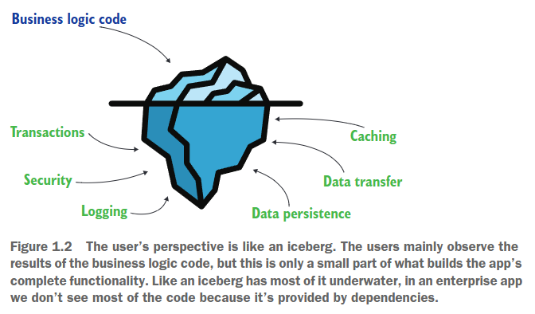

这些东西，其实每一个应用程序都需要用到。如果没有框架，那么每一个应用程序的开发者都需要自己写一套Logging的逻辑、Transaction的逻辑...实际上并不高效。

框架就是帮你把这所有的与业务逻辑无关的、通用的功能都写好，做成一个现成的工具，需要的时候直接拿来就用即可。

举一个类比的例子，例如我们现在需要做一个自己的衣柜，IKEA（框架）给我们提供了所有制作家具的工具，木板、螺丝、油漆...，我们只需要根据我们的需要，去选择合适的工具，来构造自己的衣柜就可以了，而不再需要自己从0到1地砍树，构造模板。

这里的Spring框架就类似于IKEA，他为我们提供好我们可能需要的所有工具，那我们真正用到的时候，可以直接拿来就用，不用自己去重新开发。

总结一下，使用框架的好处：

1. 节约时间成本
2. bug更少，因为已经被充分测试过
3. 有便于讨论交流的community

# 2. 创建Bean

## 2.1 创建Maven项目

* 创建maven项目
  * A group ID, which we use to group multiple related projects
  * An artifact ID, which is the name of the current application
  * A version, which is an identifier of the current implementation state

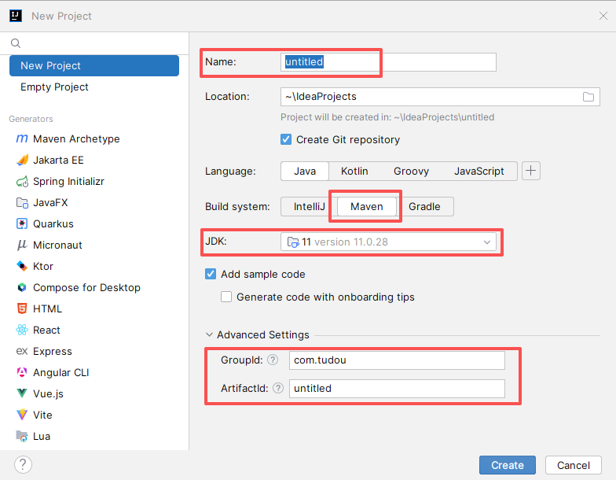

* maven文件结构

  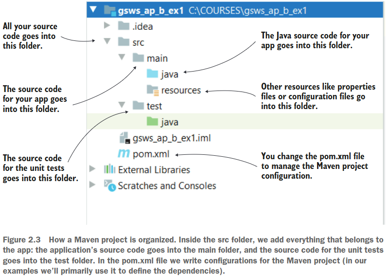

* 添加依赖

  这是原本的pom文件

  ```xml
  <?xml version="1.0" encoding="UTF-8"?>
  <project xmlns="http://maven.apache.org/POM/4.0.0"
           xmlns:xsi="http://www.w3.org/2001/XMLSchema-instance"
           xsi:schemaLocation="http://maven.apache.org/POM/4.0.0 http://maven.apache.org/xsd/maven-4.0.0.xsd">
      <modelVersion>4.0.0</modelVersion>
  
      <groupId>com.tudou</groupId>
      <artifactId>sq-ch2-ex6.</artifactId>
      <version>1.0-SNAPSHOT</version>
  
      <properties>
          <maven.compiler.source>11</maven.compiler.source>
          <maven.compiler.target>11</maven.compiler.target>
          <project.build.sourceEncoding>UTF-8</project.build.sourceEncoding>
      </properties>
  
  </project>
  ```

  原本External Libraries部分只有JDK

  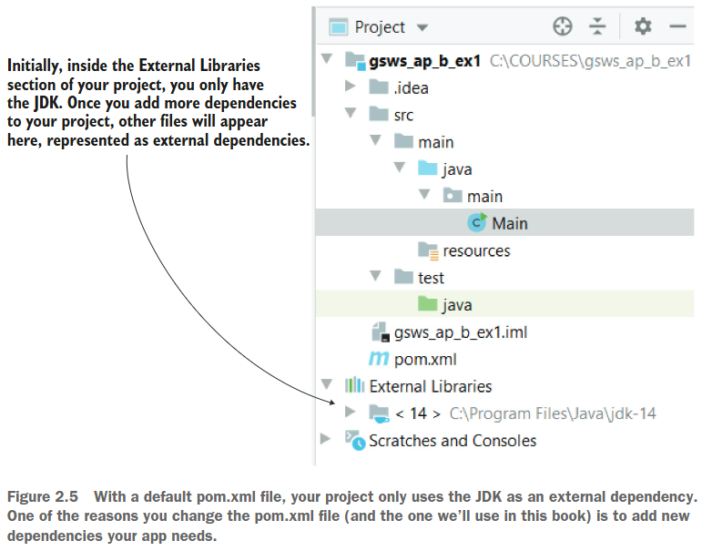

  往pom文件中增加依赖

  ```xml
  <?xml version="1.0" encoding="UTF-8"?>
  <project xmlns="http://maven.apache.org/POM/4.0.0"
           xmlns:xsi="http://www.w3.org/2001/XMLSchema-instance"
           xsi:schemaLocation="http://maven.apache.org/POM/4.0.0
  http://maven.apache.org/xsd/maven-4.0.0.xsd">
      <modelVersion>4.0.0</modelVersion>
      <groupId>org.example</groupId>
      <artifactId>sq_ch2_ex1</artifactId>
      <version>1.0-SNAPSHOT</version>
      <dependencies>
          <dependency>
              <groupId>org.springframework</groupId>
              <artifactId>spring-jdbc</artifactId>
              <version>5.2.6.RELEASE</version>
          </dependency>
      </dependencies>
  </project>
  ```

  IDE会下载这些依赖，在External Libraries可以找到这些下载的依赖

  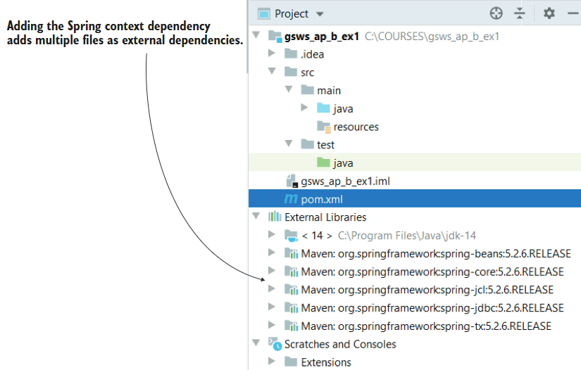

## 2.2 如何知道需要添加的maven依赖

Whenever you work with a new Spring project, you can search for the dependencies you need to add directly in the Spring reference (https://docs.spring.io/spring-framework/docs/current/spring-framework-reference/core.html). Generally, Spring dependencies are part of the org.springframework group ID.

## 2.3 创建Bean并添加入Spring容器中

### 2.3.1 使用@Bean注解

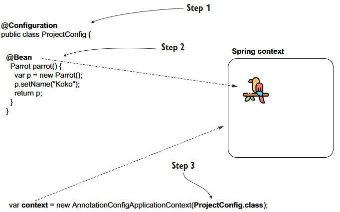

* step1：定义一个配置类

  ```java
  @Configuration
  public class ProjectConfig {
  }
  ```

* step2：在配置类中添加一个方法，并在方法上添加@Bean注解，这个方法返回一个对象实例。该实例对象会被加入到spring-context中

  ```Java
  @Configuration
  public class ProjectConfig {
      // By adding the @Bean annotation
      // we instruct Spring to call this method when at context initialization 
      // and add the returned value to the context.
      @Bean
      Parrot parrot() {  // the method's name also becomes the bean's name
          Parrot p = new Parrot();
          p.setName("Koko");
          return p;
      }
  
      @Bean
      String hello() {
          return "Hello";
      }
  
      @Bean
      Integer ten() {
          return 10;
      }
  }
  ```

* step3：基于配置类，创建spring-context

  可以从context中获取到bean

  ```java
  public class Main {
      public static void main(String[] args) {
          // When creating the Spring context instance,
          // send the configuration class as a parameter to instruct Spring to use it.
          AnnotationConfigApplicationContext context = new AnnotationConfigApplicationContext(ProjectConfig.class);
          Parrot p = context.getBean(Parrot.class);
          System.out.println(p.getName());  // Koko
  
          String s = context.getBean(String.class);
          System.out.println(s);  // Hello
  
          Integer n = context.getBean(Integer.class);
          System.out.println(n);  // 10
      }
  }
  ```

​		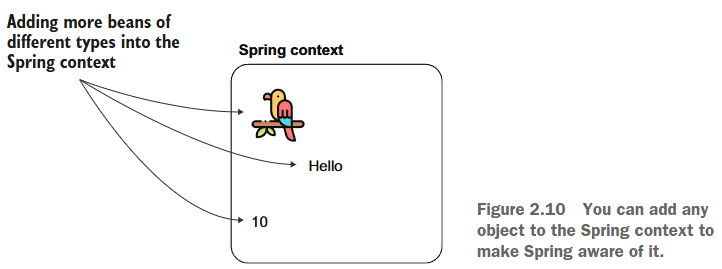

==注意：==

* 默认情况下，bean的名称为方法名

  ```java
  @Configuration
  public class ProjectConfig {
      @Bean
      Parrot parrot() {  // 该bean的名称为parrot
          Parrot p = new Parrot();
          p.setName("Koko");
          return p;
      }
  }
  ```

* 也可以通过以下注解属性来为bean重命名

  ```java
  @Bean(name = "miki")
  @Bean(value = "miki")
  @Bean("miki")
  ```

* 如果往spring容器中添加多个类型相同的Bean，则不能再通过类型来获取bean，而需要通过bean的标识符来获取bean。用`context.getBean("parrot2", Parrot.class);`方法，第一个参数为bean的名称，第二个参数为bean的类型

  ```java
  @Configuration
  public class ProjectConfig {
      @Bean
      Parrot parrot1() {  // the method's name also becomes the bean's name
          Parrot p = new Parrot();
          p.setName("Koko");
          return p;
      }
  
      @Bean
      Parrot parrot2() {  // the method's name also becomes the bean's name
          Parrot p = new Parrot();
          p.setName("Miki");
          return p;
      }
  
      @Bean
      @Primary
      Parrot parrot3() {  // the method's name also becomes the bean's name
          Parrot p = new Parrot();
          p.setName("Riki");
          return p;
      }
  }
  
  public class Main {
      public static void main(String[] args) {
          AnnotationConfigApplicationContext context = new AnnotationConfigApplicationContext(ProjectConfig.class);
          Parrot p = context.getBean("parrot2", Parrot.class);
          System.out.println(p.getName());  // Miki
      }
  }
  ```

* 如果有多个类型相同的bean，可以通过@Primary注解来设置默认选择

  这样有多个类型相同的bean时，会选择默认的那个bean

  ```java
  @Configuration
  public class ProjectConfig {
      @Bean
      Parrot parrot1() {  // the method's name also becomes the bean's name
          Parrot p = new Parrot();
          p.setName("Koko");
          return p;
      }
  
      @Bean
      Parrot parrot2() {  // the method's name also becomes the bean's name
          Parrot p = new Parrot();
          p.setName("Miki");
          return p;
      }
  
      @Bean
      @Primary
      Parrot parrot3() {  // the method's name also becomes the bean's name
          Parrot p = new Parrot();
          p.setName("Riki");
          return p;
      }
  }
  
  public class Main {
      public static void main(String[] args) {
          AnnotationConfigApplicationContext context = new AnnotationConfigApplicationContext(ProjectConfig.class);
          Parrot p = context.getBean(Parrot.class);
          System.out.println(p.getName());  // Riki
      }
  }
  ```


### 2.3.2 使用stereotype annotations

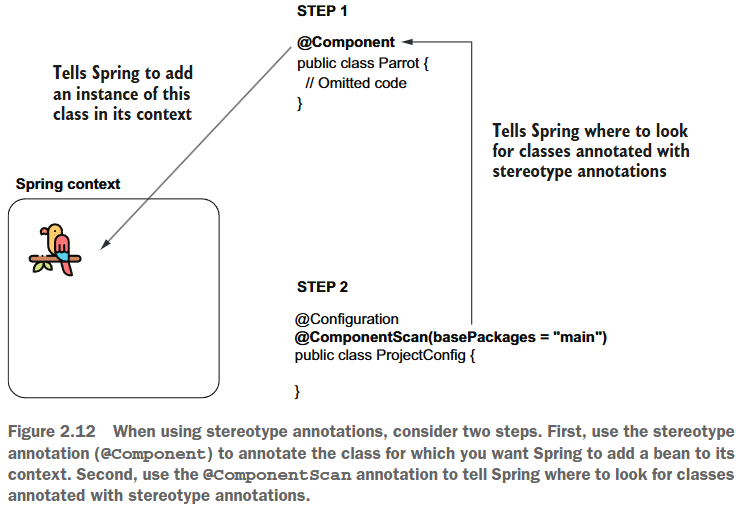

以@Component注解为例

* step1：在需要创建Bean的类增加@Component注解

  【tell Spring ==Which== classes to add an instance to its context (Parrot)】

  ```java
  package com.tudou.main;
  
  @Component
  public class Parrot {
      private String name;
  
      public String getName() {
          return name;
      }
  
      public void setName(String name) {
          this.name = name;
      }
  }
  ```

* step2：在配置类中增加 @ComponentScan 注解，该注解标识要扫描的位置

  【tell Spring ==Where== to find these classes (using @ComponentScan)】

  ```java
  @Configuration
  @ComponentScan(basePackages = "com.tudou")
  public class ProjectConfig {
  
  }
  ```

* step3：基于配置类，创建spring-context

  可以从context中获取到bean

  ```java
  public class Main {
      public static void main(String[] args) {
          // When creating the Spring context instance, send the configuration class as a parameter to instruct Spring to use it.
          AnnotationConfigApplicationContext context = new AnnotationConfigApplicationContext(ProjectConfig.class);
          Parrot p = context.getBean(Parrot.class);
          System.out.println(p);  // com.tudou.pojo.Parrot@59662a0b
          System.out.println(p.getName());  // null 因为没有给name属性赋值，则默认为null
      }
  }
  ```

* step4：如果想要创建完bean之后，对bean进行一些处理，可以使用@PostConstruct注解。spring会在执行完bean的构造函数之后，马上执行被@PostConstruct注解的方法

  * 要使用该注解，需要先增加该依赖

    ```xml
    <dependency>
        <groupId>javax.annotation</groupId>
        	<artifactId>javax.annotation-api</artifactId>
        <version>1.3.2</version>
    </dependency>
    ```

  * 在类中增加@PostConstruct方法

    ```java
    @Component
    public class Parrot {
        private String name;
    
        public String getName() {
            return name;
        }
    
        public void setName(String name) {
            this.name = name;
        }
    
        @PostConstruct
        public void init() {
            this.name = "Kiki";
        }
    }
    ```

  * 测试效果

    ```java
    public class Main {
        public static void main(String[] args) {
            // When creating the Spring context instance, send the configuration class as a parameter to instruct Spring to use it.
            AnnotationConfigApplicationContext context = new AnnotationConfigApplicationContext(ProjectConfig.class);
            Parrot p = context.getBean(Parrot.class);
            System.out.println(p);  // com.tudou.pojo.Parrot@59662a0b
            System.out.println(p.getName());  // Kiki
        }
    }
    ```


注意：

* 和@PostConstruct注解类似的，还有@PreDestroy注解

  With this annotation, you define a method that Spring calls immediately before closing and clearing the context. But generally I recommend developers avoid using it and find a different approach to executing something before Spring clears the context, *mainly because you can expect Spring to fail to clear the context*. Say you defined something sensitive (like closing a database connection) in the @PreDestroy method; if Spring doesn’t call the method, you may get into big problems.

* 使用类似@Component这样的stereotype annotation（模式注解）来创建bean，默认 bean 名 = 类名首字母小写。例如Parrot类的bean默认bean名为parrot。当然也可以用@Qualifier注解显式自定义指定bean名称。

### 2.3.3 编程式

使用 ApplicationContext实例的registerBean()方法来将bean注册到Spring容器中

* 配置类

  ```java
  @Configuration
  @ComponentScan(basePackages = "com.tudou")
  public class ProjectConfig {
  
  }
  ```

* Bean类【普通的pojo类，没有被任何注解修饰】

  ```java
  public class Parrot {
      private String name;
  
      public String getName() {
          return name;
      }
  
      public void setName(String name) {
          this.name = name;
      }
  }
  ```

* main方法

  ```java
  public class Main {
      public static void main(String[] args) {
          // When creating the Spring context instance, send the configuration class as a parameter to instruct Spring to use it.
          AnnotationConfigApplicationContext context = new AnnotationConfigApplicationContext(ProjectConfig.class);
          // We create the instance we want to add to the Spring context.
          Parrot p = new Parrot();
          p.setName("Kik1");
          // We define a Supplier to return this instance.
          Supplier<Parrot> parrotSupplier = () -> p;
          // We call the registerBean() method to add the instance to the Spring context.
          context.registerBean("parrot1", Parrot.class, parrotSupplier);
          // To verify the bean is now in the context, we refer to the parrot bean and print its name in the console.
          Parrot parrot = context.getBean(Parrot.class);
          System.out.println(p.getName());  // Kik1
      }
  }
  ```

  

==注意：==

* registerBean方法详解

  ```java
  <T> void registerBean(
  	String beanName,  // 定义bean名称 可以为null
  	Class<T> beanClass,  // bean所属类型
      // Supplier是一个@FunctionalInterface，
  	// The implementation of this Supplier needs to 
  	// return the value of the instance you add to the context.
      Supplier<T> supplier,
      // the BeanDefinitionCustomizer is just an interface 
      // you implement to configure different characteristics of the bean; 
      // e.g.,making it primary.
      // customizers是一个可变参数
  	BeanDefinitionCustomizer... customizers);
  ```

  customizers的使用示例：

  ```java
  context.registerBean("parrot1",
  	Parrot.class,
  	parrotSupplier,
  	bc -> bc.setPrimary(true));
  ```

* 只有Spring5及其之后可以使用编程式方法给bean容器添加bean

# 3. Wiring Bean【管理Bean之间的关系】

## 3.1 方法调用

直接通过方法调用的方式创建Bean之间的关系。

例如现在有一个Person类，有一个Parrot类，需要实现让person实例own parrot实例。

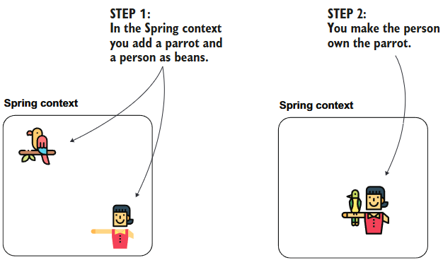

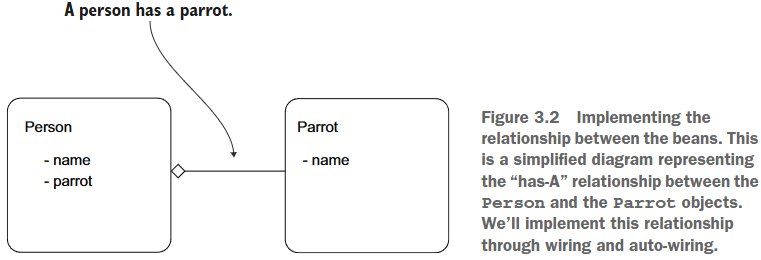

代码如下：

```java
// Parrot类
public class Parrot {
    private String name;

    public Parrot() {
        System.out.println("Parrot created");
    }

    // Omitted getters and setters

    @Override
    public String toString() {
        return "Parrot : " + name;
    }
}
```


```java
// Person类
public class Person {
    private String name;
    private Parrot parrot;

    // Omitted getters and setters
}
```


```java
// 配置类
@Configuration
public class ProjectConfig {
    @Bean
    public Parrot parrot() {
        Parrot p = new Parrot();
        p.setName("Koko");
        return p;
    }
    @Bean
    public Person person() {
        Person p = new Person();
        p.setName("Ella");
        // ***构建person实例和parrot实例的关系***
        p.setParrot(parrot());
        return p;
    }
}
```


```java
// main函数
public class Main {
    public static void main(String[] args) {
        var context = new AnnotationConfigApplicationContext(ProjectConfig.class);
        Person person = context.getBean(Person.class);
        Parrot parrot = context.getBean(Parrot.class);
        System.out.println("Person's name: " + person.getName());
        System.out.println("Parrot's name: " + parrot.getName());
        System.out.println("Person's parrot: " + person.getParrot());
    }
}

// 执行结果
// Parrot created
// Person's name: Ella
// Parrot's name: Koko
// Person's parrot: Parrot : Koko
```


==注意：==

* 在创建Person bean的时候，调用了parrot()，是否意味着又再创建了一个新的Parrot对象？

  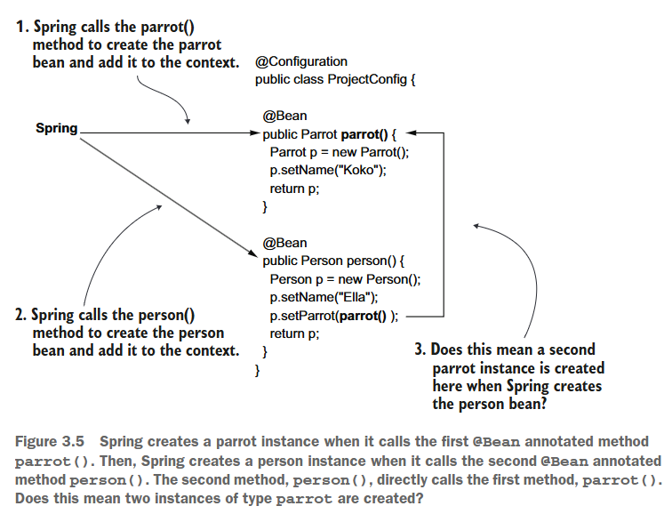

​		答案：

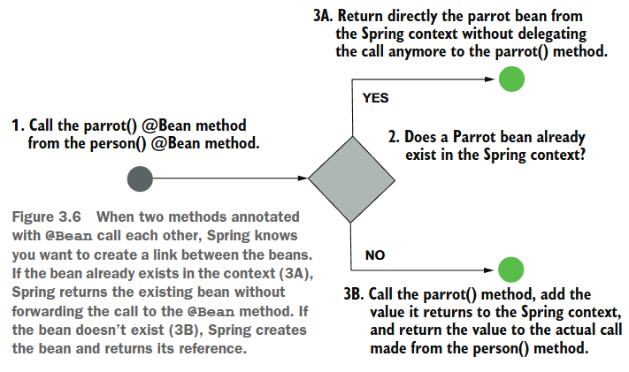

​	从上面示例代码中，也可以看到`Parrot created`只打印了一次，说明Parrot的构造函数只被调用过一次。

## 3.2 参数注入

和3.1方法的区别，仅在于配置类

```java
@Configuration
public class ProjectConfig {
    @Bean
    public Parrot parrot() {
        Parrot p = new Parrot();
        p.setName("Koko");
        return p;
    }
    // 参数注入
    // Spring injects the parrot bean into this parameter
    @Bean
    public Person person(Parrot parrot) {
        Person p = new Person();
        p.setName("Ella");
        p.setParrot(parrot);
        return p;
    }
}
```

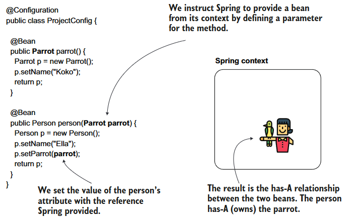

==注意：==

* 这里使用的是依赖注入的思想【I is a technique involving the framework setting a value into a specific field or parameter.】
* DI is an application of the IoC principle, and IoC implies that the framework controls the application at execution. 

## 3.3 @Autowire注入

### 3.3.1 属性注入

```java
// Parrot类
package com.tudou.pojo;
@Component
public class Parrot {
    private String name = "Koko";

    // Omitted getters and setters

    @Override
    public String toString() {
        return "Parrot : " + name;
    }
}
```


```java
// Person类
package com.tudou.pojo;
@Component
public class Person {
    private String name = "Ella";
    
    // Annotating the field with @Autowired, 
    // we instruct Spring to inject 
    // an appropriate value from its context.
    @Autowired
    private Parrot parrot;

    // Omitted getters and setters
}
```


```java
// 配置类
@Configuration
@ComponentScan(basePackages = "com.tudou.pojo")
public class ProjectConfig {
}
```


```java
// main函数
public class Main {
    public static void main(String[] args) {
        var context = new AnnotationConfigApplicationContext(ProjectConfig.class);
        Person p = context.getBean(Person.class);
        System.out.println("Person's name: " + p.getName());  // Ella
        System.out.println("Person's parrot: " + p.getParrot());  // Parrot : Koko
    }
}
```


注意：

* 这种方式在生产环境并不常使用：

  * 如果我们要使用@Autowire属性注入，就不能将该属性用final修饰

    ```java
    @Component
    public class Person {
        private String name = "Ella";
        
        @Autowired
        private final Parrot parrot;
    }
    ```

    例如上面的代码片段，是无法编译通过的。因为`private final Parrot parrot;`被final修饰的变量必须要进行初始化，而如果我们进行了初始化，则由于parrot是被final修饰的，则不能被修改，则@Autowire后续会注入失败，导致报错。

  * it’s more difficult to manage the value yourself at initialization.

### 3.3.2 构造注入

和属性注入的区别只在Person类中。

```java
// Parrot类
package com.tudou.pojo;
@Component
public class Parrot {
    private String name = "Koko";

    // Omitted getters and setters

    @Override
    public String toString() {
        return "Parrot : " + name;
    }
}
```


```java
// Person类
@Component
public class Person {
    private String name = "Ella";
    private Parrot parrot;
	
    @Autowired
    public Person(Parrot parrot) {
        this.parrot = parrot;
    }

    // Omitted getters and setters
}

```

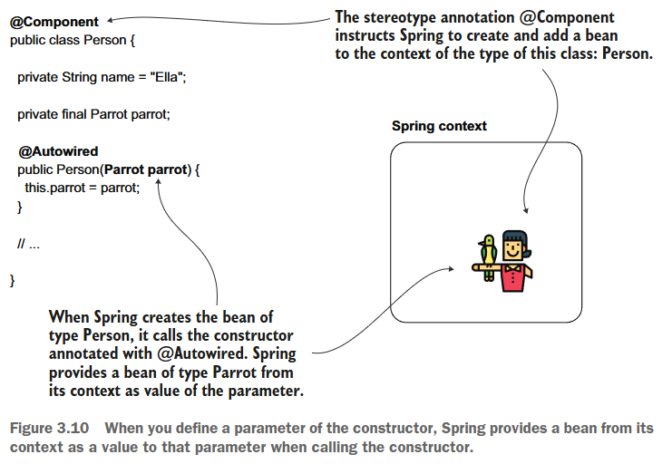

```java
// 配置类
@Configuration
@ComponentScan(basePackages = "com.tudou.pojo")
public class ProjectConfig {
}
```


```java
// main函数
public class Main {
    public static void main(String[] args) {
        var context = new AnnotationConfigApplicationContext(ProjectConfig.class);
        Person p = context.getBean(Person.class);
        System.out.println("Person's name: " + p.getName());  // Ella
        System.out.println("Person's parrot: " + p.getParrot());  // Parrot : Koko
    }
}
```

==注意：==

* **这种方式是实际生产环境使用最多的方式。**通过这种方式可以将Person类的parrot字段用final修饰。
* Spring 4.3起，如果只有一个构造函数，可以将@Autowired注解省略

### 3.3.3 setter注入

和属性注入的区别只在Person类中。

```java
@Component
public class Person {
    private String name = "Ella";
    private Parrot parrot;

    // Omitted getters and setters

    @Autowired
    public void setParrot(Parrot parrot) {
        this.parrot = parrot;
    }
}
```

==注意：==

* 这种方式非常少用
  * 可读性差
  * 不能用final修饰Person类的parrot字段

## 3.4 循环依赖

循环依赖问题

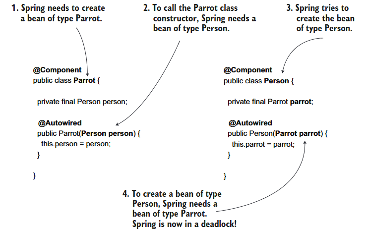

```java
// Person类
@Component
public class Person {
    private final Parrot parrot;
    @Autowired
    public Person(Parrot parrot) {
        this.parrot = parrot;
    }
    // Omitted code
}
```


```java
// Parrot类
public class Parrot {
    private String name = "Koko";
    private final Person person;
    @Autowired
    public Parrot(Person person) {
        this.person = person;
    }
    // Omitted code
}
```

这里使用的是构造注入，则Spring无法解决循环依赖问题，会报错：

```java
Caused by:
org.springframework.beans.factory.BeanCurrentlyInCreationException: Error
creating bean with name 'parrot': Requested bean is currently in creation:
Is there an unresolvable circular reference?
at
org.springframework.beans.factory.support.DefaultSingletonBeanRegistry.before
SingletonCreation(DefaultSingletonBeanRegistry.java:347)
```

如果将任意一个类改用字段注入，则可以解决：


```java
// Parrot类
@Component
public class Parrot {
    private String name = "Koko";
    
    @Autowired  // 字段注入
    private Person person;

    // Omitted code
}
```


```java
// Person类
@Component
public class Person {
    private String name = "Ella";

    @Autowired
    private final Parrot parrot;

    @Autowired
    public Person(Parrot parrot) {
        this.parrot = parrot;
    }
    
    // Omitted code
}
```

运行结果

```java
public class Main {
    public static void main(String[] args) {
        AnnotationConfigApplicationContext context = new AnnotationConfigApplicationContext(ProjectConfig.class);
        Person person = context.getBean(Person.class);
        Parrot parrot = context.getBean(Parrot.class);
        // Ella has Koko
        System.out.println(person.getName()+" has "+person.getParrot().getName());
        // Koko
        System.out.println(parrot.getName());
    }
}
```

## 3.5 有多个bean 注入时如何选择

### 3.5.1 选择bean名和参数名相同的bean注入

情况1：使用@Bean创建Person bean，并注入依赖parrot bean

```java
@Configuration
public class ProjectConfig {
    @Bean
    public Parrot parrot1() {
        Parrot p = new Parrot();
        p.setName("Koko");
        return p;
    }

    @Bean
    public Parrot parrot2() {
        Parrot p = new Parrot();
        p.setName("Miki");
        return p;
    }

    @Bean
    // The name of the parameter matches the name of the bean representing parrot Miki.
    public Person person(Parrot parrot2) {
                Person p = new Person();
        p.setName("Ella");
        p.setParrot(parrot2);
        return p;
    }
}
```

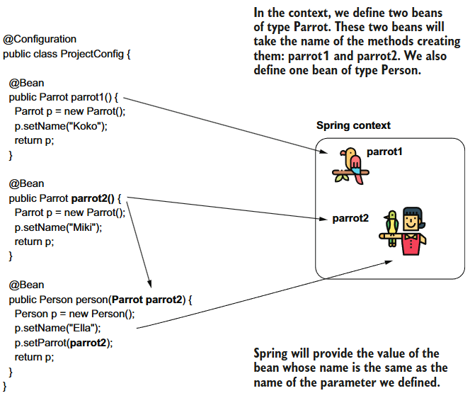


情况2：使用@Autowire注解注入parrot bean

```java
public class Parrot {
    private String name;

    // Omitted code
}
```


```java
@Component
public class Person {
    private String name = "Ella";

    private final Parrot parrot;
	
    @Autowire  // 构造注入时，@Autowire注解可以省略
    public Person(Parrot parrot2) {
        this.parrot = parrot2;
    }

    // Omitted code
}
```


```java
@Configuration
@ComponentScan(basePackages = "com.tudou.pojo")
public class ProjectConfig {
    @Bean
    public Parrot parrot1() {
        Parrot p = new Parrot();
        p.setName("Koko");
        return p;
    }

    @Bean
    public Parrot parrot2() {  // 会将这个bean注入到Person bean
        Parrot p = new Parrot();
        p.setName("Miki");
        return p;
    }
}
```

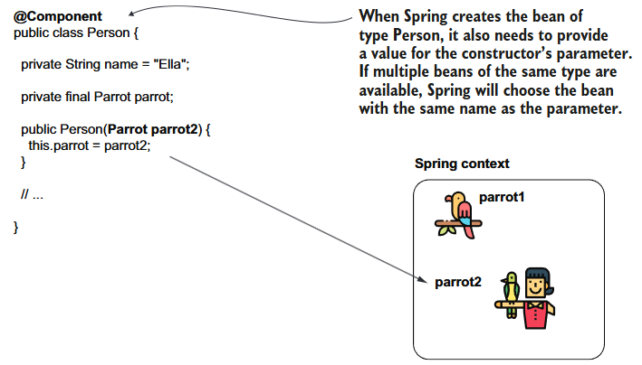


### 3.5.2 使用@Qualifier注解

@Qualifier注解可以显式选择要使用的bean的名称【推荐使用，清晰，可维护性好】

```java
@Configuration
public class ProjectConfig {
    @Bean
    public Parrot parrot1() {
        Parrot p = new Parrot();
        p.setName("Koko");
        return p;
    }

    @Bean
    public Parrot parrot2() {
        Parrot p = new Parrot();
        p.setName("Miki");
        return p;
    }

    @Bean
    public Person person(@Qualifier("parrot1") Parrot parrot) {
                Person p = new Person();
        p.setName("Ella");
        p.setParrot(parrot);
        return p;
    }
}
```

注意：

* @Qualifier除了能够显式指定要使用的bean的名称，还能够用于给bean命名

### 3.5.3 使用@Primary

使用@Primary指定优先级最高的bean

```java
@Configuration
public class ProjectConfig {
    @Bean
    public Parrot parrot1() {
        Parrot p = new Parrot();
        p.setName("Koko");
        return p;
    }

    @Bean
    @Primary
    public Parrot parrot2() {
        Parrot p = new Parrot();
        p.setName("Miki");
        return p;
    }

    @Bean
    public Person person(Parrot parrot) {
        Person p = new Person();
        p.setName("Ella");
        p.setParrot(parrot);  // 注入名为Miki的parrot
        return p;
    }
}
```


# 4. Using abstractions

> Interface specifies the “what needs to happen,” while every object implementing the interface specifies the “how it should happen.”

## 4.1 为什么要面向抽象编程

用一个例子说明，为什么要面向抽象编程。

例如现在要实现一个功能，有一个Printer要实现打印运送订单信息，并且要按照地址信息升序打印，一般来说这个Printer会将排序的任务委托给其他的类实现，而自己专注于实现这个打印任务，那么会是像下面这样实现的：
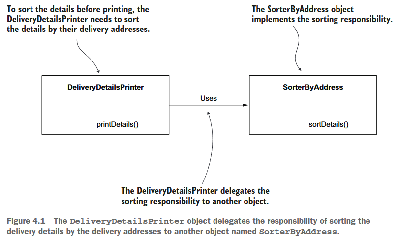

这样会存在的问题是：如果要更改排序的方式，比如现在不按照地址信息排序了，而是按照sender姓名信息排序，那DeliveryDetailsPrinter这个类也需要修改

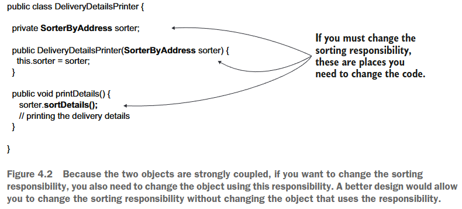

DeliveryDetailsPrinter和下层调用的排序类耦合在一起，就会导致如果要调用的排序类发生了改变，则DeliveryDetailsPrinter类的代码也需要更改。

这是面向实现编程的情况，如果我们面向接口编程，会是怎么样的？

如果DeliveryDetailsPrinter类仅是依赖一个Sorter接口，而不依赖具体的实现，那么无论下层的实现怎么改，都不会影响DeliveryDetailsPrinter的代码。

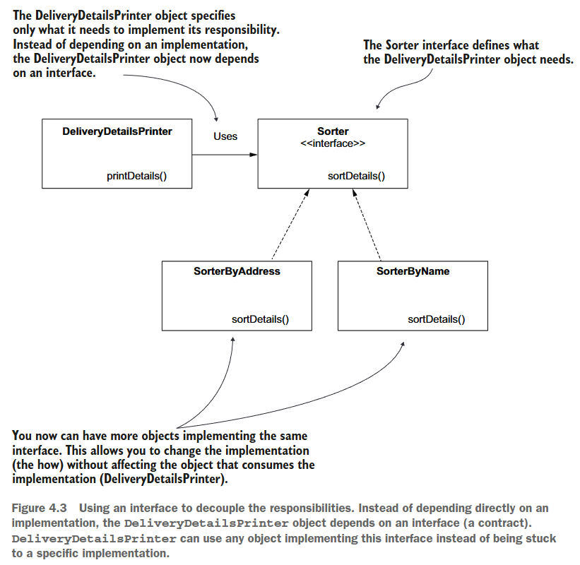


## 4.2 不使用Spring如何面向抽象编程

背景：实现一个发布评论的功能，当有人发布评论：1. 将评论存储到DB中 2. 将评论发送到一个邮箱中

项目结构：

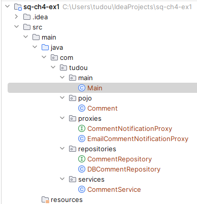

实现代码：

```java
// Comment类
package com.tudou.pojo;

public class Comment {
    private String author;
    private String text;

    public String getAuthor() {
        return author;
    }

    public void setAuthor(String author) {
        this.author = author;
    }

    public String getText() {
        return text;
    }

    public void setText(String text) {
        this.text = text;
    }
}
```


```java
// CommentRepository接口
// ps一般如果一个类/接口作用是和DB交互，就会命名为Repository
package com.tudou.repositories;

public interface CommentRepository {
    void storeComment(Comment comment);
}

```


```java
// CommentRepository接口实现类
package com.tudou.repositories;

public class DBCommentRepository implements CommentRepository{
    @Override
    public void storeComment(Comment comment) {
        System.out.println("Storing comment: " + comment.getText());
    }
}
```


```java
// CommentNotificationProxy接口
// ps  when implementing objects whose responsibility is 
// to establish communication with something outside the app, 
// we name these objects proxies
package com.tudou.proxies;

public interface CommentNotificationProxy {
    void sendComment(Comment comment);
}
```


```java
// CommentNotificationProxy接口实现类
package com.tudou.proxies;

public class EmailCommentNotificationProxy implements CommentNotificationProxy{
    @Override
    public void sendComment(Comment comment) {
        System.out.println("Sending email notification for comment: " + comment.getText());
    }
}

```


```java
// 发布评论 Service
public class CommentService {
    private final CommentRepository commentRepository;
    private final CommentNotificationProxy commentNotificationProxy;

    public CommentService(CommentRepository commentRepository, CommentNotificationProxy commentNotificationProxy) {
        this.commentRepository = commentRepository;
        this.commentNotificationProxy = commentNotificationProxy;
    }

    public void publishComment(Comment comment) {
        commentRepository.storeComment(comment);  // 存储评论
        commentNotificationProxy.sendComment(comment);  // 发送至邮箱
    }
}

```


```java
// main
// 创建接口的实例对象，并且构建CommentService和这些实例对象的关系
public class Main {
    public static void main(String[] args) {
        // Creates the instance for the dependencies
        DBCommentRepository commentRepository = new DBCommentRepository();
        EmailCommentNotificationProxy commentNotificationProxy = new EmailCommentNotificationProxy();
        // Creates the instance of the service class and providing the dependencies
        CommentService commentService = new CommentService(commentRepository, commentNotificationProxy);

        Comment comment = new Comment();
        comment.setAuthor("tudou");
        comment.setText("demo comment");

        commentService.publishComment(comment);
    }
}
```


## 4.2 Spring如何面向抽象编程


```java
// Comment类
public class Comment {
    private String author;
    private String text;

    public String getAuthor() {
        return author;
    }

    public void setAuthor(String author) {
        this.author = author;
    }

    public String getText() {
        return text;
    }

    public void setText(String text) {
        this.text = text;
    }
}
```


```java
// CommentRepository接口
package com.tudou.repositories;

public interface CommentRepository {
    void storeComment(Comment comment);
}
```


```java
// CommentRepository接口实现类
package com.tudou.repositories;

@Component
public class DBCommentRepository implements CommentRepository{
    @Override
    public void storeComment(Comment comment) {
        System.out.println("Storing comment: " + comment.getText());
    }
}
```


```java
// CommentNotificationProxy接口
// ps  when implementing objects whose responsibility is 
// to establish communication with something outside the app, 
// we name these objects proxies
package com.tudou.proxies;

public interface CommentNotificationProxy {
    void sendComment(Comment comment);
}
```


```java
// CommentNotificationProxy接口实现类
package com.tudou.proxies;

@Component
public class EmailCommentNotificationProxy implements CommentNotificationProxy{
    @Override
    public void sendComment(Comment comment) {
        System.out.println("Sending notification for comment: " + comment.getText());
    }
}
```


```java
// 发布评论 Service
@Component
public class CommentService {
    private final CommentRepository commentRepository;
    private final CommentNotificationProxy commentNotificationProxy;

    // 当只有一个构造函数的时候，可以省略@Autowire注解
    //  Spring会自动从Spring容器搜索实现了这些接口的bean并进行注入
    public CommentService(
            CommentRepository commentRepository,
            CommentNotificationProxy commentNotificationProxy
    ) {
        this.commentRepository = commentRepository;
        this.commentNotificationProxy = commentNotificationProxy;
    }

    public void publishComment(Comment comment) {
        commentRepository.storeComment(comment);
        commentNotificationProxy.sendComment(comment);
    }
}
```


```java
// 配置类
@Configuration
@ComponentScan(basePackages = "com.tudou")
public class ProjectConfiguration {
}
```


```java
public class Main {
    public static void main(String[] args) {
        AnnotationConfigApplicationContext context = new AnnotationConfigApplicationContext(ProjectConfiguration.class);
        
        Comment comment = new Comment();
        comment.setAuthor("tudou");
        comment.setText("demo comment");
        
        CommentService commentService = context.getBean(CommentService.class);
        commentService.publishComment(comment);
    }
}
//执行结果：
Storing comment: demo comment
Sending notification for comment: demo comment
```


```xml
// 涉及的依赖
<dependencies>
    <dependency>
        <groupId>org.springframework</groupId>
        <artifactId>spring-context</artifactId>
        <version>5.2.7.RELEASE</version>
    </dependency>
</dependencies>
```


==注意：==

* 为什么CommentService、DBCommentRepository、EmailCommentNotificationProxy要用@Component注解注释以创建spring bean，而Comment类不用呢？

  * 我们为什么要把bean放入Spring容器，是因为我们需要Spring容器帮我们创建它，并且管理bean之间的关系，在当前的场景，CommentService依赖DBCommentRepository和EmailCommentNotificationProxy，因此这三个bean放入Spring容器，能够让Spring容器方便地管理它们之间的关系，而Comment类不和任何其他类有依赖关系，因此没有必要放入Spring容器管理。如果硬要放入，只是增加了程序的复杂度。

* 如果一个接口有多个实现类bean，Spring怎么确定应该注入哪一个？

  例如CommentNotificationProxy接口有两个实现类，CommentPushNotificationProxy和EmailCommentNotificationProxy，注入的时候应该注入哪个类对应的bean？

  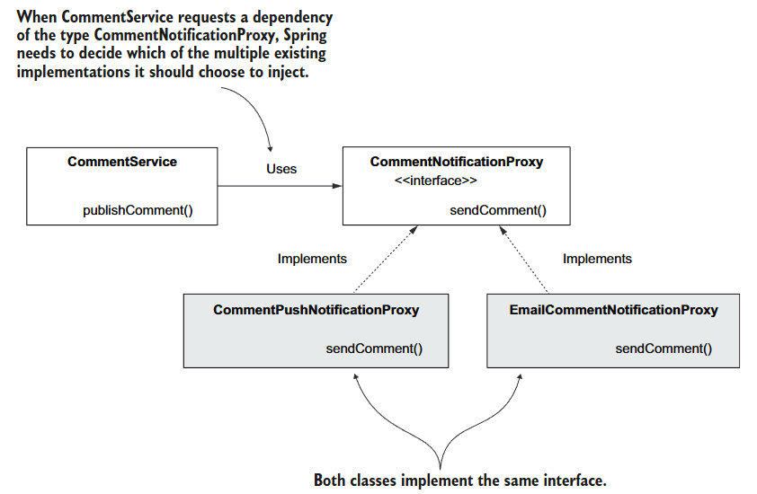

  * 使用@Primary注解标识默认使用的bean

    ```java
    @Component
    @Primary
    public class CommentPushNotificationProxy implements CommentNotificationProxy {
        @Override
        public void sendComment(Comment comment) {
            System.out.println("Sending push notification for comment: " + comment.getText());
        }
    }
    ```

    可能有人会好奇，什么情况下会用到这种方式，既然用@Primary标识默认使用的bean，那只保留那一个实现类就好了，其他的实现类是不是就用不到了，为什么还要保留？

    实际上，我们开发过程中应用程序会依赖很多依赖，这些依赖的接口可能存在已经提供的默认实现类，但并不match你的应用程序，所以这个时候你要写一个自己的实现类来满足你自己的应用程序的需求，就可以用@Primary来指定默认使用你自定义的bean。

    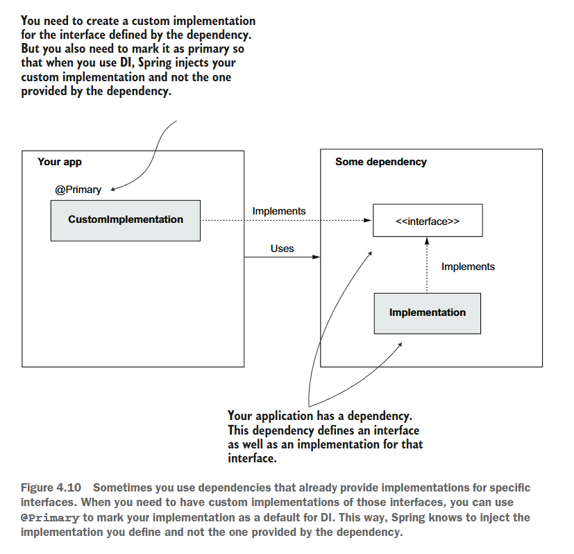

  * 使用@Qualifier注解定义bean名称，并指定要使用的bean

    ```java
    // CommentPushNotificationProxy实现类
    @Component
    @Qualifier("PUSH")  // 设置bean的标识符
    public class CommentPushNotificationProxy implements CommentNotificationProxy {
        @Override
        public void sendComment(Comment comment) {
            System.out.println("Sending push notification for comment: " + comment.getText());
        }
    }
    
    ```

    ```java
    // EmailCommentNotificationProxy实现类
    @Component
    @Qualifier("EMAIL")  // 设置bean的标识符
    public class EmailCommentNotificationProxy implements CommentNotificationProxy{
        @Override
        public void sendComment(Comment comment) {
            System.out.println("Sending notification for comment: " + comment.getText());
        }
    }
    
    ```

    ```java
    // 依赖CommentNotificationProxy接口的Service
    @Component
    public class CommentService {
        private final CommentRepository commentRepository;
        private final CommentNotificationProxy commentNotificationProxy;
    
        // 当只有一个构造函数的时候，可以省略@Autowire注解
        public CommentService(
                CommentRepository commentRepository,
            	// 指定要注入的bean
                @Qualifier("PUSH") CommentNotificationProxy commentNotificationProxy
        ) {
            this.commentRepository = commentRepository;
            this.commentNotificationProxy = commentNotificationProxy;
        }
    
        public void publishComment(Comment comment) {
            commentRepository.storeComment(comment);
            commentNotificationProxy.sendComment(comment);
        }
    }
    ```

    

    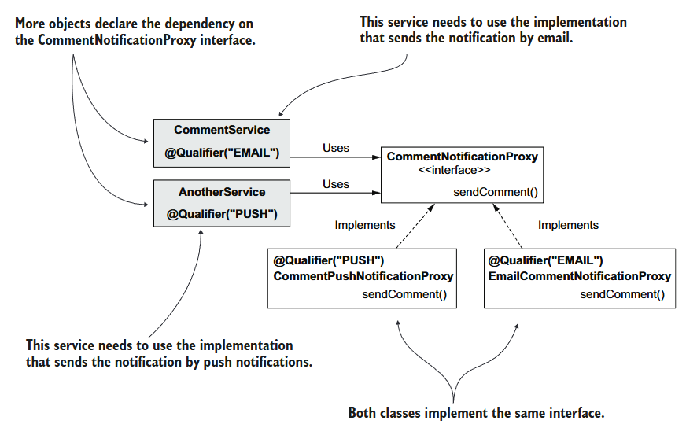

* 上面介绍了构造注入场景下，面向抽象编程怎么写；那其他注入场景下，对应的抽象编程代码怎么写？

  * 字段注入

    

  * 使用@Bean创建bean

    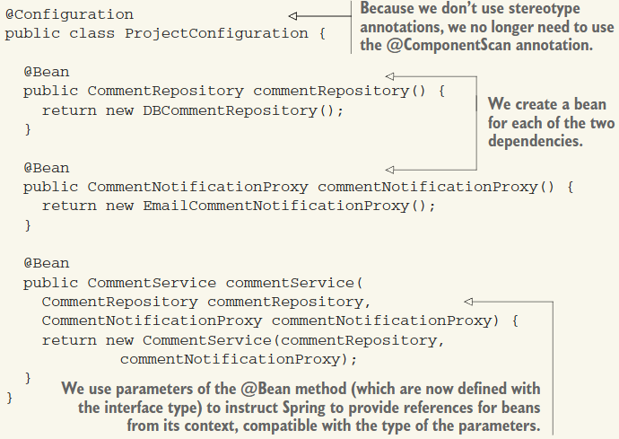

## 4.3 注解是加在Class上还是Interface上

class上，因为注解是用于让Spring扫描到这个类，然后实例化这个类的bean加入Spring容器进行管理。而接口本身是不能被实例化的，只有类才能被实例化，所以注解是要加在Class上。

## 4.4 @Service @Repository注解

@Service、@Repository、@Component注解都是一样的，都是让Spring扫描到对应的类，并创建这个类的bean，加入Spring容器进行管理。

如果全部都使用@Component注解，实际上代码的层次并不明显，可读性不够好。

使用@Service注解来标识专门负责提供服务的Bean，使用@Repository注解来标识专门负责进行DB操作的Bean，无特殊含义的Bean用@Component注解标识，这样代码的可能性更佳，层次更加明显。


# 5. Bean scopes and life cycle

## 5.1 Bean scopes

### 5.1.1 Singleton

* 是什么：Spring中的Singleton作用域，不是代表一个类只能有一个Bean。相反，一个类可以有多个Bean，但*每个Bean都有自己唯一的 bean 名称，或者说 Bean id* 。

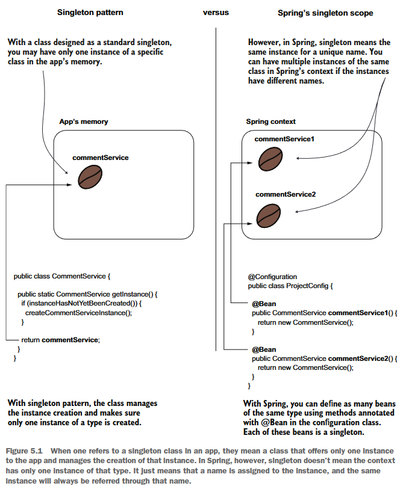

* 是否要使用单例模式：

  * 使用单例模式需要保证这个bean是不可变的。因为如果使用单例模式，则在多线程场景下，这多个线程共享这一个单例bean，如果这个bean是可变的，在多线程并发场景下，会出现竞态条件。则需要额外加锁来保证线程安全，影响性能。

    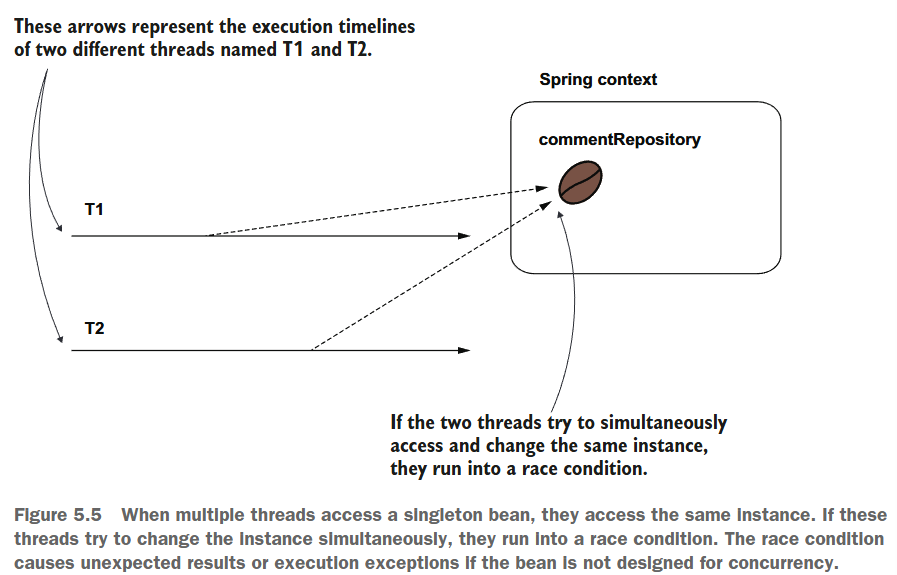

  * 如果这个bean需要可变，则可以使用多例模式。

* eager instantiation or lazy instantiation：

  * eager instantiation（默认）：Spring会在初始化context的时候就创建所有单例bean。

    示例：

    ```java
    // Service
    @Service
    public class CommentService {
        public CommentService() {
            System.out.println("CommentService instance created.");
        }
    }
    ```

    ```java
    // 配置类
    @Configuration
    @ComponentScan(basePackages = "com.tudou")
    public class ProjectConfig {
    }
    ```

    ```java
    public class Main {
        public static void main(String[] args) {
            AnnotationConfigApplicationContext context = new AnnotationConfigApplicationContext(ProjectConfig.class);
        }
    }
    ```

    ```java
    // 控制台打印
    CommentService instance created.
    ```

    可以看到，代码中并没有真正用到commentService这个bean，但是却被初始化了。

    

  * lazy instantiation：Spring只有在第一次用到这个单例bean的时候，才会创建这个bean。

    示例：

    ```java
    // Service
    @Service
    @Lazy  // 开启懒加载
    public class CommentService {
        public CommentService() {
            System.out.println("CommentService instance created.");
        }
    }
    ```

    ```java
    public class Main {
        public static void main(String[] args) {
            AnnotationConfigApplicationContext context = new AnnotationConfigApplicationContext(ProjectConfig.class);
            System.out.println("Before retrieving the CommentService");
            CommentService service = context.getBean(CommentService.class);
            System.out.println("After retrieving the CommentService");
        }
    }
    ```

    ```java
    // 控制台打印
    Before retrieving the CommentService
    CommentService instance created.
    After retrieving the CommentService
    ```

    可以看到，只有在真正使用commentService这个bean的时候，才会创建该bean。

  * 对比
    * eager instantiation：要用的时候就有；如果bean的创建存在异常，可以在启动Spring应用程序的时候就马上发现；【推荐使用】
    * lazy instantiation：用之前需要检查是否存在，如果不存在还要创建，影响性能；如果bean的创建存在异常，无法马上发现，需要后续用到该bean的时候才能被发现；

### 5.1.2 Prototype

* 是什么：每一次尝试从Spring容器获取作用域为prototype的bean，Spring都会创建一个新bean返回。

  例如下图，CommentService这个类的作用域为prototype，每一次调用context.getBean(CommentService.class)的时候，都会创建一个新bean，因此`cs1==cs2`结果永远为false。

  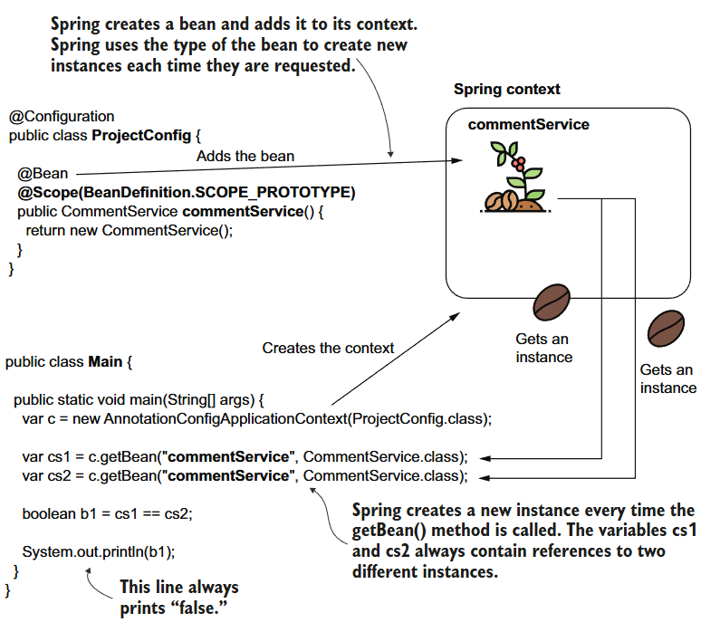

* 应用场景：如果一个bean是Prototype的作用域，那么在多线程场景下，每个线程拿到的bean都是不同的，因此是线程安全的，可以随意修改bean。

  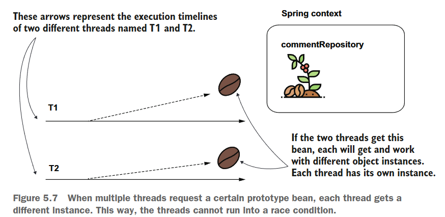

* 如何将bean定义为Prototype的作用域？

  在所有定义Bean的地方，增加上`@Scope(BeanDefinition.SCOPE_PROTOTYPE)`注解。

  * 例1：使用@Bean定义Bean

    ```java
    // Service类
    public class CommentService {
    }
    ```

    ```java
    // 配置类
    @Configuration
    public class ProjectConfig {
    
        @Bean
        @Scope(BeanDefinition.SCOPE_PROTOTYPE)  // 确定作用域
        public CommentService commentService() {
            return new CommentService();
        }
    }
    ```

    ```java
    public class Main {
        public static void main(String[] args) {
            AnnotationConfigApplicationContext context = new AnnotationConfigApplicationContext(ProjectConfig.class);
            CommentService cs1 = context.getBean(CommentService.class);
            CommentService cs2 = context.getBean(CommentService.class);
            System.out.println(cs1 == cs2);  // false
        }
    }
    ```

    

  * 例2：使用模板注解定义Bean

    ```java
    // Repository类
    @Repository
    @Scope(BeanDefinition.SCOPE_PROTOTYPE)
    public class CommentRepository {
    }
    ```

    ```java
    // Service类
    @Service
    public class CommentService {
        // 字段注入
        @Autowired
        private CommentRepository commentRepository;
    
        public CommentRepository getCommentRepository() {
            return commentRepository;
        }
    }
    ```

    ```java
    // Service类
    @Service
    public class UserService {
        // 字段注入
        @Autowired
        private CommentRepository commentRepository;
    
        public CommentRepository getCommentRepository() {
            return commentRepository;
        }
    }
    ```

    ```java
    public class Main {
        public static void main(String[] args) {
            AnnotationConfigApplicationContext context = new AnnotationConfigApplicationContext(ProjectConfig.class);
            CommentService commentService = context.getBean(CommentService.class);
            UserService userService = context.getBean(UserService.class);
            // 结果为false
            // 说明每次注入的都是一个新bean
            System.out.println(userService.getCommentRepository() == commentService.getCommentRepository());
        }
    }
    ```

* 什么时候要将Bean的作用域定义为Prototype？

  示例：

  假设当前有一个CommentProcessor类，负责处理Comment和验证Comment。CommentService类需要调用CommentProcessor实例来对Comment进行处理。

  ```java
  // CommentProcessor类
  public class CommentProcessor {
      private Comment comment;
  
      public Comment getComment() {
          return comment;
      }
  
      public void setComment(Comment comment) {
          this.comment = comment;
      }
  
      public void processComment() {
          // changing the comment attribute
      }
  
      public void validateComment() {
          // validating and changing the comment attribute
      }
  }
  ```

  ```java
  @Service
  public class CommentService {
      public void sendComment(Comment c) {
          CommentProcessor processor = new CommentProcessor();
          processor.setComment(c);
          // Uses the CommentProcessor instance to 
          // alter the Comment instance
          processor.processComment();
          processor.validateComment();
      }
  }
  ```

  这里并没有将CommentProcessor类设置为bean，因为CommentProcessor这个类本身*并不需要使用 Spring 提供的任何功能*，因此CommentProcessor不需要作为bean加入Spring容器。

  假如说，现在场景变成这样：

  CommentRepository是一个bean，而CommentProcessor需要调用这个bean来实现对Comment的持久化。

  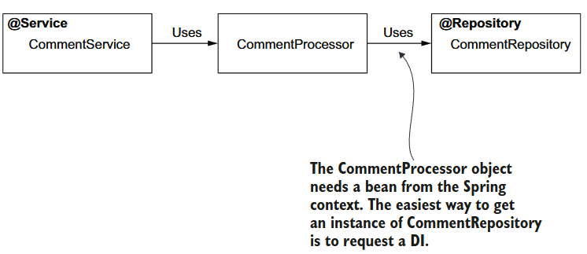

  而在CommentProcessor中获取CommentRepository bean最简单的方式，就是通过Spring的依赖注入。这里CommentProcessor要用到Spring的功能，因此也将其作为bean，加入到Spring容器中。

  这里的CommentProcessor作用域为prototype，因为CommentService需要调用CommentProcessor实例的方法来对comment对象进行处理，如果CommentProcessor是单例的话，则CommentService每次调用sendComment方法的时候，对comment进行处理的都是同一个CommentProcessor实例。这样在多线程的场景下，会存在竞态条件。

  所以，需要保证CommentService每一次调用sendComment方法的时候，处理comment的CommentProcessor实例都是不同的，以避免出现竞态条件。

  ```java
  @Component
  @Scope(BeanDefinition.SCOPE_PROTOTYPE)
  public class CommentProcessor {
      private Comment comment;
  
      @Autowired
      private CommentRepository commentRepository;
  
      public Comment getComment() {
          return comment;
      }
  
      public void setComment(Comment comment) {
          this.comment = comment;
      }
  
      public void processComment() {
          // changing the comment attribute
      }
  
      public void validateComment() {
          // validating and changing the comment attribute
      }
  }
  ```

  那我们的CommentService应该怎么改来注入CommentProcessor呢？

  下面这样吗？

  CommentService是一个单例对象，如果按照下面这样写法，则只会在创建CommentService单例对象的时候，去创建CommentProcessor对象，然后进行注入，后续使用的都是同一个。这和将CommentProcessor设为singleton作用域没有任何区别。

  ```java
  @Service
  public class CommentService {
      // Spring injects this bean when creating
      // the CommentService bean. But because
      // CommentService is singleton, Spring
      // will also create and inject the
      // CommentProcessor just once.
      @Autowired
      private CommentProcessor processor;
      public void sendComment(Comment c) {
          processor.setComment(c);
          // Uses the CommentProcessor instance to alter the Comment instance
          processor.processComment();
          processor.validateComment();
      }
  }
  ```

  正确的做法是注入context对象，然后每一次执行sendComment方法的时候，都context.getBean来获取一个新的CommentProcessor bean，这样就能保证每次执行sendComment方法的时候的bean都是独一份，线程安全的。

  ```java
  @Service
  public class CommentService {
      @Autowired
      private ApplicationContext context;
      public void sendComment(Comment c) {
          CommentProcessor processor = context.getBean(CommentProcessor.class);
          processor.setComment(c);
          // Uses the CommentProcessor instance to alter the Comment instance
          processor.processComment();
          processor.validateComment();
      }
  }
  ```


### 5.1.3 总结

什么时候要用Singleton什么时候用Prototype？

一般来说，如果这个bean是不可变的，则用Singleton；如果这个bean是可变的，则使用prototype来保证线程安全，避免出现竞态条件。

一般会把bean设计为不可变的，如果设计为可变的，需要额外考虑线程安全的问题。


# 6. AOP

## 6.1 AOP是什么

AOP面向切面编程指的是，拦截调用的方法，并且改变方法的执行。

通过AOP，我们可以将一些和业务逻辑无关的代码抽取出来，将其单独配置，使其能够和业务代码逻辑解耦，提高代码的可读性和可维护性。

例如，我们每一个方法中都需要写日志，但是日志和业务逻辑并没有关系，通过切面，我们可以将日志的部分单独提取出来，在其它的地方编写配置，而业务方法中，只保留业务逻辑的代码，以提高代码的可读性和可维护性。


## 6.2 AOP概念

* aspect: *what* code you want Spring to execute when you call specific methods. This is named an aspect.

* advice: *When* the app should execute this logic of the aspect (e.g., before or after the method call, instead of the method call). This is named the advice.

* pointcut: *Which* methods the framework needs to intercept and execute the aspect for them. This is named a pointcut.

* join point: which defines the event that triggers the execution of an aspect. But with Spring, this event is always a method call.

* target object: The bean that declares the method intercepted by an aspect is named the target object.

* proxy project: if you made the object an aspect target object, Spring won’t directly give you an instance reference for the bean when you request it from the context. Instead, Spring gives you an object that calls the aspect logic instead of the actual method. We say that Spring gives you a proxy object instead of the real bean. You will now receive the proxy instead of the bean anytime you get the bean from the context, either if you directly use the getBean() method of the context or if you use DI. This approach is named weaving.

* joint point和point cut的区别：

  * Joinpoints 指的是所有可以进行拦截的点，而point cut是你根据业务需求具体指定的要进行拦截的点。

  * 例如你写了很多方法，这里的所有方法调用都是连接点

    ```java
    public class UserService {
        public void addUser() {}
        public void deleteUser() {}
        public void updateUser() {}
    }
    ```

    如果你这样定义切点表达式，则只有addUser这一个方法调用是切点，表示只对以add开头的方法进行拦截。

    ```java
    @Pointcut("execution(* com.example.UserService.add*(..))")
    public void userAddOperation() {}
    ```


ps：如果我们要对一个对象进行AOP编程，则说明这个对象需要用到Spring提供的功能，则这个对象要被作为bean加入到Spring容器中，Spring才能够管理这个bean，这个bean从而才能使用Spring提供的AOP功能。

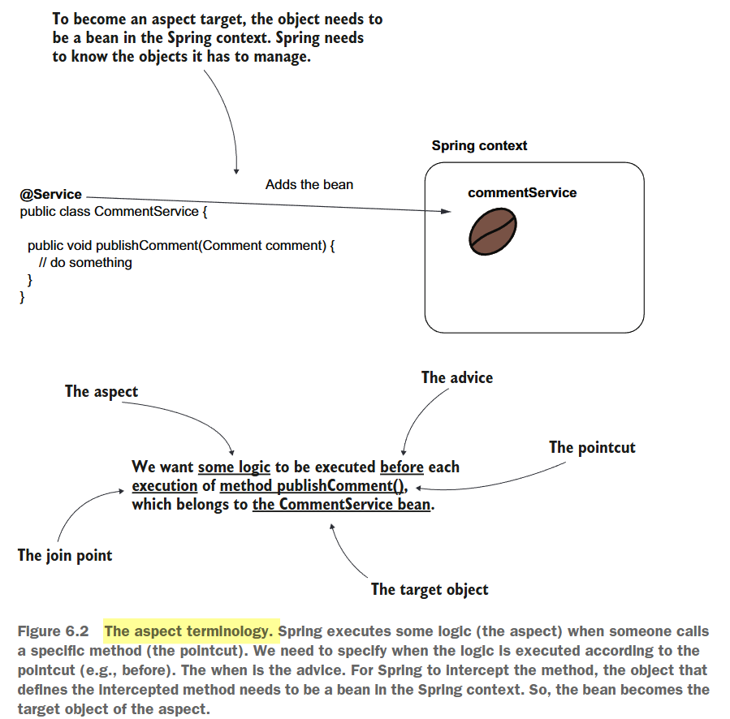

## 6.3 用 vs 不用AOP

不用AOP，我们调用一个对象的方法，是直接调用这个方法本身。

使用AOP，调用一个对象的方法，实际上Spring会调用这个目标对象的proxy对象增强的方法，这个proxy对象的增强方法中，一方面包含增强/切面逻辑，另一方面会再去调用目标对象的方法来完成具体的业务逻辑。

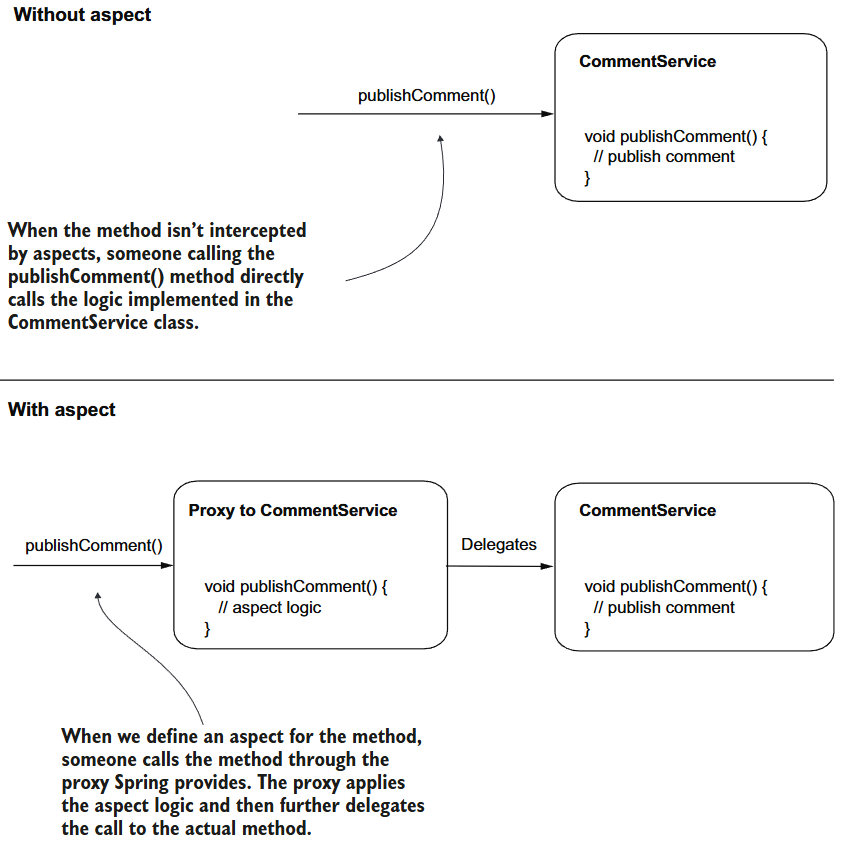

## 6.4 AOP实践

当前的项目是，这个Spring app提供一个发布评论的功能。

先搭建一个项目的架子，然后在此基础上，增加AOP功能。

* 项目代码

  项目结构：

  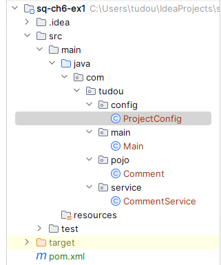

  

  ```xml
  <!--pom依赖-->
  <dependencies>
      <dependency>
          <groupId>org.springframework</groupId>
          <artifactId>spring-context</artifactId>
          <version>5.2.8.RELEASE</version>
      </dependency>
  </dependencies>
  ```

  ```java
  // Comment类
  package com.tudou.pojo;
  
  public class Comment {
      private String text;
      private String author;
  
      // Omitted getters and setters
  }
  ```

  ```java
  // Service类
  package com.tudou.service;
  
  @Service
  public class CommentService {
      //  When declaring a logger object, you need to give it a name as a parameter.
      //  This name then appears in the logs and makes it easy for you to
      //  observe the log message source.
      private Logger logger = Logger.getLogger(CommentService.class.getName());
      public void publishComment(Comment comment) {
          logger.info("Publishing comment:" + comment.getText());
      }
  }
  ```

  ```java
  // 配置类
  package com.tudou.config;
  
  @Configuration
  @ComponentScan(basePackages = "com.tudou")
  public class ProjectConfig {
  }
  ```

  ```java
  // main函数
  public class Main {
      public static void main(String[] args) {
          var c = new AnnotationConfigApplicationContext(ProjectConfig.class);
          var service = c.getBean(CommentService.class);
          Comment comment = new Comment();
          comment.setText("Demo comment");
          comment.setAuthor("Natasha");
          service.publishComment(comment);
      }
  }
  
  // 执行结果
  11月 09, 2025 5:24:49 下午 com.tudou.service.CommentService publishComment
  信息: Publishing comment:Demo comment
  ```


现在有一个新增的需求，需要统计所有方法的执行时长，下面介绍如何用AOP实现。

增加AOP功能，有以下4步：

项目结构

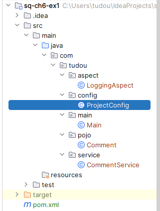

1. 增加AOP依赖

   ```xml
   <dependency>
       <groupId>org.springframework</groupId>
       <artifactId>spring-aspects</artifactId>
       <version>5.2.8.RELEASE</version>
   </dependency>
   ```

2. 在配置类增加 @EnableAspectJAutoProxy注解来开启AOP功能

   ```java
   @Configuration
   @ComponentScan(basePackages = "com.tudou")
   // Enables the aspects mechanism in our Spring app
   @EnableAspectJAutoProxy
   public class ProjectConfig {
   }
   ```

3. 创建一个切面类，增加@Aspect注解，会在该类中定义AOP相关配置

   ```java
   package com.tudou.aspect;
   
   @Aspect
   public class LoggingAspect {
   }
   ```

   ```java
   package com.tudou.aspect;
   
   @Aspect
   public class LoggingAspect {
       private Logger logger = Logger.getLogger(LoggingAspect.class.getName());
   	
       
       // 环绕通知 Defines which are the intercepted methods
       @Around("execution(* com.tudou.service.*.*(..))")
       // the ProceedingJoinPoint parameter, 
       // which represents the intercepted method. 
       // The main thing you do with this parameter is tell the aspect 
       // when it should delegate further to the actual method.
       public void log(ProceedingJoinPoint joinPoint) throws Throwable {
           logger.info("Method will execute");
           // 调用实际被拦截的方法
           // proceed() method throws a Throwable. 
           // The method proceed() is designed to 
           // throw any exception coming from the intercepted method. 
           joinPoint.proceed();
           logger.info("Method executed");
       }
   }
   ```

4. 创建一个LoggingAspect类的Bean

   ```java
   package com.tudou.config;
   
   @Configuration
   @ComponentScan(basePackages = "com.tudou")
   // Enables the aspects mechanism in our Spring app
   @EnableAspectJAutoProxy
   public class ProjectConfig {
       @Bean
       public LoggingAspect aspect() {
           return new LoggingAspect();
       }
   }
   ```

​	

最终执行结果：

```java
// 增强逻辑
11月 09, 2025 5:25:39 下午 com.tudou.aspect.LoggingAspect log
信息: Method will execute
// 调用目标对象方法
11月 09, 2025 5:25:39 下午 com.tudou.service.CommentService publishComment
信息: Publishing comment:Demo comment
// 增强逻辑
11月 09, 2025 5:25:39 下午 com.tudou.aspect.LoggingAspect log
信息: Method executed
```


==注意：==

* 一定要手动创建一个切面类的Bean。

  因为@Aspect这个注解并不会创建对应Bean，这个注解只是用来告诉Spring，这个类中定义了AOP相关配置。

* *execution(\* services.*.*(..))* 这是用于定义切点的表达式

  * 含义

    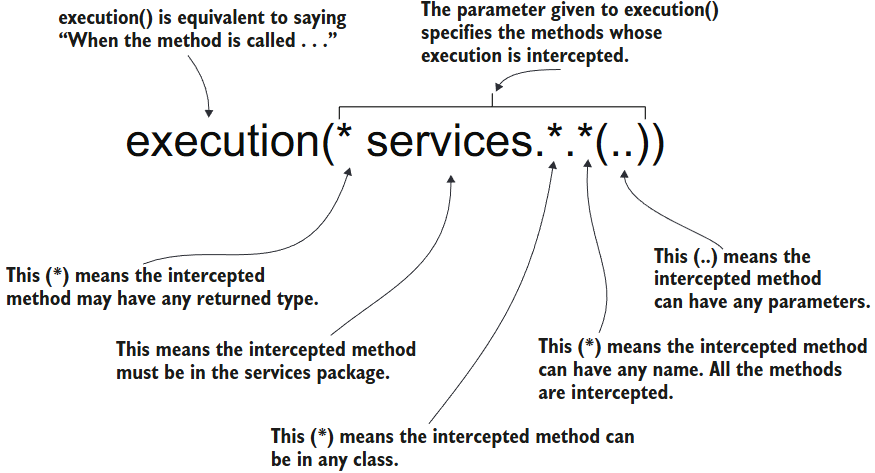

  * 不需要死记硬背，如果要写的时候，直接查询文档即可http://mng.bz/4K9g


## 6.5 获取/修改 拦截的方法的参数和返回值

**获取被拦截的方法的参数和返回值**

```java
// main方法
public class Main {
    private static Logger logger = Logger.getLogger(Main.class.getName());
    public static void main(String[] args) {
        var c = new AnnotationConfigApplicationContext(ProjectConfig.class);
        var service = c.getBean(CommentService.class);
        Comment comment = new Comment();
        comment.setText("Demo comment");
        comment.setAuthor("Natasha");
        String value = service.publishComment(comment);
        logger.info(value);
    }
}
```

```java
// 被拦截的方法
@Service
public class CommentService {
    private Logger logger = Logger.getLogger(CommentService.class.getName());
    public String publishComment(Comment comment) {
        logger.info("Publishing comment:" + comment.getText());
        return "SUCCESS";
    }
}
```

```java
// 切面类
@Aspect
public class LoggingAspect {
    private Logger logger = Logger.getLogger(LoggingAspect.class.getName());

    @Around("execution(* com.tudou.service.*.*(..))")
    public Object log(ProceedingJoinPoint joinPoint) throws Throwable {
        // Obtains the name and parameters of the intercepted method
        String methodName = joinPoint.getSignature().getName();
        Object[] args = joinPoint.getArgs();
        logger.info("Method " + methodName + "with parameters " + Arrays.asList(args) + " will execute");

        // Calls the intercepted method
        Object returnedByMethod = joinPoint.proceed();
        logger.info("Method executed and returned " + returnedByMethod);

        // Returns the value returned by the intercepted method
        return returnedByMethod;
    }
}
```

```java
// 执行结果
11月 10, 2025 11:10:31 上午 com.tudou.aspect.LoggingAspect log
信息: Method publishCommentwith parameters [Comment{text='Demo comment', author='Natasha'}] will execute
11月 10, 2025 11:10:31 上午 com.tudou.service.CommentService publishComment
信息: Publishing comment:Demo comment
11月 10, 2025 11:10:31 上午 com.tudou.aspect.LoggingAspect log
信息: Method executed and returned SUCCESS
11月 10, 2025 11:10:31 上午 com.tudou.main.Main main
信息: SUCCESS
```


**获取被拦截的方法的参数和返回值**

和上面的例子只有切面类有区别

```java
// 切面类
@Aspect
public class LoggingAspect {
    private Logger logger = Logger.getLogger(LoggingAspect.class.getName());

    // Defines which are the intercepted methods
    @Around("execution(* com.tudou.service.*.*(..))")
    public Object log(ProceedingJoinPoint joinPoint) throws Throwable {
        // Obtains the name and parameters of the intercepted method
        String methodName = joinPoint.getSignature().getName();
        Object[] args = joinPoint.getArgs();
        logger.info("Method " + methodName + "with parameters " + Arrays.asList(args) + " will execute");

        // Send a different comment instance as a value to the method’s parameter.
        Comment comment = new Comment();
        comment.setText("Some other text!");
        Object[] newArgs = {comment};

        // Calls the intercepted method
        Object returnedByMethod = joinPoint.proceed(newArgs);
        logger.info("Method executed and returned " + returnedByMethod);

        // Return a different value to the caller.
        return "FAILED";
    }
}
```

```java
// 执行结果
11月 10, 2025 10:53:59 上午 com.tudou.aspect.LoggingAspect log
信息: Method publishCommentwith parameters [Comment{text='Demo comment', author='Natasha'}] will execute
11月 10, 2025 10:53:59 上午 com.tudou.service.CommentService publishComment
信息: Publishing comment:Some other text!
11月 10, 2025 10:53:59 上午 com.tudou.aspect.LoggingAspect log
信息: Method executed and returned SUCCESS
11月 10, 2025 10:53:59 上午 com.tudou.main.Main main
信息: FAILED
```

## 6.6 通过注解指定需要拦截的方法

1. 定义一个自定义注解

   ```java
   // Enables the annotation to be intercepted at runtime
   @Retention(RetentionPolicy.RUNTIME)
   // Restricts this annotation to only be used with methods
   @Target(ElementType.METHOD)
   public @interface ToLog {
   }
   ```

2. 在需要拦截的方法上增加这个注解

   ```java
   package com.tudou.service;
   
   @Service
   public class CommentService {
       private Logger logger = Logger.getLogger(CommentService.class.getName());
       public void publishComment(Comment comment) {
           logger.info("Publishing comment:" + comment.getText());
       }
   	
       // 需要拦截的方法
       @ToLog
       public void deleteComment(Comment comment) {
           logger.info("Deleting comment:" + comment.getText());
       }
   
       public void editComment(Comment comment) {
           logger.info("Editing comment:" + comment.getText());
       }
   }
   ```

3. 定义Aspect表达式

   ```java
   package com.tudou.aspect;
   
   @Aspect
   public class LoggingAspect {
       private Logger logger = Logger.getLogger(LoggingAspect.class.getName());
   
       // 这里的Aspect表达式代表包含ToLog注解的方法
       @Around("@annotation(com.tudou.annotation.ToLog))")
       public Object log(ProceedingJoinPoint joinPoint) throws Throwable {
           // Obtains the name and parameters of the intercepted method
           String methodName = joinPoint.getSignature().getName();
           Object[] args = joinPoint.getArgs();
           logger.info("Method " + methodName + "with parameters " + Arrays.asList(args) + " will execute");
   
           // Calls the intercepted method
           Object returnedByMethod = joinPoint.proceed();
           logger.info("Method executed and returned " + returnedByMethod);
   
           return returnedByMethod;
       }
   }
   
   ```

4. main方法

   ```java
   public class Main {
       private static Logger logger = Logger.getLogger(Main.class.getName());
       public static void main(String[] args) {
           var c = new AnnotationConfigApplicationContext(ProjectConfig.class);
           var service = c.getBean(CommentService.class);
           Comment comment = new Comment();
           comment.setText("Demo comment");
           comment.setAuthor("Natasha");
           service.publishComment(comment);
           service.deleteComment(comment);
           service.editComment(comment);
       }
   }
   ```

   ```java
   // 执行结果
   // publishComment方法执行
   11月 10, 2025 12:12:15 下午 com.tudou.service.CommentService publishComment
   信息: Publishing comment:Demo comment
   // deleteComment方法执行 被增强
   11月 10, 2025 12:12:15 下午 com.tudou.aspect.LoggingAspect log
   信息: Method deleteCommentwith parameters [Comment{text='Demo comment', author='Natasha'}] will execute
   11月 10, 2025 12:12:15 下午 com.tudou.service.CommentService deleteComment
   信息: Deleting comment:Demo comment
   11月 10, 2025 12:12:15 下午 com.tudou.aspect.LoggingAspect log
   信息: Method executed and returned null
   // editComment方法执行
   11月 10, 2025 12:12:15 下午 com.tudou.service.CommentService editComment
   信息: Editing comment:Demo comment
   ```

   

==注意：==

* `@Retention(RetentionPolicy.RUNTIME)`这是什么意思？

  * @Retention是用于修饰注解的注解，也就是说，通过@Retention，我们可以对@ToLog注解进行配置。

    `RetentionPolicy.RUNTIME`就是对@ToLog注解的保留策略进行配置。

  * RetentionPolicy代表注解的保留策略

    | RetentionPolicy 值 | 生命周期阶段                             | 能否在运行时通过反射读取？ | 常见用途                                                     |
    | ------------------ | ---------------------------------------- | -------------------------- | ------------------------------------------------------------ |
    | **SOURCE**         | 只存在于源码中，编译后就丢弃             | ❌ 否                       | 编译检查（例如 `@Override`）                                 |
    | **CLASS**          | 编译进 `.class` 文件，但运行时被丢弃     | ❌ 否                       | 框架很少直接用（默认值）                                     |
    | **RUNTIME**        | 编译进 `.class` 文件，并在运行时依然存在 | ✅ 是                       | 需要在运行时通过反射/AOP 处理的注解，如 `@Autowired`、`@Transactional`、`@RequestMapping` |

    简单来说，`RetentionPolicy.RUNTIME`表示运行时注解依然保留，而其他两种保留策略运行时不会保留注解。

    而AOP通过注解实现，是Spring在运行时通过反射获取方法的注解，然后对持有@ToLog注解的方法进行拦截。

    只有`RetentionPolicy.RUNTIME`这种保留策略才能保证Spring运行时还能够看到方法的@ToLog注解，以对对应的方法进行增强。

    总结一句话：

    `@Retention(RetentionPolicy.RUNTIME)`：告诉 JVM“请在运行时也保留这个注解的信息，让反射或 AOP 能看见它”。

* `@Around("@annotation(com.tudou.annotation.ToLog))")`这里的注解名称一定要写全限定名，如果写成`@Around("@annotation(ToLog))")`，Spring会报下面的异常

  11月 10, 2025 12:14:17 下午 org.springframework.context.support.AbstractApplicationContext refresh
  警告: Exception encountered during context initialization - cancelling refresh attempt: org.springframework.beans.factory.BeanCreationException: Error creating bean with name 'projectConfig': Initialization of bean failed; nested exception is java.lang.IllegalArgumentException: **error Type referred to is not an annotation type: ToLog**

## 6.7 通知注解

* @Around：在目标方法执行前/后都可以进行增强
* @Before：在目标方法执行前进行增强
* @AfterReturning：calls the method defining the aspect logic after the method successfully returns, and provides the returned value as a parameter to the aspect method. *The aspect method isn’t called if the intercepted method throws an exception.*
* @AfterThrowing：Calls the method defining the aspect logic if the intercepted
  method throws an exception, and provides the exception instance as a parame-
  ter to the aspect method.
* @After：Calls the method defining the aspect logic only after the intercepted method execution, whether the method successfully returned or threw an exception.


注意：

* 只有@Around注解的增强方法拥有ProceedingJoinPoint参数，用于决定何时调用目标方法。拥有其他通知注解的方法没有该参数，因为根据它们的语义，它们无法控制目标方法什么时候被调用。


示例：

```java
// @AfterReturning通知注解的使用示例
@Aspect
public class LoggingAspect {
    private Logger logger = Logger.getLogger(LoggingAspect.class.getName());

    // returning 属性指定log方法声明中用于接收目标方法执行结果的参数的参数名
    @AfterReturning(value = "@annotation(com.tudou.annotation.ToLog)", returning = "returnedValue")
    public void log(Object returnedValue) {
        logger.info("Method executed and returned " + returnedValue);
    }
}
```

```java
// 执行结果
// publishComment方法执行
11月 10, 2025 4:43:59 下午 com.tudou.service.CommentService publishComment
信息: Publishing comment:Demo comment
// deleteComment方法执行
11月 10, 2025 4:43:59 下午 com.tudou.service.CommentService deleteComment
信息: Deleting comment:Demo comment
// deleteComment方法被增强
11月 10, 2025 4:43:59 下午 com.tudou.aspect.LoggingAspect log
信息: Method executed and returned null
// editComment方法执行
11月 10, 2025 4:43:59 下午 com.tudou.service.CommentService editComment
信息: Editing comment:Demo comment
```


## 6.8 切面执行链

### 6.8.1 切面执行顺序

如果有多个切面，那这多个切面的执行顺序是怎样的？

假设当前app需要实现两个切面：

* SecurityAspect：对所有的请求先进行权限校验，当通过校验才放行执行业务逻辑
* LoggingAspect：对所有的请求进行拦截，对请求的开始和结束都需要打日志

如果我们指定先执行SecurityAspect切面，则对于那些权限校验没有通过的请求，不会再把请求委托给LoggingAspect切面，则这部分请求不会被打日志，这并不符合我们的要求。我们对LoggingAspect的要求是，对于所有请求都要进行打日志。

所以，我们必须要指定先执行LoggingAspect切面，这会对所有请求都打日志，之后再将请求委托给SecurityAspect切面继续执行，如果权限校验没有通过，则不会调用业务逻辑代码。

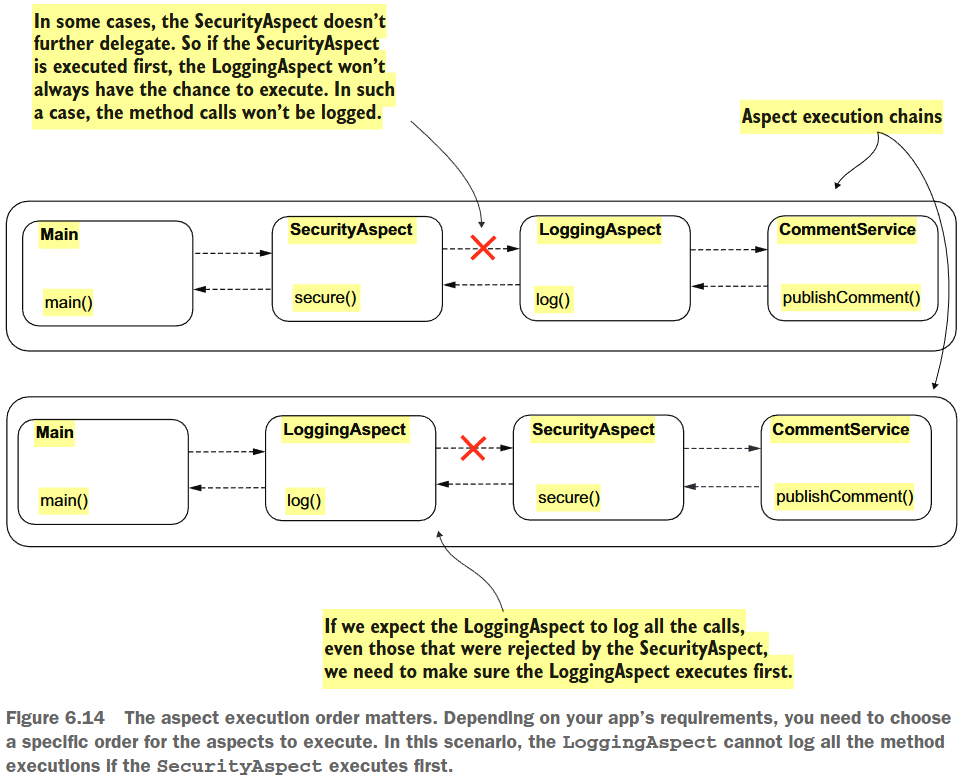

### 6.8.2 如何指定切面执行的先后顺序

* 默认场景下，如果不进行显式指定，切面的执行顺序是随机的，Spring doesn’t guarantee the order in which two aspects in the same execution chain are called. 如果业务中对切面的顺序没有要求，则无需显式指定顺序
* 如果要显式指定顺序，则可以在切面类上使用@Order注解，接受一个序号数为参数，值越小，优先级越高。

示例：

```java
// LoggingAspect切面类
package com.tudou.aspect;

@Aspect
@Order(1)  // 指定顺序
public class LoggingAspect {
    private Logger logger = Logger.getLogger(LoggingAspect.class.getName());

    @Around(value = "@annotation(com.tudou.annotation.ToLog)")
    public Object log(ProceedingJoinPoint joinPoint) throws Throwable {
        logger.info("Logging Aspect: Calling the intercepted method");
        // The proceed() method here delegates further in the aspect execution chain. \
        // It can either call the next aspect or the intercepted method.
        Object returnedValue = joinPoint.proceed();
        logger.info("Logging Aspect: Method executed and returned " + returnedValue);
        return returnedValue;
    }
}
```

```java
// SecurityAspect切面类
package com.tudou.aspect;

@Aspect
@Order(2)  // 指定顺序
public class SecurityAspect {
    private Logger logger = Logger.getLogger(SecurityAspect.class.getName());

    @Around(value = "@annotation(com.tudou.annotation.ToLog)")
    public Object secure(ProceedingJoinPoint joinPoint) throws Throwable {
        logger.info("Security Aspect: Calling the intercepted method");
        Object returnedValue = joinPoint.proceed();
        logger.info("Security Aspect: Method executed and returned " + returnedValue);
        return returnedValue;
    }
}

```

```java
// 被增强的Service类
@Service
public class CommentService {
    private Logger logger = Logger.getLogger(CommentService.class.getName());
    @ToLog
    public String publishComment(Comment comment) {
        logger.info("Publishing comment:" + comment.getText());
        return "SUCCESS";
    }
}
```

```java
// main方法
public class Main {
    private static Logger logger = Logger.getLogger(Main.class.getName());
    public static void main(String[] args) {
        var c = new AnnotationConfigApplicationContext(ProjectConfig.class);
        var service = c.getBean(CommentService.class);
        Comment comment = new Comment();
        comment.setText("Demo comment");
        comment.setAuthor("Natasha");
        service.publishComment(comment);
    }
}
```

```java
// LoggingAspect切面逻辑优先执行
11月 10, 2025 8:12:52 下午 com.tudou.aspect.LoggingAspect log
信息: Logging Aspect: Calling the intercepted method
// SecurityAspect切面逻辑第二执行
11月 10, 2025 8:12:52 下午 com.tudou.aspect.SecurityAspect secure
信息: Security Aspect: Calling the intercepted method
// 调用目标方法
11月 10, 2025 8:12:52 下午 com.tudou.service.CommentService publishComment
信息: Publishing comment:Demo comment
// 目标方法结果返回给SecurityAspect
11月 10, 2025 8:12:52 下午 com.tudou.aspect.SecurityAspect secure
信息: Security Aspect: Method executed and returned SUCCESS
// SecurityAspect结果返回给LoggingAspect
11月 10, 2025 8:12:52 下午 com.tudou.aspect.LoggingAspect log
信息: Logging Aspect: Method executed and returned SUCCESS
```

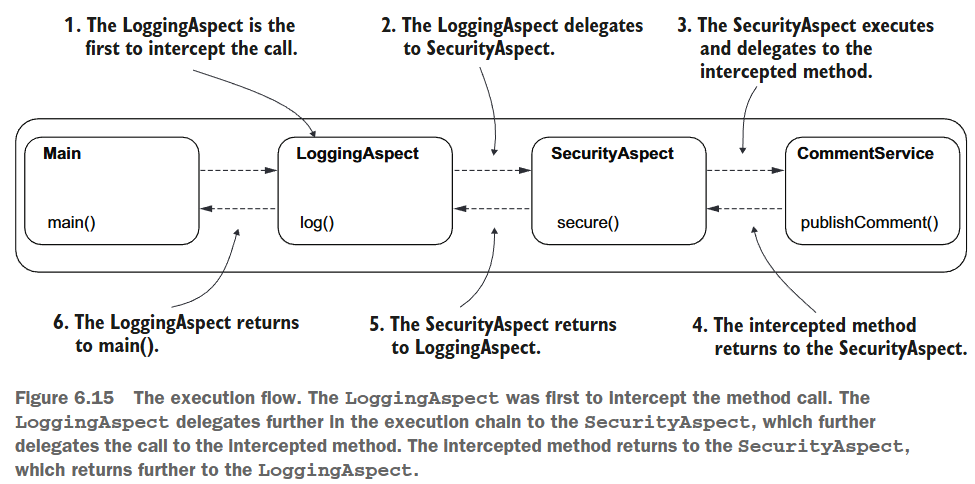


==注意：==

* 如果使用`@Around`环绕通知，方法可以接受一个`ProceedingJoinPoint`类型的参数（假设参数名为`joinPoint`），这里`joinPoint.proceed();`并不完全代表调用目标方法，而是代表调用执行链的下一个方法，可以是下一个切面，可以是目标方法。

  假设有两个切面`LoggingAspect`（order=1）、`SecurityAspect`（order=2），且都是用环绕通知。我们首先调用`LoggingAspect`，第二调用`SecurityAspect`切面，则在`LoggingAspect`切面的增强方法中调用`joinPoint.proceed();`是表示调用`SecurityAspect`切面的增强方法。在`SecurityAspect`切面中的增强方法中调用`joinPoint.proceed();`是表示调用目标方法。简而言之，就是表示调用执行链的下一个方法。

# 7. SpringBoot & Spring MVC

## 7.1 web app是什么

**是什么：**

通过浏览器访问的应用就是web app。

以前，人们使用各种应用都需要下载对应的软件，现在，通过浏览器就可以看youtube、听音乐、玩游戏，不需要再下载软件，非常方便，这些通过浏览器就可以访问的应用就是web app。

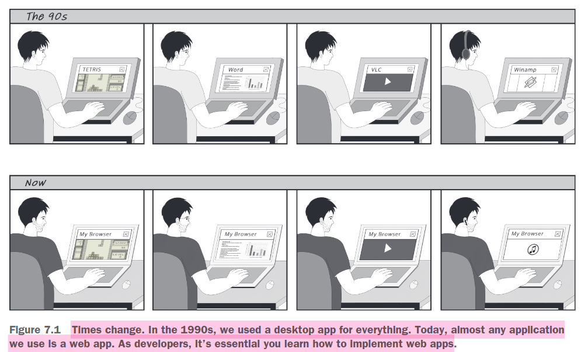


**big picture of a web app:**

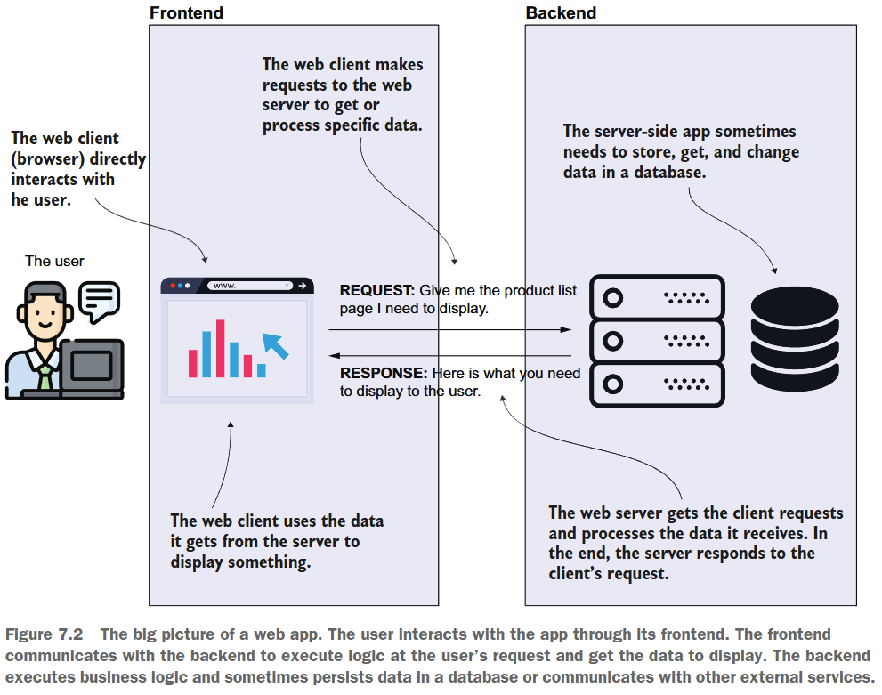

注意：the backend serves multiple clients concurrently，因此后端需要考虑竞态条件问题。

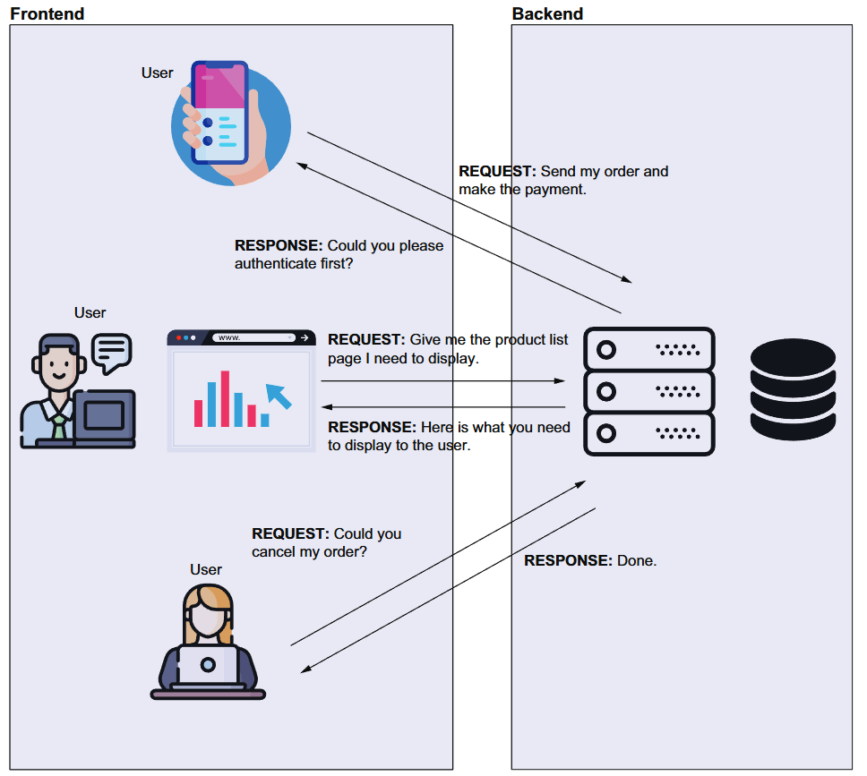

## 7.2 前后端不分离 vs 前后端分离

实现一个web app有多种方式：

* 前后端不分离：浏览器获取到后端传来的数据直接展示给用户。

  后端会返回浏览器能够展示的数据类型，例如HTML、CSS、JS...

  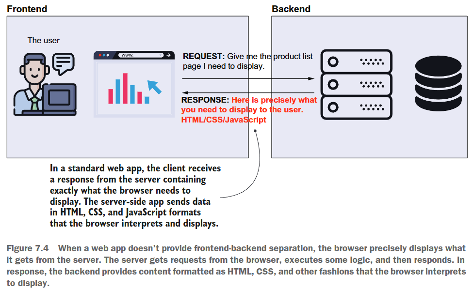

* 前后端分离：后端只提供要展示的raw data，前端会对raw data进行处理、渲染，浏览器会将前端处理后的数据展示给用户。

  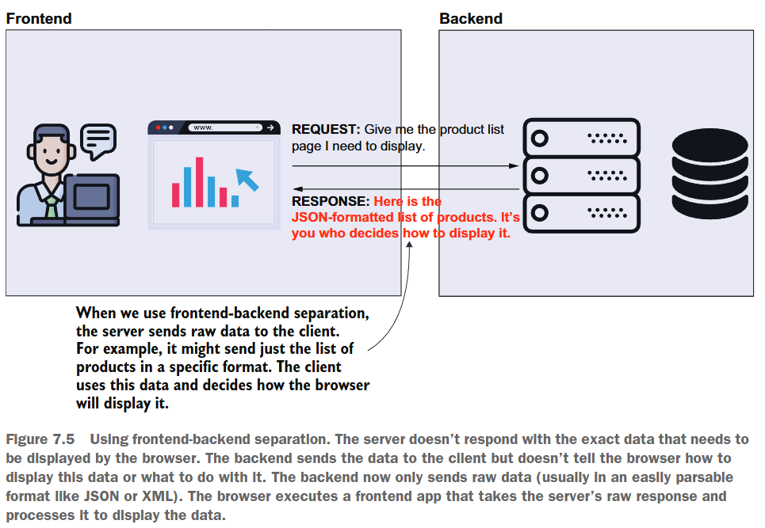

## 7.3 Servlet

**servlet container是什么：**

一句话解释：servlet container(e.g., Tomcat): software with the capability to translate HTTP requests and responses to the Java app. 

在web-app中，有client和server两个角色，client和server通过HTTP协议进行通信。

那我们在开发web-app应用的时候，需要考虑如何将HTTP协议请求、响应转化为Java应用能够理解的对象。

servlet container可以理解为一个翻译器，用以将HTTP messages翻译为Java应用能够理解的对象。这样的话，我们的web-app本身不用再关心如何进行HTTP messages和Java对象的转换、翻译，而只需要关注我们业务逻辑本身。

Tomcat是One of the most appreciated servlet container，除了Tomcat之外，还有其他替代品例如Jetty、JBoss、Payara等。

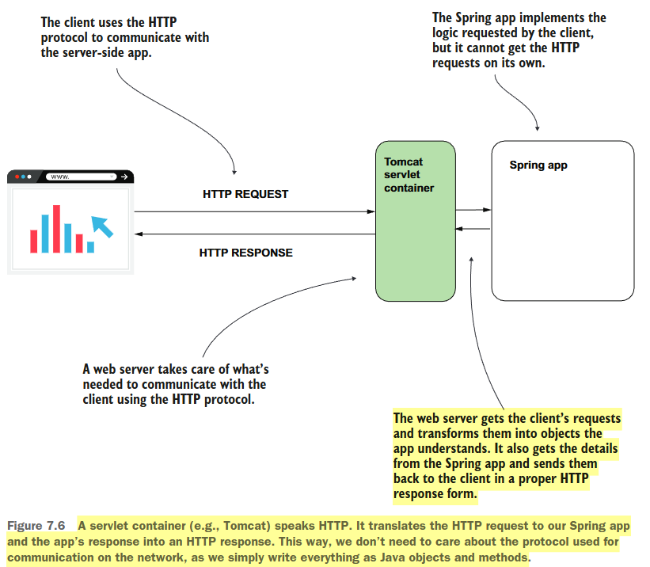

自己的话：tomcat是servlet container的一种，它的作用就是将http请求翻译成Java对象，让web app开发者不用关注如何处理http格式的请求。将响应内容翻译成http响应，开发者也无需关注如何将请求封装成http格式的响应。简单来说，他就是做了一层抽象，让web app开发者无需关注网络传输协议是什么，而只需要关注实现自己的业务逻辑，其中具体的转化，交给tomcat来实现。除此之外，servlet container还能够管理servlet，一个servlet container中包含多个servlet，servlet container管理这些servlet，并在请求到达的时候，确定调用哪一个servlet的方法。

**servlet是什么：**

servlet是一个Java对象，能够直接和servlet container交互。当servlet container接收到一个HTTP请求，它会调用某一个servlet对象的方法，并将请求作为方法的参数request传入。该方法也有一个响应对象参数，开发者通过这个response对象可以设置返回给client的内容。

浏览器 → HTTP 请求 → **Tomcat（Servlet 容器）**
 Tomcat: 解析请求 → 调用 Servlet 方法 → 传入 req & resp
 Servlet：读取 req → 处理逻辑 → 写入 resp
 Tomcat：发送 HTTP 响应 → 浏览器


**当servlet container接受到一个请求，它如何决定调用哪一个servlet对象的方法？**

当我们创建一个servlet的时候，需要将这个servlet和一个路径绑定在一起。当servlet接受到一个请求的时候，会根据请求的路径，找到对应的servlet，调用对应的servlet对象的方法。The servlet contained the logic associated with the user’s request and the ability to prepare a response. servlet is the entry point to your app’s logic. 

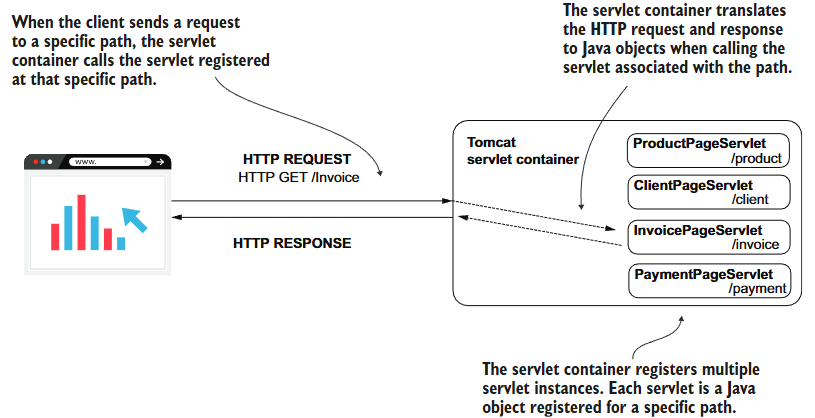

## 7.4 SpringBoot

Spring Boot 是 Spring 的快速开发脚手架，目的是让你无需繁琐配置就能快速构建 Spring 应用。

SpringBoot提供了很多功能，使得我们创建web app的过程能够大大简化，让开发者能够做到最大程度只需关注业务逻辑开发。

Spring Boot提供的主要功能：

* Simplified project creation—You can use a project initialization service to get an empty but configured skeleton app.
* Dependency starters—Spring Boot groups certain dependencies used for a specific purpose with dependency starters. You don’t need to figure out all the must-have dependencies you need to add to your project for one particular purpose nor which versions you should use for compatibility.
* Autoconfiguration based on dependencies—Based on the dependencies you added to your project, Spring Boot defines some default configurations. Instead of writing all the configurations yourself, you only need to change the ones provided by Spring Boot that don’t match what you need. Changing the configs likely requires less code (if any).

### 7.4.1 如何创建一个SpringBoot项目

有两种方式：

1. 有一些ide中，集成了SpringBoot project initializer，通过这个initializer就可以直接创建SpringBoot项目。

   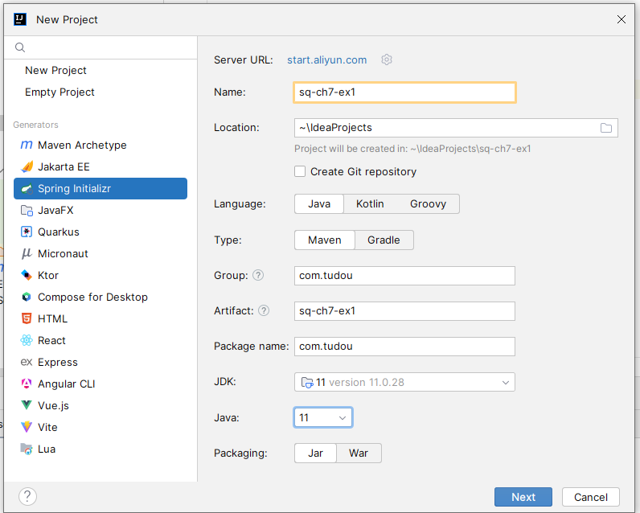

2. 如果ide中没有集成SpringBoot project initializer，可以通过`http://start.spring.io`网站来创建SpringBoot初始项目。

   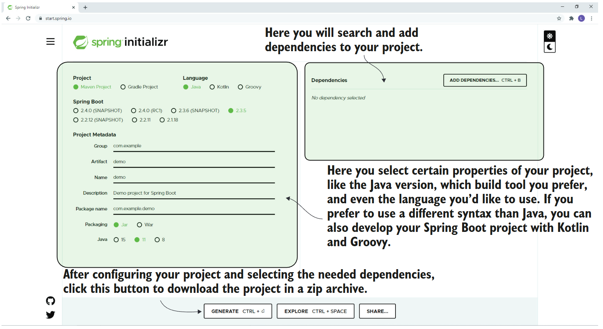

   点击generate之后，会得到Spring Boot project的压缩文件，解压之后就可以将其导入ide中。

### 7.4.2 新SpringBoot项目的构成

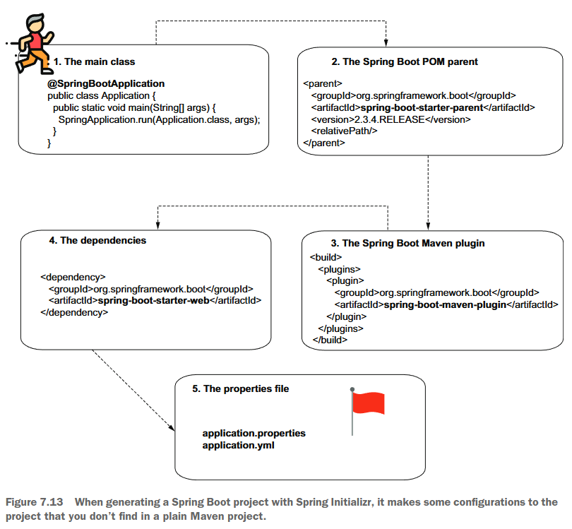

* The Spring app main class

  SpringBoot项目的main class是拥有@SpringBootApplication注解的class

  ```java
  @SpringBootApplication  // This annotation defines the Main class of a Spring Boot app.
  public class Main {
  
      public static void main(String[] args) {
          SpringApplication.run(Main.class, args);
      }
  
  }
  ```

* The Spring Boot POM.xml

  下面的POM文件是新建的SpringBoot项目默认的pom文件，可以看到SpringBoot已经根据我们在Spring initializer勾选的信息帮我们做了很多配置工作，让开发者可以专注于业务逻辑开发。

  * 通过BOM (Bill Of Materials)，SpringBoot提供的版本管理清单。即SpringBoot会提供所有依赖的版本，开发者无需再手动指定版本号，以保证依赖之间版本的可兼容性。【书中的图是pom parent，而新版本的Spring中已经使用BOM替代原方案，因此这里的介绍是基于BOM】
  * 插件
  * provided dependency.这是因为在创建SpringBoot项目的时候，选中了Spring-web依赖，则SpringBoot会自动帮你将web应用需要使用到的依赖导入到SpringBoot中。

  ```xml
  <?xml version="1.0" encoding="UTF-8"?>
  <project xmlns="http://maven.apache.org/POM/4.0.0" xmlns:xsi="http://www.w3.org/2001/XMLSchema-instance"
           xsi:schemaLocation="http://maven.apache.org/POM/4.0.0 https://maven.apache.org/xsd/maven-4.0.0.xsd">
      <!--基本项目信息-->
      <modelVersion>4.0.0</modelVersion>
      <groupId>com.tudou</groupId>  <!--公司/组织的反向域名-->
      <artifactId>sq-ch7-ex1</artifactId>  <!--项目名称-->
      <version>0.0.1-SNAPSHOT</version>  <!--版本号-->
      <name>sq-ch7-ex1</name>
      <description>sq-ch7-ex1</description>
      <!--项目配置 & 全局变量-->
      <properties>
          <java.version>11</java.version>
          <project.build.sourceEncoding>UTF-8</project.build.sourceEncoding>
          <project.reporting.outputEncoding>UTF-8</project.reporting.outputEncoding>
          <spring-boot.version>2.6.13</spring-boot.version>
      </properties>
      <!--项目真正用到的依赖-->
      <dependencies>
          <dependency>
              <groupId>org.springframework.boot</groupId>
              <artifactId>spring-boot-starter-web</artifactId>
          </dependency>
  
          <dependency>
              <groupId>org.springframework.boot</groupId>
              <artifactId>spring-boot-starter-test</artifactId>
              <scope>test</scope> <!--表示仅用于测试，不会打包进入最终的jar-->
          </dependency>
      </dependencies>
      <!--依赖版本统一管理-->
      <!--dependencyManagement不会引入任何依赖，只负责告诉Maven:如果你的依赖列表有某个库，你又没写版本号，就按照我提供的这个版本来。-->
      <dependencyManagement>
          <dependencies>
              <!--BOM-->
              <!--org.springframework.boot:spring-boot-dependencies内部为SpringBoot生态中的所有依赖统一指定了版本号。则开发者无需自己指定版本号，保证所有依赖之间的版本能够兼容。-->
              <dependency>
                  <groupId>org.springframework.boot</groupId>
                  <artifactId>spring-boot-dependencies</artifactId>
                  <version>${spring-boot.version}</version>
                  <type>pom</type>
                  <scope>import</scope>
              </dependency>
          </dependencies>
      </dependencyManagement>
      <!--插件-->
      <build>
          <plugins>
              <plugin>
                  <groupId>org.apache.maven.plugins</groupId>
                  <artifactId>maven-compiler-plugin</artifactId>  <!--用于编译Java-->
                  <version>3.8.1</version>
                  <configuration>
                      <source>11</source>
                      <target>11</target>
                      <encoding>UTF-8</encoding>
                  </configuration>
              </plugin>
              <plugin>
                  <groupId>org.springframework.boot</groupId>
                  <artifactId>spring-boot-maven-plugin</artifactId>  <!--用于将SpringBoot项目打包成可执行jar-->
                  <version>${spring-boot.version}</version>
                  <configuration>
                      <mainClass>com.tudou.SqCh7Ex1Application</mainClass>
                      <skip>true</skip>
                  </configuration>
                  <executions>
                      <execution>
                          <id>repackage</id>
                          <goals>
                              <goal>repackage</goal>
                          </goals>
                      </execution>
                  </executions>
              </plugin>
          </plugins>
      </build>
  
  </project>
  ```

* The properties file: application.properties文件在resources目录下，该文件为配置文件。

### 7.4.3 dependency starter

* dependency starter是一个依赖，这个依赖中包含了你要实现某个目的所涉及的一组依赖。例如如果你的app中需要实现web功能，以前，你需要自己手动添加web功能所涉及的所有依赖，并且保证这些所有依赖版本的兼容性。如果我们导入spring-boot-starter-web依赖，这个依赖内部包含了所有要实现web功能所涉及的依赖，并且保证了这些所有依赖的版本的可兼容性。大大减少开发者的工作量。

  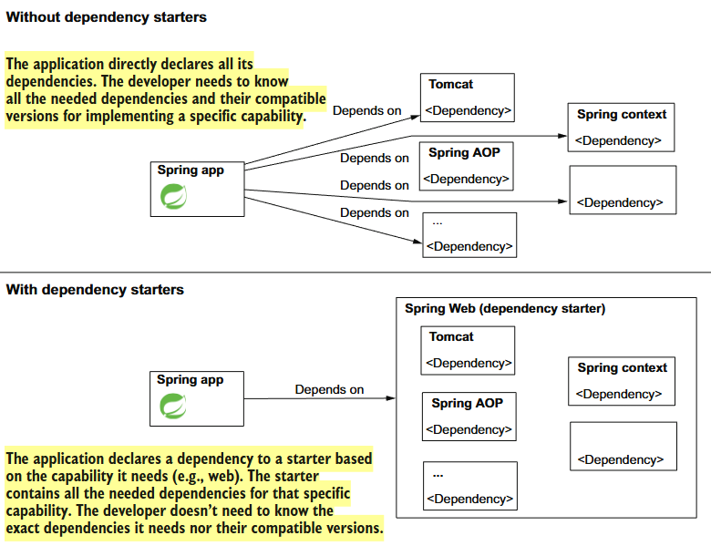

* starter通常被命名为spring-boot-starter-xxx，例如spring-boot-starter-web

### 7.4.4 convention-over-configuration principle

一些约定俗成的配置，会被SpringBoot设为默认配置，开发者无需再手动配置。只有当自定义的和默认配置不同的，才需要显式配置。


例如，如果我们增加了`spring-boot-starter-web`依赖，启动项目，可以看到这一行在console中。

我们没有进行任何配置，就启动了tomcat容器，并且是在8080端口启动。

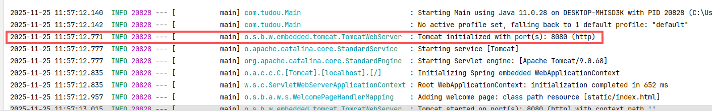

这是因为，这是web开发中最常用的配置，SpringBoot会帮我们按照最常用的配置设置默认配置。这样，我们只需要针对那些需要个性化配置的配置进行配置，其他的使用默认配置即可。这样大大减少了我们需要编写的配置代码。

## 7.5 SpringMVC

### 7.5.1 SpringMVC开发示例

1. 在resources/static增加一个home.html页面【 This folder is the default place where the Spring Boot app expects to find the pages to render.】

   ```html
   <!DOCTYPE html>
   <html lang="en">
   <head>
       <meta charset="UTF-8">
       <title>Home Page</title>
   </head>
   <body>
   <h1>Welcome!</h1>
   </body>
   </html>
   ```

   

2. 编写一个Controller【The controller is a component of the web app that contains methods (often named actions) executed for a specific HTTP request. In the end, the controller’s action returns a reference to the web page the app returns in response. 】

   * 如果希望用户访问/home路径的时候，执行某个方法，则需要在方法上增加@RequestMapping("/home")注解
   * 方法需要返回一个字符串，该字符串对应你希望用户访问的页面的名称

   ```java
   @Controller
   public class MainController {
       // We use the @RequestMapping annotation to
       // associate the action with an HTTP request path.
       @RequestMapping("/home")
       public String home() {
           // We return the HTML document name that contains
           // the details we want the browser to display.
           return "home.html";
       }
   }
   ```

3. 结果验证

   

### 7.5.2 SpringMVC architecture


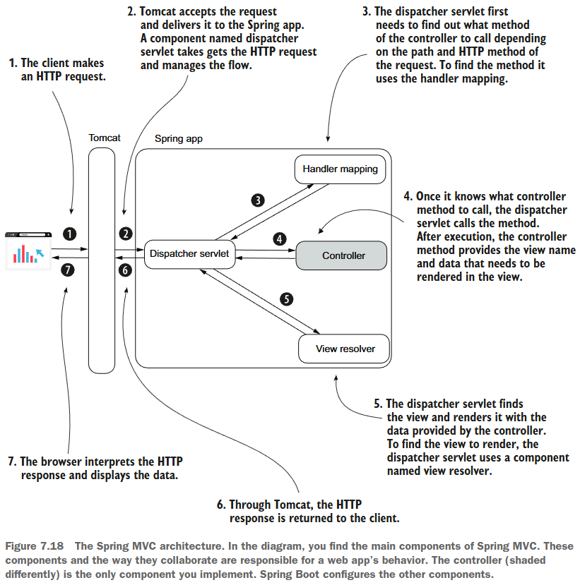


==注意：==

* 在前面介绍servlet的时候，是这样说的【当我们创建一个servlet的时候，需要将这个servlet和一个路径绑定在一起。当servlet接受到一个请求的时候，会根据请求的路径，找到对应的servlet，调用对应的servlet对象的方法。】

  为什么在SpringMVC中，只有一个servlet（Dispatcher Servlet）来处理所有请求，然后再分发给对应的Controller呢？

  答：在原始的Java web模式下，确实每一个路径和一个Servlet绑定。请求到达web server（tomcat）之后，tomcat会根据URL找到对应的servlet，并调用对应的方法。

  在SpringMVC模式中，只有一个servlet，就是Dispatcher Servlet，来处理所有请求。实际上，他是拦截一个大范围的URL，在SpringBoot自动配置中，默认为`<url-pattern>/</url-pattern>`，表示默认匹配所有路径。

  则访问所有路径的请求都会被Dispatcher Servlet拦截，然后Dispatcher Servlet会根据根据后续路径（e.g. /home）找到匹配的Controller，来调用对应的Controller方法。

  这里的Dispatcher Servlet就是一个前端控制器。

  它的好处在于：

  * 实现统一入口
  * 支持拦截器、过滤器、AOP
  * 支持统一异常管理
  * ...

  自己的理解：

  基于Java web的时候，相当于每一个路径的请求都有一个处理员。（每个 URL 对应一个处理员（Servlet）。 请求来 → Tomcat 根据路径找到对应的 Servlet → 调用它处理。）

  而SpringMVC的场景下，所有的请求都被一个前置处理员处理，再由前置处理员根据注册表来分发给后续的哪一个处理员处理，这里的注册表就是记录路径和对应处理员的关系（例如/user交给处理员Bob处理，/home交给处理员Alice处理）。这样的好处在于，有一个前置处理员，我们可以对所有的请求执行统一的入口处理，可以实现拦截器、AOP、统一异常管理、同一JSON转换等等。

* 可以看到，整个SpringMVC流程图，只有Controller（图中颜色加深部分）是需要开发者自己写的，其他都是Spring底层已经实现好的。
* Spring & SpringMVC & SpringBoot的关系是什么
  * Spring是一个提供IOC、AOP能力的框架
  * SpringMVC是基于Spring实现的Web应用框架，即SpringMVC是专门用来做Web应用的
  * SpringBoot是对Spring/SpringMVC的封装，使它们能够更容易使用，目的是提升开发体验

# 8. Implementing web apps with Spring Boot and Spring MVC

## 8.1 如何实现动态页面

在ch7中，我们学会了如何创建一个静态页面：1. 在resources/static目录下增加一个静态html页面 2. 新增一个Controller，在Controller中增添一个方法，用@RequestMapping注解标识方法和路径的映射关系，在方法返回html页面的名称例如home.html。


SpringMVC的底层执行逻辑如图：

1. The client sends an HTTP request to the web server.
2. The dispatcher servlet uses the handler mapping to find out what controller action to call.
3. The dispatcher servlet calls the controller’s action.
4. After executing the action associated with the HTTP request, the controller returns the view name the dispatcher servlet needs to render into the HTTP response.
5. The response is sent back to the client.

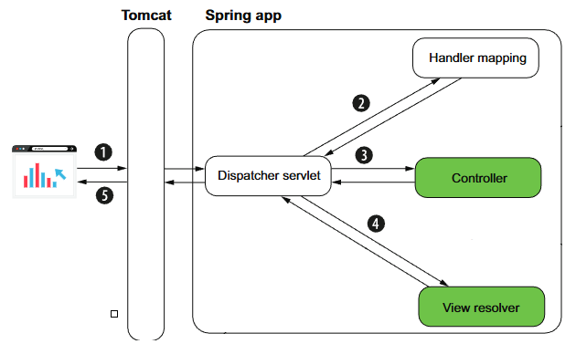

上面介绍的是如何实现静态页面，那如果我要实现动态页面呢？

例如manning.com/cart这个页面，用于显式用户的购物车。那这个页面显式的内容必须要根据每个用户的购物车展示不同的内容，那如何实现呢？

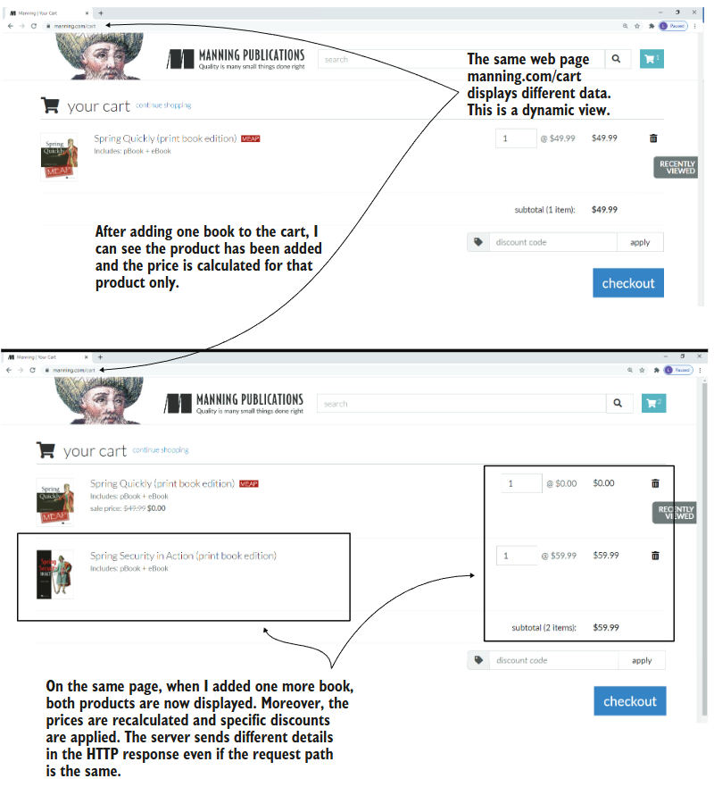

下面介绍如何用Thymeleaf模板引擎实现：

*模板引擎是什么： The template engine is a dependency that allows us to easily send data from the controller to the view and display this data in a specific way. Thymeleaf只是其中一种，比较简单易学的一种。*

1. 增加Thymeleaf依赖

   ```xml
   <!--The dependency starter that needs to be added to use Thymeleaf as a template engine-->
   <dependency>
       <groupId>org.springframework.boot</groupId>
       <artifactId>spring-boot-starter-thymeleaf</artifactId>
   </dependency>
   ```

2. 在Controller方法中，增加Model入参。

   Model用于存储要发送给view的数据。通过key-value方式存储。

   通过Model.addAttribute()方法能够往model中添加数据。

   ```java
   @Controller
   public class MainController {
       @RequestMapping("/home")
       // The action method defines a parameter of type Model that
       // stores the data the controller sends to the view.
       public String home(Model page) {
           // We add the data we want the controller to send to the view.
           page.addAttribute("username", "Katy");
           page.addAttribute("color", "red");
   
           // The controller’s action returns the view to be rendered into the HTTP response
           return "home.html";
       }
   }
   ```

3. 往`resources/templates`文件夹中增加html页面

   ```html
   <!DOCTYPE html>
   <html lang="en" xmlns:th="http://www.thymeleaf.org">
   <head>
       <meta charset="UTF-8">
       <title>Home Page</title>
   </head>
   <body>
   <h1>Welcome
       <span th:style="'color:' + ${color}"
             th:text="${username}"></span>!</h1>
   </body>
   </html>
   ```

   * 在ch7中，我们是在`resources/static`目录下增加html页面，我们增加的是静态页面。

     这里我们需要模板引擎帮我们渲染动态页面，因此要把html页面加入到`resources/templates`目录下。

   * `xmlns:th="http://www.thymeleaf.org"` This definition is equivalent to an import in Java. It allows us further to use the prefix “th” to refer to specific features provided by Thymeleaf in the view.

   * 通过`${attribute_key}`可以获取Controller往Model中添加的key-value的v值。例如`${username}`获取到的就是`Katy`

4. 执行结果

   

   

==注意：==

* Thymeleaf和react和vue的区别？

  答：thymeleaf用于前后端不分离的场景，由后端使用模板引擎渲染好html页面返回给浏览器展示。react和vue时用于前后端分离的场景，后端只返回raw data（例如json格式），由react和vue这种前端应用单独负责渲染到html页面。

* 如果用户访问的路径没有对应的Controller Action（Controller中路径匹配的方法），则SpringBoot会返回一个默认的404页面。

  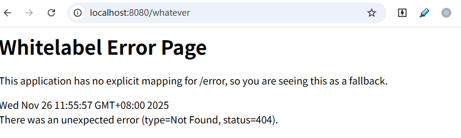

## 8.2 client如何通过HTTP发数据给server

我们在8.1介绍实现动态页面，其实数据完全是固定写好在server端的。

```java
page.addAttribute("username", "Katy");
page.addAttribute("color", "red");
```

如果我们想要从client通过HTTP协议发数据给server应该怎么做？

* HTTP request parameter

  示例：`http://example.com/products?brand=honda`

* path variable

  示例：`http://localhost:8080/home/blue`

* HTTP request body

  *will discuss in chapter 10*

* HTTP request header

### 8.2.1 HTTP request parameter

**是什么：**

示例：

`http://example.com/products?brand=honda`

`http://example.com/products?brand=honda&price=7000`

**代码：**

```java
@Controller
public class MainController {
    @RequestMapping("/home")
    // The action method defines a parameter of type Model that
    // stores the data the controller sends to the view.
    public String home(@RequestParam(required = false) String name,
                       @RequestParam(required = false) String color,
                       Model page) {
        // We add the data we want the controller to send to the view.
        page.addAttribute("username", name);
        page.addAttribute("color", color);

        // The controller’s action returns the view to be rendered into the HTTP response
        return "home.html";
    }
}
```

* @RequestParam注解告诉Spring要从request parameter获取值的字段名。这里的参数名要和请求路径的key名完全一致，例如`http://localhost:8080/home?color=blue&name=Jane`

* A request parameter is mandatory by default. If the client doesn’t provide a value for it, the server sends back a response with the status HTTP “400 Bad Request.” If you wish the value to be optional, you need to explicitly specify this on the annotation using the optional attribute: @RequestParam(optional=true).

* 执行效果：

  

* 下图展示了client发送的数据，controller如何获取到，然后再交给View resolver，渲染到html页面中。

  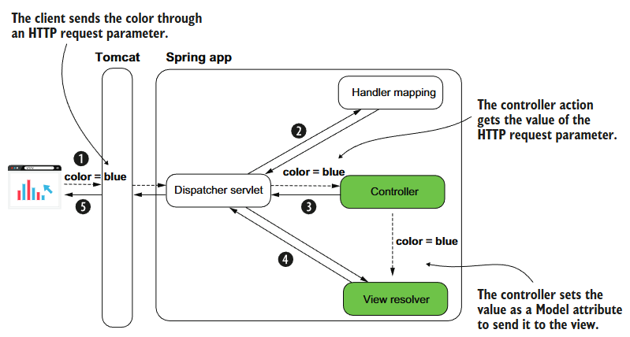


### 8.2.2 path variables

**是什么：**

Using request parameters:
`http://localhost:8080/home?color=blue`
Using path variables:
`http://localhost:8080/home/blue`

简单来说，就是不以key-value的方式来写参数，而是直接在路径的一部分写入参数。 On the server side, you extract that value from the path from the specific position.


**代码：**

```java
@Controller
public class MainController {
    // To define a path variable, you assign it a name 
    // and put it in the path between curly braces.
    @RequestMapping("/home/{color}")
    // You mark the parameter where you
	// want to get the path variable value
	// with the @PathVariable annotation.
	// The name of the parameter must be
	// the same as the name of the variable
	// in the path.
    public String home(@PathVariable String color, Model page) {
        
        page.addAttribute("username", "Katy");
        page.addAttribute("color", color);

        return "home.html";
    }
}
```

* 要使用path variable，在RequestMapping匹配的路径用花括号阔起路径变量的位置。用@PathVariable注解标注接收路径变量的变量。两个变量名必须完全一致。

* 执行效果：

  

## 8.3 如何实现GET、POST请求

假设现在有一个这样的场景，思考如何实现？

产品product有两个属性：1. 产品名称 2. 产品价格。

* 用户每次可以新增一个产品（POST）
* 用户可以查看完整的产品列表信息（GET）


实现思路：

1. 新创建一个SpringBoot项目
2. 增加web依赖；增加Thymeleaf依赖；
3. 新增一个Model类Product
4. 新增一个Service类ProductService，专门处理Product相关的业务逻辑
5. 新增一个Controller类ProductController，专门处理Product相关的请求
6. 在static/templates目录下新增product.html页面，用户在该页面能够1.新增产品信息 2.查看所有产品信息

代码实现：

1. 新创建一个SpringBoot项目

   略

2. 增加web依赖；增加Thymeleaf依赖；

   ```xml
   <dependency>
       <groupId>org.springframework.boot</groupId>
       <artifactId>spring-boot-starter-thymeleaf</artifactId>
   </dependency>
   <dependency>
       <groupId>org.springframework.boot</groupId>
       <artifactId>spring-boot-starter-web</artifactId>
   </dependency>
   ```

3. 新增一个Model类Product

   ```java
   public class Product {
       private String name;
       private double price;
   
       // omitted getter setter code
   }
   ```

4. 新增一个Service类ProductService，专门处理Product相关的业务逻辑

   ```java
   @Service
   public class ProductService {
       public List<Product> products = new ArrayList<>();
   
       public List<Product> getAllProducts() {
           return products;
       }
   
       public void addProduct(Product product) {
           products.add(product);
       }
   }
   ```

   

5. 新增一个Controller类ProductController，专门处理Product相关的请求

   ```java
   @Controller
   public class ProductController {
       private ProductService productService;
   
       ProductController(ProductService productService) {
           this.productService = productService;
       }
   
       @RequestMapping("/products")
       public String getAllProducts(Model model) {
           // 获取所有product
           List<Product> products = productService.getAllProducts();
           // 展示
           model.addAttribute("products", products);
           return "product.html";
       }
   
       @RequestMapping(value = "/products", method = RequestMethod.POST)
       public String addProduct(@RequestParam String name,
                                @RequestParam double price,
                                Model model) {
           // 创建product对象
           Product product = new Product();
           product.setName(name);
           product.setPrice(price);
   
           // 增加到product列表
           productService.addProduct(product);
   
           // 展示最新product列表
           List<Product> products = productService.getAllProducts();
           model.addAttribute("products", products);
           return "product.html";
       }
   }
   ```

   

6. 在static/templates目录下新增products.html页面，用户在该页面能够1.新增产品信息 2.查看所有产品信息

   ```html
   <!DOCTYPE html>
   <html lang="en" xmlns:th="http://www.thymeleaf.org">
   <head>
       <meta charset="UTF-8">
       <title>Home Page</title>
   </head>
   <body>
   <h1>Products</h1>
   <h2>View products</h2>
   <table>
       <tr>
           <th>PRODUCT NAME</th>
           <th>PRODUCT PRICE</th>
       </tr>
       <tr th:each="p: ${products}" >
           <td th:text="${p.name}"></td>
           <td th:text="${p.price}"></td>
       </tr>
   </table>
   
   <h2>Add a product</h2>
   <form action="/products" method="post">
       Name: <input
           type="text"
           name="name"><br />
       Price: <input
           type="number"
           step="any"
           name="price"><br />
       <button type="submit">Add product</button>
   </form>
   </body>
   </html>
   ```

7. 效果展示

   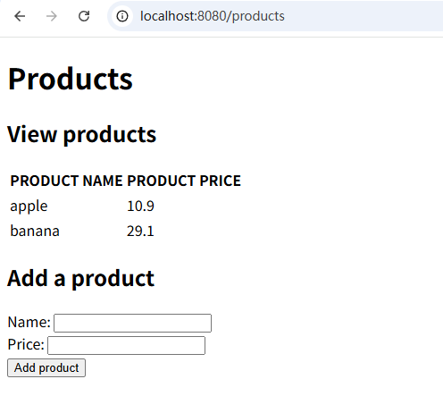


注意：

* 当访问/products的时候，获取product列表到展示的SpringMVC底层执行流程

  1. The client sends an HTTP request for the /products path.
  2. The dispatcher servlet uses the handler mapping to find the controller’s action to call for the /products path.
  3. The dispatcher servlet calls the controller’s action.
  4. The controller requests the product list from the service and sends it to be rendered with the view.
  5. The view is rendered into an HTTP response.
  6. The HTTP response is sent back to the client.

  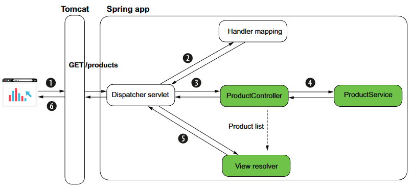

* 如果@RequestMapping("/products")注解不显式指定Method，则默认是使用GET

* @GetMapping("/products")等于@RequestMapping(value = "/products", method = RequestMethod.GET)

  @PostMapping("/products")等于@RequestMapping(value = "/products", method = RequestMethod.POST)

* 下面两种写法完全一样

  ```java
  @RequestMapping(value = "/products", method = RequestMethod.POST)
  public String addProduct(@RequestParam String name,
                           @RequestParam double price,
                           Model model) {
      // 创建product对象
      Product product = new Product();
      product.setName(name);
      product.setPrice(price);
  
      // 增加到product列表
      productService.addProduct(product);
  
      // 展示最新product列表
      List<Product> products = productService.getAllProducts();
      model.addAttribute("products", products);
      return "product.html";
  }
  ```

  ```java
  @RequestMapping(value = "/products", method = RequestMethod.POST)
  public String addProduct(Product product, Model model) {
      // 增加到product列表
      productService.addProduct(product);
  
      // 展示最新product列表
      List<Product> products = productService.getAllProducts();
      model.addAttribute("products", products);
      return "product.html";
  }
  ```

  因为由于Product类的属性名和（在product.html指定的）request parameter的名称完全一致，都是name和price，Spring能够识别它们相互匹配，并且自动帮你创建Product对象。这是Spring帮助开发者减少代码量的一种机制。

  注意这里Product类一定要有构造函数，以便于Spring能够调用构造函数来创建Product实例对象。

  *be aware that Spring tends to have plenty of syntaxes to hide as much code as possible. Whenever you find a syntax you don’t clearly understand in an example or article, try finding the framework specification details.*

# 9. Using the Spring web scopes

本章学习三个注解的使用`@RequestScope`、`@SessionScope`、`@ApplicationScope`

web scopes包含三个：

* Request scope: 对于每一个HTTP请求，都会创建一个新的bean

  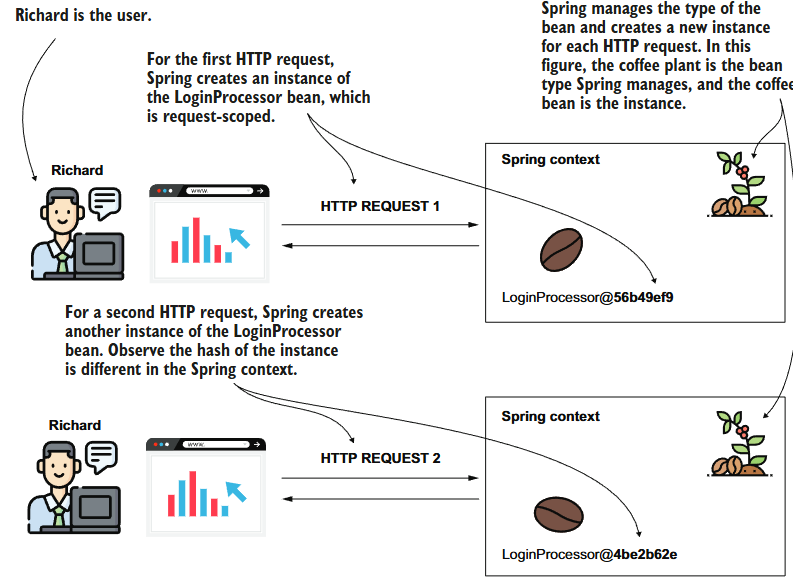

  Key aspects of request-scoped beans:

  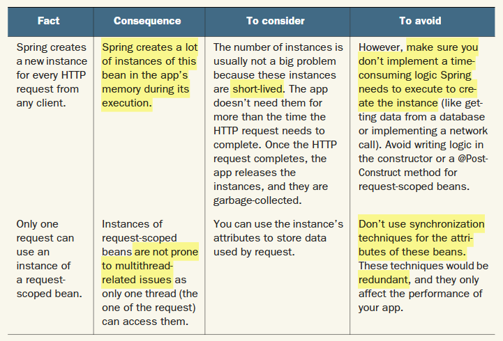

* Session scope: 开启一个会话的时候，会创建一个bean。后续同一个会话，始终用同一个bean。

  A session-scoped bean allows us to store data shared by multiple requests of the same client.

  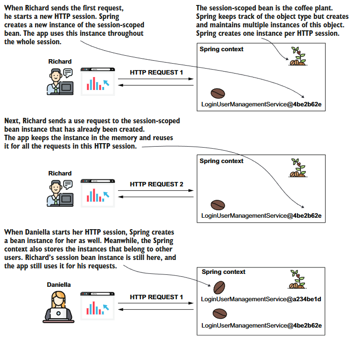

  Key aspects of session-scoped beans:

  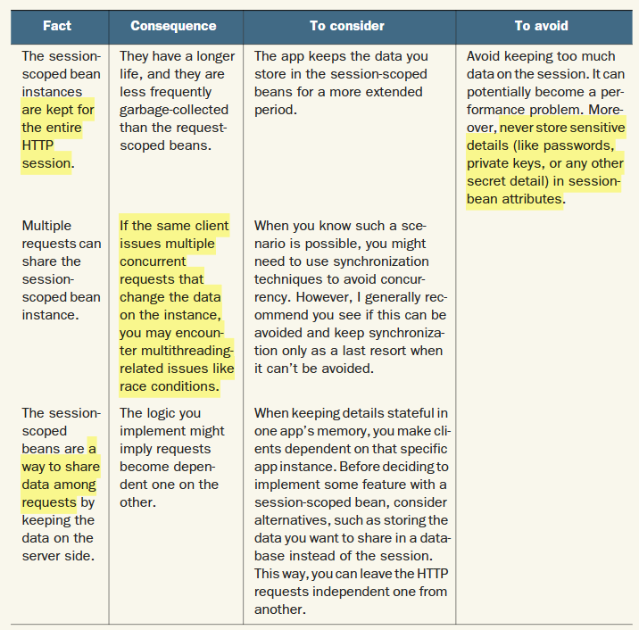

* Application scope: 所有请求共用同一个bean

  


通过一个示例来介绍这三个scope的应用。

需求：实现一个登陆功能。

1. 用户通过输入username和password来实现登陆 - request scope
2. 如果登陆成功，要保证会话范围内，能够持续显示用户username - session scope
3. 需要记录app范围总的登陆次数 - application scope


**实现需求1：用户通过输入username和password来实现登陆 - request scope**

* LoginController

  * `/` - login() - GET: 访问`login.html`

  * `/` - login(String username, String password) - POST: 登陆

    通过调用Request Scope的LoginProcessor来实现登陆逻辑

    * 登陆成功 - 跳转`login.html`，显示`You are now logged in.`
    * 登陆失败 - 跳转`login.html`，显示`Login failed!`

  ```java
  @Controller
  public class LoginController {
      private final LoginProcessor loginProcessor;
  
      public LoginController(LoginProcessor loginProcessor) {
          this.loginProcessor = loginProcessor;
      }
  
      @GetMapping("/")
      public String login() {
          return "login.html";
      }
  
      @PostMapping("/")
      public String login(@RequestParam String username, @RequestParam String password, Model model) {
          loginProcessor.setUsername(username);
          loginProcessor.setPassword(password);
          boolean loggedIn = loginProcessor.login();
          if (loggedIn) {
              model.addAttribute("message", "You are now logged in.");
          } else {
              model.addAttribute("message", "Login failed!");
          }
          return "login.html";
      }
  }
  ```


* LoginProcessor

  ```java
  @Component
  @RequestScope
  // 每个HTTP请求都会创建一个新的LoginProcessor对象
  // why?因为 LoginProcessor 保存了 username/password，所以如果是单例，会产生线程安全问题。
  public class LoginProcessor {
      private String username;
      private String password;
  
      public boolean login() {
          boolean loggedIn = false;
          if ("alice".equals(this.username) && "password".equals(this.password)) {
              loggedIn = true;
          }
          return loggedIn;
      }
  
      // omitted getters & setters
  }
  ```

  

* `static/templates/login.html`

  ```html
  <!DOCTYPE html>
  <html lang="en" xmlns:th="http://www.thymeleaf.org">
  <head>
      <meta charset="UTF-8">
      <title>Login</title>
  </head>
  <body>
  <form action="/" method="post">
      Username: <input type="text" name="username" /><br />
      Password: <input type="password" name="password" /><br />
      <button type="submit">Log in</button>
  </form>
  <p th:text="${message}"></p>
  </body>
  </html>
  ```


* 实现效果：

  输入错误的username和password

  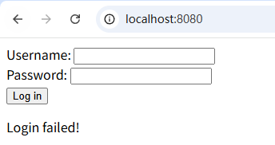

  输入正确的username和password

  


==注意：==

* 这里注入的是LoginProcessor的bean，而LoginController只会注入一次LoginProcessor，那怎么实现每次http请求都创建新的LoginProcessor实例？

  ```java
  @Controller
  public class LoginController {
      private final LoginProcessor loginProcessor;
  
      public LoginController(LoginProcessor loginProcessor) {
          // 这里注入的是一个代理对象proxy
          // 每次请求进来的时候，都会创建一个新的LoginProcessor实例，proxy对象会指向该实例
          // request A -> proxy指向LoginProcessor A
          // request B -> proxy指向LoginProcessor B
          // ...
          this.loginProcessor = loginProcessor;
      }
      // omitted code
  }
  ```

  LoginController注入的实际上是LoginProcessor的一个proxy对象，每次有新的http请求到达的时候，都会创建一个新的LoginProcessor对象。则proxy对象会指向这个新的LoginProcessor对象。

* RequestScope和多例的区别是什么？

  * prototype scope: 每次注入/获取Bean时创建新实例
  * request scope: 每次http请求时创建新实例


**实现需求2：如果登陆成功，要保证会话范围内，能够持续显示用户username - session scope**

目标：

* 如果登陆成功，从login.html跳转到home.html，并在home.html持续显示用户username - session scope
* 实现logout功能


具体实现：

* LoggedUserManagementService

  * 负责在session维度存储username信息

  ```java
  @Service
  @SessionScope  // 在同一session维度所有请求都会用同一个bean，保证所有请求都能获得username信息
  public class LoggedUserManagementService {
      private String username;
  
      public String getUsername() {
          return username;
      }
  
      public void setUsername(String username) {
          this.username = username;
      }
  }
  ```

  

* HomeController

  * `/home` - home() - GET: 访问主页面home.html
    * 首先检查是否需要登出，如果需要登出跳转至login.html，否则继续
    * 在访问home.html之前，需要检查一下是否已登录（LoggedUserManagementService.username是否不为空）
      * 是 - 则跳转到home.html
      * 否 - 则跳转到login.html页面

  ```java
  @Controller
  public class HomeController {
      private LoggedUserManagementService loggedUserManagementService;
  
      public HomeController(LoggedUserManagementService loggedUserManagementService) {
          this.loggedUserManagementService = loggedUserManagementService;
      }
  
      @GetMapping("/home")
      public String home(@RequestParam(required = false) String logout, Model model) {
          // 检查是否需要登出
          if (logout != null) {
              loggedUserManagementService.setUsername(null);
              return "redirect:/";
          }
          // 检查用户是否已登录
          boolean loggedIn = false;
          String username = loggedUserManagementService.getUsername();
          if (username != null) {
              loggedIn = true;
          }
          // 是则跳转到home页面
          if (loggedIn) {
              model.addAttribute("username", username);
              return "home.html";
              // 否则跳转到登陆页面
          } else {
              return "redirect:/";
          }
      }
  }
  ```

  

* LoginController更改

  * `/` - login(String username, String password) - POST: 登陆

    通过调用Request Scope的LoginProcessor来实现登陆逻辑

    * 登陆成功 - 将username信息通过LoggedUserManagementService存储到session维度->跳转到home.html
    * 登陆失败 - 跳转`login.html`，显示`Login failed!`

  ```java
  @Controller
  public class LoginController {
      private final LoginProcessor loginProcessor;
      private final LoggedUserManagementService loggedUserManagementService;
  
      public LoginController(LoginProcessor loginProcessor,
                             LoggedUserManagementService loggedUserManagementService) {
          // 这里注入的是一个代理对象proxy
          // 每次请求进来的时候，都会创建一个新的LoginProcessor实例，proxy对象会指向该实例
          // request A -> proxy指向LoginProcessor A
          // request B -> proxy指向LoginProcessor B
          // ...
          this.loginProcessor = loginProcessor;
          this.loggedUserManagementService = loggedUserManagementService;
      }
  
      @GetMapping("/")
      public String login() {
          return "login.html";
      }
  
      @PostMapping("/")
      public String login(@RequestParam String username, @RequestParam String password, Model model) {
          loginProcessor.setUsername(username);
          loginProcessor.setPassword(password);
          boolean loggedIn = loginProcessor.login();
          if (loggedIn) {
              // 在session维度存储username信息
              loggedUserManagementService.setUsername(username);
              return "redirect:/home";
          } else {
              model.addAttribute("message", "Login failed!");
          }
          return "login.html";
      }
  }
  ```


* `static\templates\home.html`

  ```html
  <!DOCTYPE html>
  <html lang="en" xmlns:th="http://www.thymeleaf.org">
  <head>
      <meta charset="UTF-8">
      <title>Login</title>
  </head>
  <body>
  <h1>Welcome, <span th:text="${username}"></span></h1>
  <a href="/home?logout">Log out</a>
  </body>
  </html>
  ```


* 实现效果

  成功登陆的效果

  

  点击log out的效果

  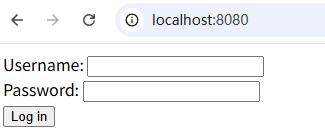


**实现需求3：需要统计app范围总的登陆次数 - application scope**

* LoginCountService用于统计总的登陆次数

  ```java
  @Service
  @ApplicationScope  // 保证在整个application维度存储loginCount
  public class LoginCountService {
      private int loginCount;
  
      public void increment() {
          this.loginCount++;
      }
  
      public int getLoginCount() {
          return loginCount;
      }
  }
  ```

* LoginController 每次尝试登陆都更新登录次数

  ```java
  @Controller
  public class LoginController {
      // omitted code
      
      @PostMapping("/")
      public String login(@RequestParam String username, @RequestParam String password, Model model) {
          // 增加尝试登陆的次数
          loginCountService.increment();
  
          loginProcessor.setUsername(username);
          loginProcessor.setPassword(password);
          boolean loggedIn = loginProcessor.login();
          if (loggedIn) {
              loggedUserManagementService.setUsername(username);
              return "redirect:/home";
          } else {
              model.addAttribute("message", "Login failed!");
          }
          return "login.html";
      }
  }
  
  ```

  

* HomeController 用户成功登陆可以展示登陆次数

  ```java
  @Controller
  public class HomeController {
      // omitted code
  
      @GetMapping("/home")
      public String home(@RequestParam(required = false) String logout, Model model) {
          // 检查是否需要登出
          if (logout != null) {
              loggedUserManagementService.setUsername(null);
              return "redirect:/";
          }
          // 检查用户是否已登录
          boolean loggedIn = false;
          String username = loggedUserManagementService.getUsername();
          if (username != null) {
              loggedIn = true;
          }
          // 是则跳转到home页面
          if (loggedIn) {
              model.addAttribute("username", username);
              model.addAttribute("loginCount", loginCountService.getLoginCount());
              return "home.html";
              // 否则跳转到登陆页面
          } else {
              return "redirect:/";
          }
      }
  }
  ```

* `static\templates\home.html`增加展示登陆次数信息

  ```html
  <!DOCTYPE html>
  <html lang="en" xmlns:th="http://www.thymeleaf.org">
  <head>
      <meta charset="UTF-8">
      <title>Login</title>
  </head>
  <body>
  <h1>Welcome, <span th:text="${username}"></span>!</h1>
  <h2>
      Your login number is
      <span th:text="${loginCount}"></span>
  </h2>
  <a href="/home?logout">Log out</a>
  </body>
  </html>
  ```

  

==注意：==

* 现实场景中，一般不会自定义实现login或授权功能，一般使用Spring Security来实现相关功能。该示例仅用于教学场景。why使用Spring Security？
  1. 已经封装好，直接用更简单
  2. 避免出现bug
  3. 作者推荐Spring Security学习书籍：*Spring Security in Action (Manning, 2020)*
* 如果要从一个页面重定向要另一个页面，则Controller action方法需要返回这样形式的字符串`redirect:/xxx` 注意，`/xxx`是把请求重定向到另一个Controller action，因此不是`/home.html`，而是`/home`形式。
* Request scope、Session scope、Application scope only make sense in web apps, and that’s why we call them web scopes.
* 尽量避免使用Application scope，因为这意味着所有的 web request 共享这些作用范围为`application-scope`的beans，对这些 beans 的写操作会涉及竞态条件，需要加锁等操作保证线程安全，会严重影响性能。且Application scope的bean不会被GC，会一直占用内存。A better approach is to directly store the data in a database.

# 10. 实现REST服务

## 10.1 REST是什么

REST是一种设计Web API的风格，用URL标识资源，用HTTP方法标识操作。

REST不是协议，也不是框架，而是一种思想。

* 资源：

  REST的核心思想：把所有东西看作一种资源。例如：

  | 资源       | URL               |
  | ---------- | ----------------- |
  | 用户列表   | `/users`          |
  | 单个用户   | `/users/1`        |
  | 用户的订单 | `/users/1/orders` |

  这些都是“资源”。

* 操作

  用HTTP的方法`GET/POST/PUT/DELETE`标识对资源要执行什么操作。

  REST强调不要在URL写动作，而是用HTTP标识。

  例如

  不推荐写：

  ```
  GET /getUsers
  POST /createUser
  DELETE /removeUser
  ```

  推荐写：

  ```
  GET /users
  POST /users
  DELETE /users/1
  ```


REST的好处：

* 简洁、规范、清晰、易于维护。

## 10.2 REST如何返回数据给client（概念）

**1. Controller action和REST endpoint是什么？**

* Controller action: controller类中的某个方法

  例如：`getUsers()` 就是一个 **controller action**（也叫 handler method）。

  ```java
  @GetMapping("/users")
  public List<User> getUsers() { ... }
  ```

* REST endpoint: 一个遵循REST风格的URL接口

  例如：`GET /users` 就是一个REST endpoint

* 两者的关系：一个 REST endpoint 通常由一个 controller action 实现，如果项目是100% RESTful，则基本可以视为是一 一对应关系。

**2. RESTful 接口和普通Controller action的写法有什么区别？**

* Controller action return返回的是表示要显示的页面的名称，例如`home.html`。通过Model来向View resolver传递数据，由View resolver对页面进行渲染然后返回给client。

* RESTful接口返回的内容直接作为HTTP Response响应体返回给client，不再需要View resolver。例如如果返回了一个对象，就以下面Json形式在响应体传递给client。

  ```json
  {
      "amount": 10001
  }
  ```

  

## 10.3 实现REST 服务（实现）

RESTful controller和普通web controller的区别：

普通web controller

```java
@Controller
public class HelloController {
    @GetMapping("/hello")
    public String hello() {
        return "hello.html";  // return a view name
    }
}
```


RESTful controller

```java
@Controller
public class HelloController {
    @GetMapping("/hello")
    @ResponseBody
    public String hello() {
        return "Hello!";
    }
}

// The @ResponseBody annotation tells the dispatcher servlet that 
// the controller’s action doesn’t return a view name 
// but the data sent directly in the HTTP response.
```


总结：

所以对于一个普通web controller，controller action会返回一个字符串，这个字符串代表的是view name。对于RESTful controller action，会在方法上增加@ResponseBody注解，表示返回的内容直接作为HTTP Reponse响应体返回，而不是表示view name。


REST这种写法不足在于，如果controller中的方法很多，那么每一个方法上都需要增加@ResponseBody注解，例如：

```java
@Controller
public class HelloController {
    @GetMapping("/hello")
    @ResponseBody
    public String hello() {
        return "Hello!";
    }

    @GetMapping("/ciao")
    @ResponseBody
    public String ciao() {
        return "Ciao!";
    }
}
```


为了解决避免出现重复代码，可以在controller类上使用`@Controller`和`@ResponseBody`两个注解，或者直接用`@RestController`（两个注解的结合）。这样表示该controller类的所有action都属于RESTful endpoints。如下：

```java
@RestController
public class HelloController {
    @GetMapping("/hello")
    public String hello() {
        return "Hello!";
    }

    @GetMapping("/ciao")
    public String ciao() {
        return "Ciao!";
    }
}
```


现在我们写好了代码，是时候测试一下效果了，如何发起http请求呢，我们之前都是直接在浏览器输入URL，对于开发者，这种方式是远远不够的，我们需要能够便捷地 1. 指定完整的http请求内容（包括请求体、请求头、URL...） 2. 查看完整的相应内容（包括响应体、响应头...）。因此Postman和Curl是更加专业的两个工具。

postman是图形化工具，更加便于使用。Curl是命令行工具，适合用于脚本。下面展示分别用两种工具测试的效果：

postman：

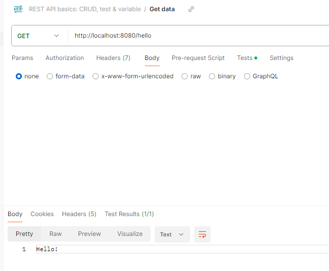


curl：

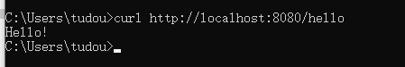

（当然curl也可以展示详细的相应内容，需要增加对应的参数，这里不进行详细介绍）


总结：

* 如何实现REST服务？

  答：其写法和普通的Controller是类似的。区别只在于普通的Controller action返回view name字符串，需要View Resolver来渲染页面返回给client。而RESTful Controller action返回的内容，会直接作为HTTP Response的响应内容。

  如何写编写代码呢？

  1. 在RESTful Controller action上增加@ResponseBody注解 或
  2. 用@RestController注解替代@Controller注解即可。
  3. return xxx `xxx`为想要在response body返回的内容，而不是view name


## 10.4 自定义HTTP Response

HTTP Response包含三部分：

1. Response headers
2. Response body
3. Response status

### 10.4.1 如何response body中返回对象

直接在RESTful Controller action中以该对象作为返回值即可。

例一：

Country类，作为返回的对象类型

```java
public class Country {
    private String name;
    private int population;

    public static Country of(String name, int population) {
        Country country = new Country();
        country.setName(name);
        country.setPopulation(population);
        return country;
    }
    // omitted getters and setters
}
```

RESTful Controller

```java
@RestController
public class CountryController {
    @GetMapping("/france")
    public Country france() {  // 直接以Country作为返回类型
        Country c = Country.of("France", 67);
        return c;  // 直接返回要返回的对象
    }
}
```

测试效果：

可以看到，Spring是默认将对象转化为Json格式进行返回。

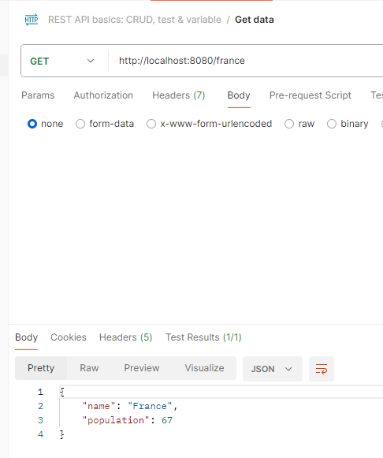

例二：

返回Country列表

RESTful Controller

```java
@RestController
public class CountryController {
    @GetMapping("/all")
    public List<Country> countries() {
        Country c1 = Country.of("France", 67);
        Country c2 = Country.of("Spain", 45);
        return List.of(c1, c2);
    }
}

```

测试效果：

Spring依然会将列表转化为JSON格式返回，只不过这是数组的形式。

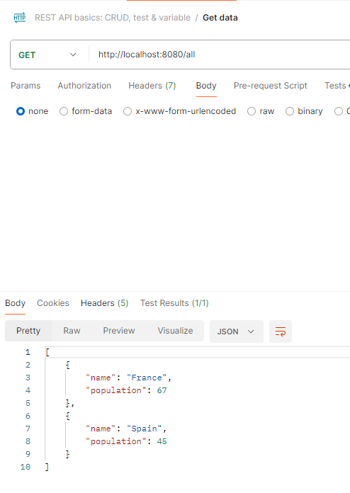

==注意：==

* When we use an object (such as Country) to model the data transferred between two apps, we name this object a data transfer object (DTO). We can say that Country is our DTO.

### 10.4.2 如何自定义response status和headers

通过ResponseEntity这个类，可以自定义reponse body、status、headers...

示例：

RESTful Controller

```java
@RestController
public class CountryController {

    @GetMapping("/france")
    public ResponseEntity<Country> france() {
        Country c = Country.of("France", 67);
        return ResponseEntity
                .status(HttpStatus.ACCEPTED)
                .header("continent", "Europe")
                .header("capital", "Paris")
                .header("favorite_food", "cheese and wine")
                .body(c);
    }
}
```

测试效果：

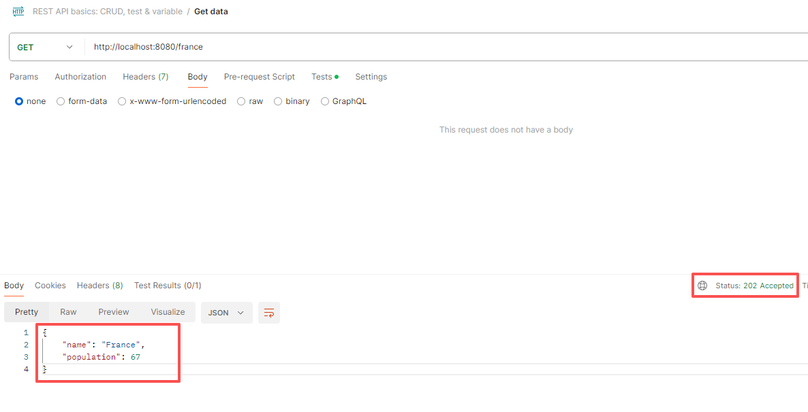

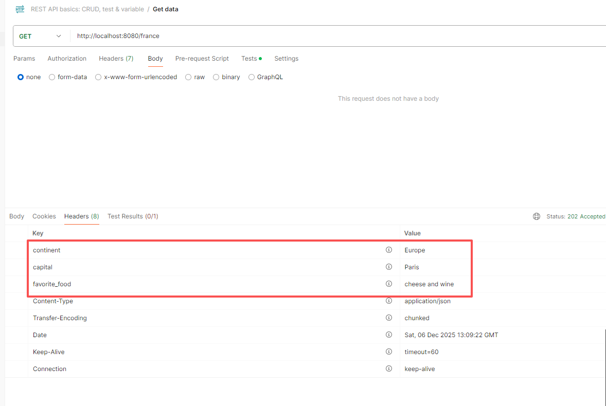

### 10.4.3 异常控制

#### 方法一：每个controller action单独处理

情景介绍：

假设现在有一个支付接口makePayment()，该接口调用service层的processPayment()方法进行业务处理。

- 用户余额充足，支付成功，则Controller action需要返回一个PaymentDetail对象，包含订单支付详情（例如支付的金额等）。
- 用户余额不足，service层会抛出一个余额不足异常，Controller action需要返回一个ErrorDetail对象，包含异常详情。

代码设计：

* pojo
  * PaymentDetail
  * ErrorDetail
* exception
  * NotEnoughMoneyException
* Service
  * PaymentService
    * processPayment方法 - 支付成功，返回PaymentDetail；支付失败，抛出NotEnoughMoneyException异常。
* Controller
  * PaymentController
    * makePayment方法 - 调用#PaymentService.processPayment方法，如果执行成功，则返回ResponseEntity with 1.PaymentDetail 2.status 202ACCEPTED；如果获取到异常，则返回ResponseEntity with 1.ErrorDetail 2.status 400 badrequest；

代码实现：

* pojo

  * PaymentDetail

    ```java
    public class PaymentDetail {
        private double fee;
    
        public double getFee() {
            return fee;
        }
    
        public void setFee(double fee) {
            this.fee = fee;
        }
    }
    ```

  * ErrorDetail

    ```java
    public class ErrorDetail {
        private String message;
    
        public String getMessage() {
            return message;
        }
    
        public void setMessage(String message) {
            this.message = message;
        }
    }
    ```

* exception

  * NotEnoughMoneyException

    ```java
    public class NotEnoughMoneyException extends RuntimeException{
    }
    ```

* Service

  * PaymentService

    * processPayment方法 - 支付成功，返回PaymentDetail；支付失败，抛出NotEnoughMoneyException异常。

      ```java
      @Service
      public class PaymentService {
          public PaymentDetail processPayment(double money) {
              if (money < 100) {
                  // 如果余额不足100，则抛出异常
                  throw new NotEnoughMoneyException();
              }
              PaymentDetail paymentDetail = new PaymentDetail();
              paymentDetail.setFee(money);
              return paymentDetail;
          }
      }
      ```

      

* Controller

  * PaymentController

    * makePayment方法 - 调用#PaymentService.processPayment方法，如果执行成功，则返回ResponseEntity with 1.PaymentDetail 2.status 202ACCEPTED；如果获取到异常，则返回ResponseEntity with 1.ErrorDetail 2.status 400 badrequest；

      ```java
      @RestController
      public class PaymentController {
      
          private final PaymentService paymentService;
      
          public PaymentController(PaymentService paymentService) {
              this.paymentService = paymentService;
          }
      
          @PostMapping("/payment")
          public ResponseEntity<?> makePayment(@RequestParam double money) {
              try {
                  PaymentDetail paymentDetail = paymentService.processPayment(money);
      
                  return ResponseEntity
                          .status(HttpStatus.ACCEPTED)
                          .body(paymentDetail);
              } catch (NotEnoughMoneyException e) {
                  ErrorDetail errorDetail = new ErrorDetail();
                  errorDetail.setMessage("Not enough money for this payment.");
                  return ResponseEntity
                          .badRequest()  // 将status设为400
                          .body(errorDetail);
              }
          }
      }
      ```


实现效果：

余额不足

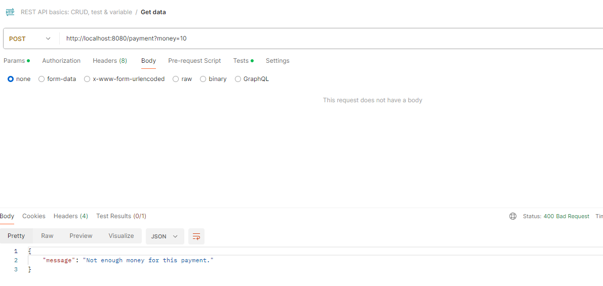


支付成功

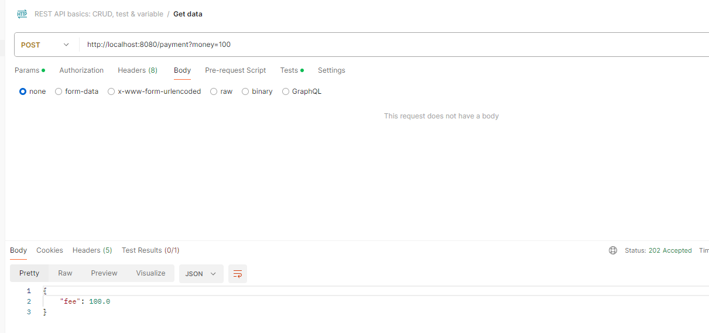

#### 方法二：异常处理切面（推荐）

上述方法的不足：

1. 如果多个controller action需要处理同一个异常，则存在代码冗余
2. 异常处理逻辑分散在各个action中，不方便阅读

解决方案：使用切面进行异常处理，这个切面会拦截所有异常，开发者可以在这个切面类中自定义所有异常的处理方式，则一方面，不会再出现代码冗余，另一方面，异常处理逻辑可以集中在这个切面类中，controller action中不需要再对异常进行专门的处理，职能分工，提升代码可读性以及可维护性。

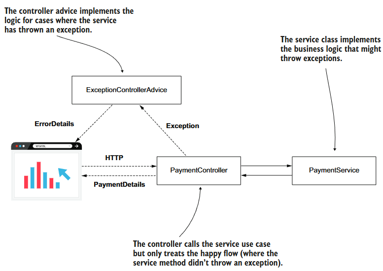


将方法一的代码改写为方法二的做法。

Controller只需要关注happy flow（正常/没有异常的case）

```java
@RestController
public class PaymentController {

    private final PaymentService paymentService;

    public PaymentController(PaymentService paymentService) {
        this.paymentService = paymentService;
    }

    @PostMapping("/payment")
    public ResponseEntity<PaymentDetail> makePayment(@RequestParam double money) {
        PaymentDetail paymentDetail = paymentService.processPayment(money);

        return ResponseEntity
                .status(HttpStatus.ACCEPTED)
                .body(paymentDetail);
    }
}
```

由advice专门对异常进行统一处理

```java
@RestControllerAdvice  // 标识这是一个RESTController的增强(advice)
public class ExceptionControllerAdvice {
    @ExceptionHandler(NotEnoughMoneyException.class)  // 标识要处理的异常类
    public ResponseEntity<ErrorDetail> exceptionNotEnoughMoneyHandler() {
        ErrorDetail errorDetails = new ErrorDetail();
        errorDetails.setMessage("Not enough money to make the payment.");
        return ResponseEntity
                .badRequest()
                .body(errorDetails);
    }
}
```

和方法一的效果完全一致。

==注意：==

* 如果我们希望在ExceptionHandler的方法获取到完整的Exception信息，可以在方法参数增加这个异常类型的参数，Spring会帮我们将Controller抛出的异常作为参数传入，从而ExceptionHandler能够获取到完整的异常信息。

  例如：

  ```java
  @RestControllerAdvice
  public class ExceptionControllerAdvice {
      @ExceptionHandler(NotEnoughMoneyException.class)
      public ResponseEntity<ErrorDetail> exceptionNotEnoughMoneyHandler
          (NotEnoughMoneyException ex) {  // controller抛出的异常会作为参数传入
          System.out.println(ex.getMessage());
          // omitted code
      }
  }


## 10.5 接收client在Request Body携带的数据

如果server要接收client在request body携带的数据，需要：

1. To use the request body, you just need to annotate a parameter of the controller’s
   action with `@RequestBody`.
2. By default, Spring assumes you used `JSON` to represent the parameter you annotated and will try to `decode the JSON string into an instance of your parameter type`.
3. In the case Spring cannot decode the JSON-formatted string into that type, the app sends back a response with the status “`400 Bad Request.`” 


示例：

client发送一个PaymentDetail实例给server，server打印日志，然后将同一个实例返回给client。

Controller

```java
@RestController
public class PaymentController {
    private static Logger logger = Logger.getLogger(PaymentController.class.getName());
   
    private final PaymentService paymentService;

    public PaymentController(PaymentService paymentService) {
        this.paymentService = paymentService;
    }

    @PostMapping("/payment")
    public ResponseEntity<PaymentDetails> makePayment(@RequestBody PaymentDetails paymentDetails) {
        logger.info("Received payment " + paymentDetails.getAmount());
        return ResponseEntity
                .status(HttpStatus.ACCEPTED)
                .body(paymentDetails);
    }
}
```

日志

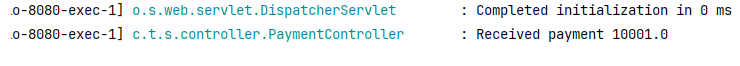

响应

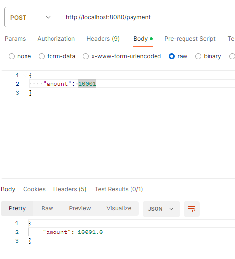

==注意：==

* 从2014年起，GET 请求也可以携带request body


# 11. 跨服务调用RESTful接口

RESTful接口不仅是web client会调用，有时候服务之间也会相互调用。

本章介绍一下，不同服务直接如何互相调用RESTful接口。

服务A调用服务B的RESTful接口，有三种方式：

1. OpenFeign：最新、最推荐的方式。
2. RestTemplate：以前最被广泛使用的方式，虽然不是当前的首选，但是有很多服务在以前使用这种方式实现的。
3. WebClient：reactive app首选的方式。


接下来通过示例介绍一下这三种方式如何实现。

假设现在我们有一个app A，其中包含的一项功能为支付功能，而支付功能是由另一个服务service Payment来实现的，也就是说，当client尝试进行支付的时候，请求会到达app A，app A会调用service Payment的RESTful接口来实现支付。

app A如何调用service Payment的支付接口，就是我们要讨论的问题。


1. 实现一个service Payment

   该支付接口的逻辑为：

   1. RequestHeader接收requestId，RequestBody接收Payment信息
   2. log打印日志，输出requestId、payment的amount信息
   3. 为payment对象设置id
   4. 返回 ResponseHeader中增加requestId，ResponseBody中增加Payment信息

2. 通过上面介绍的三种方式来调用service Payment的RESTful接口


1. 实现一个service Payment

   该支付接口的逻辑为：

   1. RequestHeader接收requestId，RequestBody接收Payment信息
   2. log打印日志，输出requestId、payment的amount信息
   3. 为payment对象设置id
   4. 返回 ResponseHeader中增加requestId，ResponseBody中增加Payment信息

   ```java
   public class Payment {
       private String id;
       private double amount;
   	// omitted getter setter
   }
   ```

   ```java
   @RestController
   public class PaymentController {
       private static Logger logger = Logger.getLogger(PaymentController.class.getName());
   
       @PostMapping("/payment")
       public ResponseEntity<Payment> createPayment(
               @RequestHeader String requestId,
               @RequestBody Payment payment
       ) {
          logger.info("request id: " + requestId +
                  "; payment's amount: " + payment.getAmount() + ".");
           payment.setId(UUID.randomUUID().toString());
           return ResponseEntity
                   .status(HttpStatus.OK)
                   .header("requestId", requestId)
                   .body(payment);
       }
   }

2. 通过上面介绍的三种方式来调用service Payment的RESTful接口


## 11.1 OpenFeign

1. 注入OpenFeign相关依赖

   ```xml
   <dependency>
       <groupId>org.springframework.cloud</groupId>
       <artifactId>spring-cloud-starter-openfeign</artifactId>
   </dependency>
   ```

   注意OpenFeign是spring-cloud内部的依赖，因此BOM中要引入spring-cloud-dependencies

   ```xml
   <dependencyManagement>
       <dependencies>
           <dependency>
               <groupId>org.springframework.boot</groupId>
               <artifactId>spring-boot-dependencies</artifactId>
               <version>${spring-boot.version}</version>
               <type>pom</type>
               <scope>import</scope>
           </dependency>
           <dependency>
               <groupId>org.springframework.cloud</groupId>
               <artifactId>spring-cloud-dependencies</artifactId>
               <version>${spring-cloud.version}</version>
               <type>pom</type>
               <scope>import</scope>
           </dependency>
       </dependencies>
   </dependencyManagement>
   ```

2. 编写FeignClient接口及内部方法

   ```java
   @FeignClient(name = "payment", url = "${payment.service.url}")
   public interface PaymentProxy {
       @PostMapping("/payment")
       Payment createPayment(@RequestHeader("requestId") String requestId,
                             @RequestBody Payment payment);
   }
   ```

   * `@FeignClient`注解标识这是REST client，在接口上增加`@FeignClient`注解，OpenFeign会自动生成该接口的实现类，并生成对应的bean，注入到Spring容器。
   * 使用`@FeignClient`注解，至少要指定两个属性 `name` 和 `url` 。
     * `name`是OpenFeign内部使用到的REST client唯一标识。
     * `URL`指定要访问的REST的url地址，例如`http://localhost:8080`。注意，类似这样的URL一定要在配置文件进行配置，而不是硬编码在代码中。

3. 配置中启用OpenFeign以及指定OpenFeign client所在的包

   ```java
   @Configuration
   // We enable the OpenFeign clients and tell the OpenFeign dependency
   // where to search for the proxy contracts.
   @EnableFeignClients(basePackages = "com.tudou.sqch11ex1.proxy")
   public class ProjectConfig {
   }
   ```

4. 编写controller，并注入Feign Client bean，调用方法

   ```java
   @RestController
   public class PaymentController {
       private final PaymentProxy paymentProxy;
   
       public PaymentController(PaymentProxy paymentProxy) {
           this.paymentProxy = paymentProxy;
       }
   
       @PostMapping("/payment")
       public Payment createPayment(@RequestBody Payment payment) {
           String requestId = UUID.randomUUID().toString();
           return paymentProxy.createPayment(requestId, payment);
       }
   }
   ```

5. application.properties

   ```properties
   # app A在9090端口启动
   server.port = 9090
   # service payemnt在8080启动，访问该url以访问payment service
   payment.service.url = http://localhost:8080
   ```

6. 测试效果

   ps：在response body中的id是在payment Service中生成的payment id。在控制台打印的这个request Id，是app A生成，然后作为request header参数传给payment service的request Id。

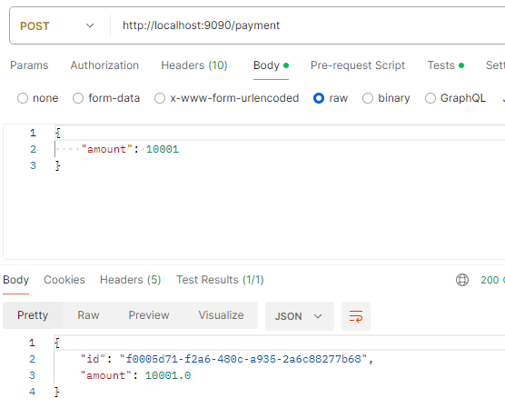

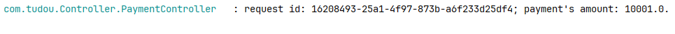


解析：

* 我在看到这里的时候会有一个问题。我访问app A的createPayment接口的时候，只传入了payment对象，requestId是此时生成然后传入paymentProxy.createPayment中的。我很好奇为什么paymentProxy拿到了这个requestId之后，就能够在后续调用payment Service的createPayment方法时作为request header传入呢？

  答：这里只是定义了接口，并没有写真正的HTTP请求逻辑。

  ```java
  @FeignClient(name = "payment", url = "${payment.service.url}")
  public interface PaymentProxy {
      @PostMapping("/payment")
      Payment createPayment(@RequestHeader("requestId") String requestId,
                            @RequestBody Payment payment);
  }
  ```

  但 Feign 会在运行时为这个接口生成一个代理类（动态代理），这个代理：

  * 看到你标了 @PostMapping("/payment")
  * 看到你标了 @RequestHeader("requestId") String requestId
  * 看到 @RequestBody Payment payment

  知道它应该构造一条 HTTP POST 请求：

  ```css
  POST /payment
  Header: requestId=<你传入的值>
  Body: { "amount": ..., ... }
  ```

  也就是说：**你调用 Java 方法 = Feign 帮你构造并发送 HTTP 请求**

  所以OpenFeign的优点在于，把整个发送HTTP请求的复杂过程，简化成接口+注解的形式。

  通过各个注解，我们可以声明我们需要以*什么HTTP方法*、向*哪里*发送*什么请求*。

  而OpenFeign会根据我们声明的接口和注解，自动帮我们去生成实现类，这个实现类内部的方法，就是运行过程中Spring会真正调用的方法，内部实现了真正的构造HTTP请求，发送HTTP请求，接收HTTP响应的行为。

## 11.2 RestTemplate

为什么OpenFeign逐渐替代RestTemplate：并不是因为RestTemplate有什么不足，而是因为OpenFeign更加易用，简单。很多现有的服务的运行代码依然是使用RestTemplate，因为开发这些服务的时候RestTemplate在当时是最好的方案，因此掌握RestTemplate也是非常必要的。

1. 引入spring-boot-starter-web依赖

   因为`RestTemplate`是`spring-boot-starter-web`依赖下的类

   ```xml
   <dependency>
       <groupId>org.springframework.boot</groupId>
       <artifactId>spring-boot-starter-web</artifactId>
   </dependency>
   ```

2. 配置中创建RestTemplate Bean

   ```java
   @Configuration
   public class ProjectConfig {
       @Bean
       public RestTemplate restTemplate() {
           return new RestTemplate();
       }
   }
   ```

3. 编写proxy，在proxy方法中实现构造HTTP请求，使用restTemplate实现发送HTTTP请求，接收HTTP响应

   ```java
   @Component
   public class PaymentProxy {
       private final RestTemplate restTemplate;
   
       @Value("${payment.service.url}")
       private String url;
   
       public PaymentProxy(RestTemplate restTemplate) {
           this.restTemplate = restTemplate;
       }
   
       public Payment createPayment(Payment payment) {
           // 1. 构造url
           String url = this.url + "/payment";
           // 2. 构造HTTP request headers
           String requestId = UUID.randomUUID().toString();
           HttpHeaders headers = new HttpHeaders();
           headers.add("requestId", requestId);
           // 3. 构造HTTP Entity（HTTP请求体，包含request body、request header）
           HttpEntity<Payment> httpEntity = new HttpEntity<>(payment, headers);
           // 4. 发送http请求
           ResponseEntity<Payment> responseEntity = restTemplate.exchange(url, HttpMethod.POST, httpEntity, Payment.class);
           // 5. 返回response body
           return responseEntity.getBody();
       }
   }
   ```

4. 编写Controller，注入proxy bean，调用方法

   ```java
   @RestController
   public class PaymentController {
       private final PaymentProxy paymentProxy;
   
       public PaymentController(PaymentProxy paymentProxy) {
           this.paymentProxy = paymentProxy;
       }
   
       @PostMapping("/payment")
       public Payment createPayment(@RequestBody Payment payment) {
           return paymentProxy.createPayment(payment);
       }
   }
   ```

5. application.properties

   ```properties
   # app A在9090端口启动
   server.port = 9090
   # service payemnt在8080启动，访问该url以访问payment service
   payment.service.url = http://localhost:8080
   ```

6. 测试效果

   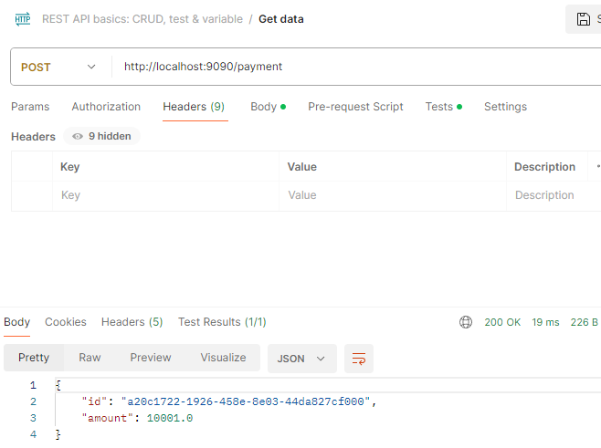

   

解析：

* 可以非常明显地看到，RestTemplate的编码复杂度比OpenFeign高得多，RestTemplate需要手动编写生成HTTP header的代码、生成HTTP Entity（请求体）的代码，再调用RestTemplate的exchange方法才能真正调用payment service。而OpenFeign只需要定义一个接口，通过注解的方式进行配置，大大减少了代码量，也很大程度提高了可读性

## 11.3 WebClient

结论：如果是一个reactive app，则使用WebClient；如果不是reactive app，则使用OpenFeign。

* 非reactive app是什么

  通过举例的方式来说明。

  假设A银行业务需要开发一个新的系统，该系统用于统计一个顾客的总负债情况。考虑到一个顾客可能在多家不同银行都设立了账户，因此这个系统的实现思路如下：

  1. 接收到统计某顾客总负债情况请求，userId为请求参数
  2. 根据userId从service x 获取用户信息
  3. 根据userId从service y 获取用户在本银行的负债情况
  4. 根据1. 得到的用户信息从service z 获取用户在外部银行的负债信息
  5. 将内部负债和外部负债值进行加和，得到该名用户的总负债值

  对于非reactive app，每一个请求都由一个线程来负责。

  例如现在有一个查询顾客Alice的负债情况的请求，此时系统会分配一个线程，这个线程负责完整的1-5的工作。

  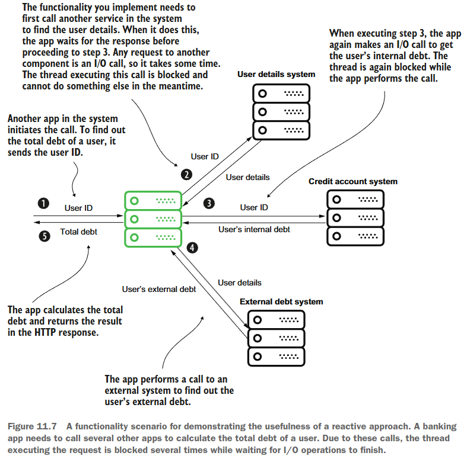

  由于系统调用service x、y、z都是IO操作，该线程在每一个IO操作的时候都需要闲置等待，因此，本质上是一个线性操作。

  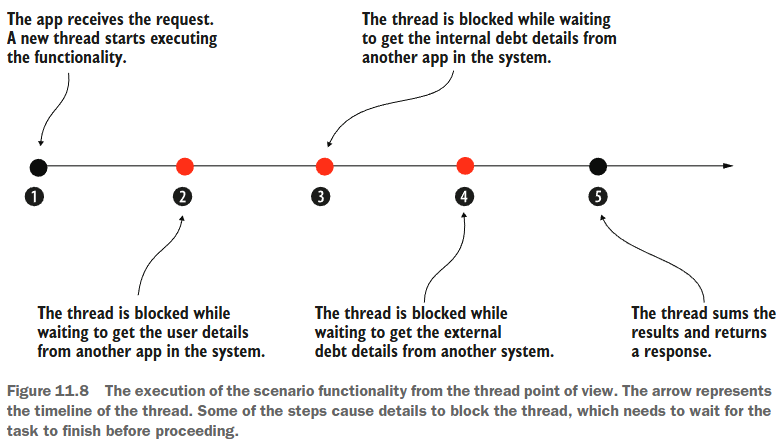

  这种方式存在的问题是什么？

  * 当线程遇到IO操作的时候，会被阻塞，此时该线程不能做其它的事情，只能闲置等待IO操作完成。线程即占用着宝贵的内存，还不在工作。
  * 部分task之间并没有相互依赖的关系。例如Figure 11.8图中的2、3步，他们是相互独立的，第3步并不依赖第2步的执行，因此它们实际上是可以并行地计算的。

* reactive app是什么

  Reactive apps change the idea of having one atomic flow in which one thread executes all its tasks from the beginning to the end. With reactive apps, we think of tasks as independent, and multiple threads can collaborate to complete a flow composed of multiple tasks.

  也就是说，reactive app会将所有的task都看作相互独立的，所有线程都可以去执行的。

  假设现在有两个线程在共同执行一些任务，线程A执行执行任务1，线程B正在执行任务2，此时任务1正在执行IO操作，线程1被阻塞，则线程1继续去执行其它任务，然后任务1 IO完成之后继续执行任务1。或者线程B空闲之后如果发现任务1可以继续往下执行了，线程B可以去执行。

  

  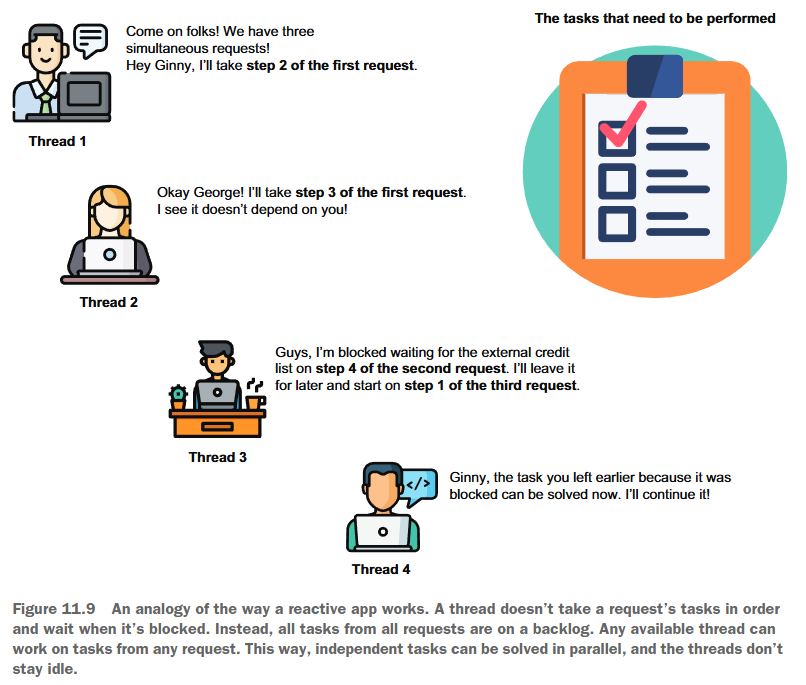

  类比：

  非reactive app：厨房的厨师A负责做水煮鱼这道菜，他每接受到一个水煮鱼订单，就烧水->切菜->炒菜，只有水烧开了他才会切菜，烧水过程中他只会站在那里等待水烧开。他不会边切菜边等水烧开，等水烧开的过程中，就算有其他厨师非常忙，他也不会去帮忙，因此效率是比较低的。

  reactive app：同样的一个厨师负责做水煮鱼，他会先烧水，等水开的过程会去切菜，提高效率。当他没事干的时候还会去帮其它的厨师。大家相互帮忙，提升效率。

* reactive app如何表达task之间的依赖关系？

  producer + subscriber

  subscriber 订阅 producer，表示当producer task执行完毕，subscriber task会根据producer task的执行结果开始执行。

  银行示例task之间的依赖关系如图：通过这个依赖关系，可以知道TASK C、D没有相互的依赖关系，可以同时执行。

  

* WebClient是如何体现reactive app的思想的

  通过Mono。

  WebClient是HTTP请求的执行器。Mono表示一个task的异步结果。

  如果我们给一个方法的入参传入的是一个Mono，表示这个方法 subscribe to Mono对应的task，只有当这个task执行完毕，这个方法才能够执行。

  如果一个方法的返回值类型是Mono，则调用这个方法的地方 就是subscribe to这个方法，这个方法执行返回返回成功，调用的地方才能够继续往下执行。

  也就是说，通过Mono我们能够给task之间建立producer和consumer这样的依赖关系。

  因此得以builds the flow, not by chaining them on a thread, but by linking the dependencies between tasks through producers and consumers 

  

  注意：Mono只是帮助我们搭建任务之间的producer-consumer这样的依赖关系。只有Spring WebFlux订阅整个WebClient链的时候，订阅关系才会生效，单独的Mono的使用并没有真正的订阅关系。

  当收到一个 HTTP 请求时，Spring WebFlux 调用你的 Controller 方法 -> Controller 返回一个Mono对象，例如`Mono<Payment>` -> 然后 Spring WebFlux 会订阅这个 Mono，从而触发整个 WebClient 链条的执行。

  

* WebClient的开发流程是什么

  1. 引入WebFlux依赖

     ```xml
     <dependency>
         <groupId>org.springframework.boot</groupId>
         <artifactId>spring-boot-starter-webflux</artifactId>
     </dependency>
     ```

  2. 配置创建WebClient Bean

     ```java
     @Configuration
     public class ProjectConfig {
         @Bean
         public WebClient webClient() {
             return WebClient
                     .builder()
                     .build();
         }
     }
     ```

  3. 创建proxy类，注入WebClient bean，该bean负责真正的构造http请求、发送http请求、接收http响应

     ```java
     @Component
     public class PaymentProxy {
         private final WebClient webClient;
     
         @Value("${payment.service.url}")
         private String url;
     
         public PaymentProxy(WebClient webClient) {
             this.webClient = webClient;
         }
     
         public Mono<Payment> createPayment(String requestId, Payment payment) {
             // 1. 构造url
             String url = this.url + "/payment";
             // 2. 发起http请求
             return webClient
                     .post()
                     .uri(url)
                     .header("requestId", requestId)
                     .body(Mono.just(payment), Payment.class)
                     .retrieve()
                     .bodyToMono(Payment.class);
         }
     }
     ```

  4. 创建controller，注入proxy bean，调用方法

     ```java
     @RestController
     public class PaymentController {
         private final PaymentProxy paymentProxy;
     
         public PaymentController(PaymentProxy paymentProxy) {
             this.paymentProxy = paymentProxy;
         }
     
         @PostMapping("/payment")
         public Mono<Payment> createPayment(@RequestBody Payment payment) {
             String requestId = UUID.randomUUID().toString();
             return paymentProxy.createPayment(requestId, payment);
         }
     }

  5. application.properties

     ```properties
     server.port=9090
     payment.service.url=http://localhost:8080
     ```

  6. 测试效果

     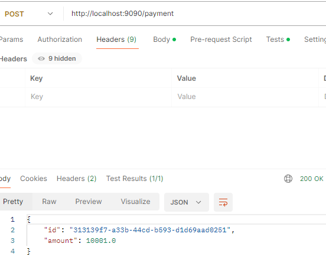

     

  proxy这段代码的task之间的依赖关系：

  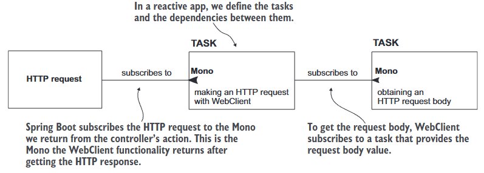

## 11.4 总结

非reactive app - 使用OpenFeign

​    reactive app - 使用WebClient


# 12. 使用data source

## 12.1 data source是什么

问题1：Java如何建立DB连接？

Java其实不会直接和DB进行连接，而是和DBMS进行连接，DBMS（the database management system） 用于管理DB中的数据，通过DBMS我们可以方便地进行增删改查。

ok 问题转化为Java如何建立和DBMS的连接？在后续的讨论钟，我们不严格对DBMS和DB的表述进行区分。

使用JDBC。JDBC是什么？

JDBC: 是Java所提供的用于和关系型数据库进行连接的功能（Java Database Connectivity）。

JDBC仅提供抽象（接口），不提供连接各个类型的DBMS（MySQL、Postgres、Oracle）的功能实现，具体的实现称为JDBC driver，由具体的DBMS厂商根据JDBC所提供的接口进行实现。

不同的DBMS会提供不同的JDBC driver实现，例如MySQL会提供MySQL JDBC driver，Oracle会提供Oracle JDBC driver。在进行Java开发的过程中，如果我们是要连接MySQL数据库，则我们引入MySQL JDBC driver的依赖，就可以与之建立连接了。

那具体怎么建立连接呢？

JDBC提供了一个DriverManager类，这个类提供了一个getConnetion(...)方法用于建立连接

```java
Connection con = DriverManager.getConnection(url, username, password);
```

问题2：

直接使用JDBC建立连接，存在什么问题吗？

我们在程序中，直接使用DriverManager类来建立连接，则每一次进行DB操作，都需要调用getConnection(...)方法，那每一次都需要创建新的连接，进行验证，需要多次进行重复的操作。就类似于你去酒吧点酒，酒保需要查看你的身份证看是否成年，然后你每点一次酒都要检查一次身份证，是不合理的。

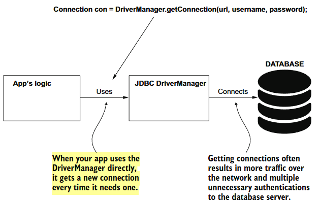

问题3：如何解决这个问题？

引入data source。

data source的作用就是帮助我们管理数据库连接，它能够保证能够复用连接的时候尽量复用连接，只有在必须的情况下，才会创建新的连接，以提高性能。

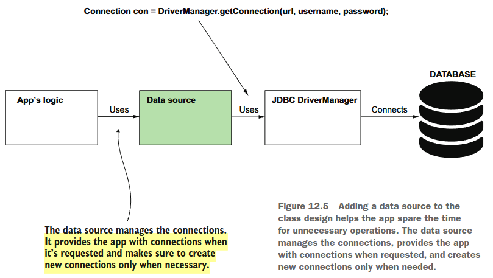

所以我们现在知道了data source是什么，data source就是一个负责管理数据库连接的组件，它实现了复用数据库连接，避免重复创建新连接，只有在必要的时候才会创建新连接，提升我们的服务性能。

## 12.2 JdbcTemplate的使用

这一节我们来介绍一下如何使用JdbcTemplate来建立DB连接，并实现基本的数据库操作。

JdbcTemplate是什么？

JdbcTemplate 是 Spring 提供的 JDBC 工具类，用来简化数据库访问。它本身不管理连接，也不直接和数据库通信，而是通过 DataSource 获取 Connection，再调用 JDBC API（由 JDBC Driver 实现）执行 SQL。

为什么要用JdbcTemplate？

如果我们使用JDBC接口提供的方法来执行SQL，其实并不方便，下面这段代码只是向purchase表中插入一条数据，需要写这么多行代码，更不必说已经省略了catch块中的代码。

```java
String sql = "INSERT INTO purchase VALUES (?,?)";
try (PreparedStatement stmt = con.prepareStatement(sql)) {
stmt.setString(1, name);
stmt.setDouble(2, price);
stmt.executeUpdate();
} catch (SQLException e) {
// do something when an exception occurs
}
```

JdbcTemplate就是Spring提供的帮我们进一步减少代码量的工具类。

怎么使用JdbcTemplate？

以下面这个例子来介绍：

有一张Purchase表，这个表中包含三列：id、product、price

* id—An auto-incrementing unique value that also takes the responsibility of the primary key of the table
* product—The name of the purchased product
* price—The purchase price

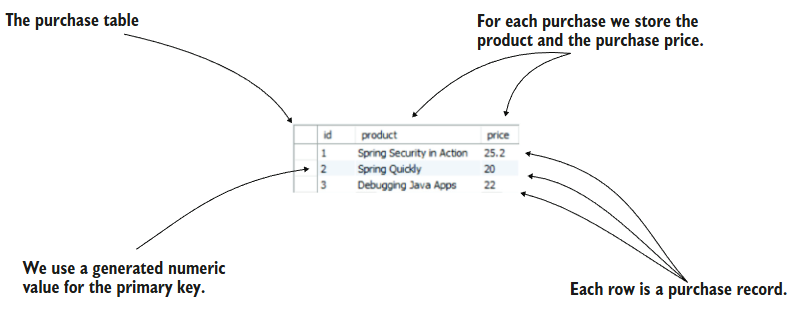

**业务需求：**

* 访问GET-/purchase可以获得purchase表中的所有数据
* 访问POST-/purchase可以向purchase插入一条新的数据

**代码设计：**

* Repository层：
  * PurchaseRepository
    * void storePurchase(Payment) 插入一条新数据
    * List\<Purchase> findAllPurchase() 获取所有数据
* Controller层（调用Repository层的方法）
  * GET-/purchase-storePurchase(Payment)
  * POST-/purchase-findAllPurchase()

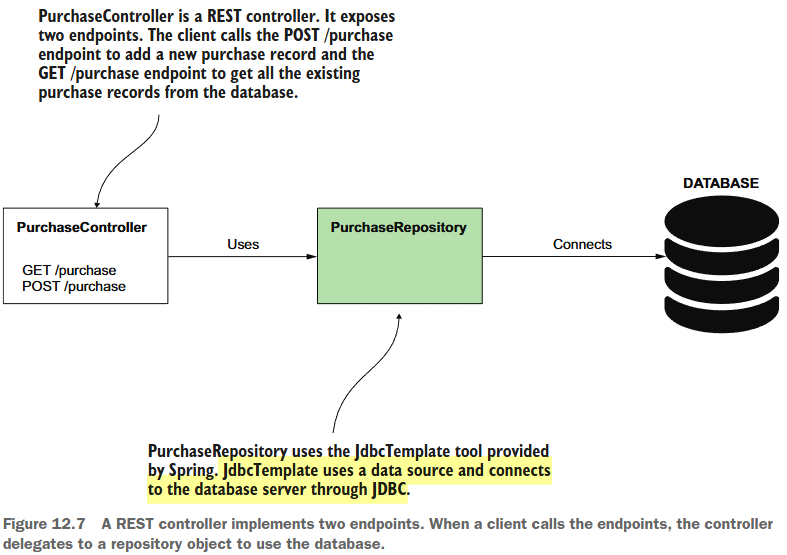

**代码实现：**

* schema.sql

  示例使用了H2数据库，在resources目录下新增schema.sql文件，可以在里面编写DDL，Spring启动时会执行。【该方法仅适用于学习】

  ```sql
  CREATE TABLE IF NOT EXISTS purchase (
      id INT AUTO_INCREMENT PRIMARY KEY,
      product varchar(50) NOT NULL,
      price double NOT NULL
  );
  ```

* model层

  ```java
  public class Purchase {
      private Integer id;
      private String product;
      private BigDecimal price;
  	// omitted getter/setter
  }
  ```

* pom.xml

  ```xml
  <!--引入该依赖才能够实现web功能-->
  <dependency>
      <groupId>org.springframework.boot</groupId>
      <artifactId>spring-boot-starter-web</artifactId>
  </dependency>
  <!--引入该依赖：
  	1. 触发 Spring Boot 自动创建 DataSource Bean
  	2. 引入JdbcTemplate
  	3. 自动创建JdbcTemplate Bean
  -->
  <dependency>
      <groupId>org.springframework.boot</groupId>
      <artifactId>spring-boot-starter-jdbc</artifactId>
  </dependency>
  <!--We add the H2 dependency to get both
          an in-memory database for this example and
          a JDBC driver to work with it.-->
  <dependency>
      <groupId>com.h2database</groupId>
      <artifactId>h2</artifactId>
      <!--The app only needs the database and the JDBC driver at runtime.
              The app doesn't need them for compilation-->
      <scope>runtime</scope>
  </dependency>
  ```

* Repository层

  ```java
  @Repository
  public class PurchaseRepository {
      private final JdbcTemplate jdbcTemplate;
  
      public PurchaseRepository(JdbcTemplate jdbcTemplate) {
          this.jdbcTemplate = jdbcTemplate;
      }
  
      public void storePurchase(Purchase purchase) {
          String sql = "INSERT INTO PURCHASE VALUES (NULL, ?, ?)";
          jdbcTemplate.update(sql, purchase.getProduct(), purchase.getPrice());
      }
  
      public List<Purchase> findAllPurchase() {
          String sql = "SELECT * FROM PURCHASE";
          // We implement a RowMapper object
          // that tells JdbcTemplate how to map a 
          // row in the result set into a Purchase
          // object. In the lambda expression,
          // parameter “r” is the ResultSet (the
          // data you get from the database),
          // while parameter “i” is an int
          // representing the row number.
          // JdbcTemplate will use
          // this logic for each row in the
          // result set.
          RowMapper rowMapper = (r, i) -> {
              Purchase purchase = new Purchase();
              purchase.setId(r.getInt("id"));
              purchase.setProduct(r.getString("product"));
              purchase.setPrice(r.getBigDecimal("price"));
              return purchase;
          };
          return jdbcTemplate.query(sql, rowMapper);
      }
  }
  ```

* Controller层

  ```java
  @RestController
  @RequestMapping("/purchase")
  public class PurchaseController {
      private final PurchaseRepository purchaseRepository;
  
      public PurchaseController(PurchaseRepository purchaseRepository) {
          this.purchaseRepository = purchaseRepository;
      }
  
      @PostMapping
      public void storePurchase(@RequestBody Purchase purchase) {
          purchaseRepository.storePurchase(purchase);
      }
  
      @GetMapping
      public List<Purchase> findAllPurchase() {
          return purchaseRepository.findAllPurchase();
      }
  }
  ```

* 测试效果

  

  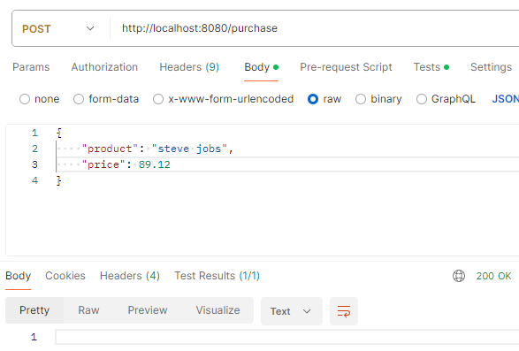

​	

==注意：==

* repository是什么意思：

  A repository is a class responsible with working with a database.

* 为什么Purchase的price属性类型为BigDecimal，而不是double/float
  * 使用double/float在计算过程中可能会丧失精度，对精度敏感的属性如价格，都应该用BigDecimal类型

* JdbcTemplate实例是谁创建的 为什么可以直接注入

  * spring-boot-starter-jdbc依赖内部包含HikariCP data source依赖和spring-jdbc依赖（其中包含JdbcTemplate类）。

  * 当我们引入spring-boot-starter-jdbc依赖，实际上也引入了HikariCP data source依赖。

  * 如果我们没有引入其他的datasource依赖，也没有手动定义datasource bean，则Spring Boot自动装配会帮我们自动创建HikariCP data source的Bean。

  * 有了data source Bean，SpringBoot自动装配也会帮我们自动创建JdbcTemplate的Bean。

  * 因此我们可以在Repository类直接注入JdbcTemplate bean。

  * 又因为我们还引入了h2数据库依赖，这个依赖不仅包含h2依赖，还包含了h2 jdbc driver依赖。

    h2 jdbc driver会被注册为对象。

    ```xml
    <dependency>
        <groupId>com.h2database</groupId>
        <artifactId>h2</artifactId>
        <scope>runtime</scope>
    </dependency>
    ```

  * 则JdbcTemplate可以通过data source bean来获取connection，调用JDBC接口，最终由h2 jdbc driver对这些接口的实现，完成对数据库的操作。

* RowMapper是什么

  RowMapper是一个对象，通过对该对象的配置，可以指定SELECT SQL执行结果ResultSet如何和Java类进行映射。

  也就是如何将查询结果转化为目标的Java类对象。

* JDBCTemplate SELECT query steps：

  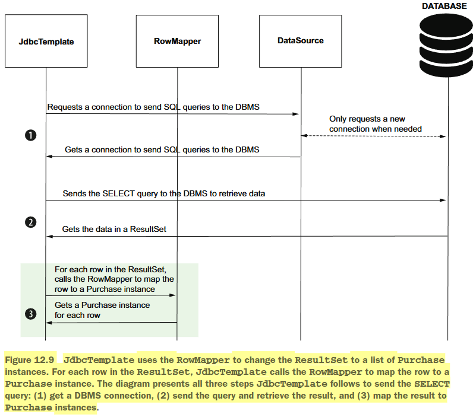

* Jdbc vs Jdbc Driver vs JdbcTemplate vs DriverManager vs DataSource

  * Jdbc是JDK定义的、用于和DB交互的接口

  * Jdbc Driver是各个数据库厂商对Jdbc接口的实现

  * JdbcTemplate是Spring提供的一个工具类，因为Jdbc的接口对于开发者来说并不方便使用，JdbcTemplate进行了进一步封装，对于开发者更加简单易用。【底层会从data source获取连接，调用Jdbc接口来实现和DB交互】

  * DriverManager用于管理所有的JdbcDriver，根据URL来分配请求给对应的Jdbc Driver。

    例如url为 `jdbc:mysql://localhost:3306`，就会找到MySQL的Driver来处理请求。

  * DataSource高效管理连接，尽量复用，必要时才创建新连接，提升性能。

## 12.3 自定义数据源

12.2的例子中，我们使用的是H2内存数据库，该数据库仅适用于教学，但是在真正实践中，我们通常使用MySQL、Oracle等可以进行持久化的数据库，那我们应该如何定义数据源？下面通过将12.2中的例子中的H2数据库改为使用MySQL数据库来介绍，总共分三步：

1. 引入MySQL JDBC driver
2. 在application.properties配置文件中配置连接信息（url、username、password...）
3. 让SpringBoot根据配置信息生成默认的DataSource Bean / 自定义DataSource Bean


1. 引入MySQL JDBC driver

   总共需要以下依赖

   ```xml
   <dependency>
       <groupId>org.springframework.boot</groupId>
       <artifactId>spring-boot-starter-web</artifactId>
   </dependency>
   <dependency>
       <groupId>org.springframework.boot</groupId>
       <artifactId>spring-boot-starter-jdbc</artifactId>
   </dependency>
   <dependency>
       <groupId>mysql</groupId>
       <artifactId>mysql-connector-java</artifactId>
       <scope>runtime</scope>
   </dependency>
   ```

2. 在application.properties配置文件中配置连接信息（url、username、password...）

   ```properties
   # defines the location to the database.
   spring.datasource.url=jdbc:mysql://localhost/spring_start_here?useLegacyDatetimeCode=false&serverTimezone=UTC
   spring.datasource.username=root
   spring.datasource.password=password
   # We set the initialization mode to 
   # “always” to instruct Spring Boot to run
   # the queries in the “schema.sql” file
   spring.sql.init.mode=always
   ```

   注意：如果是使用SpringBoot自动装配来创建DataSource Bean，则配置的前缀必须是`spring.datasource.*`，这是 Spring Boot 官方定义的标准前缀。

   

3. 让SpringBoot根据配置信息生成默认的DataSource Bean（自动装配） / 自定义DataSource Bean

   1. SpringBoot根据application.properties文件中的`spring.datasource`配置自动创建DataSource Bean（自动装配）。

      如果要使用SpringBoot默认生成的DataSource Bean，则不需要任何操作，到这里就配置好了MySQL数据源，就能够通过注入JDBCTemplate和MySQL数据库交互了。

      SpringBoot默认使用的是HikariCP DataSource。

      

   2. 自定义DataSource Bean

      *什么时候需要自定义DataSource Bean？*

      其中一个场景是多数据源场景：如果应用需要同时连多个数据库，则意味着需要多个DataSource Bean，而SpringBoot默认只会创建一个，因此在这种场景下，需要开发者手动创建。

      开发者手动创建之后，SpringBoot探测到已经有了，就不会进行自动创建。

      注意：在有多个Bean的情况下，注入的时候需要通过@Qualifier注解来指定注入的是哪个Bean。

      简单来说就是，当自动配置不能满足开发者的需求的时候，就可以自定义Bean。

      

      *如何自定义DataSource Bean？*

      ```java
      @Configuration
      public class ProjectConfig {
          @Value("${datasource.url}")
          private String datasourceUrl;
      
          @Value("${datasource.username}")
          private String datasourceUsername;
      
          @Value("${datasource.password}")
          private String datasourcePassword;
      
          //The method returns a DataSource object. If
          //Spring Boot finds a DataSource already exists in
          //the Spring context it doesn’t configure one.
          @Bean
          public DataSource dataSource() {
              //We’ll use HikariCP as the data source implementation
              // for this example. However, when you define the bean
              // yourself, you can choose other implementations if
              // your project requires something else.
              HikariDataSource dataSource = new HikariDataSource();
              dataSource.setJdbcUrl(datasourceUrl);
              dataSource.setUsername(datasourceUsername);
              dataSource.setPassword(datasourcePassword);
              dataSource.setConnectionTimeout(1000);
              return dataSource;
          }
      }
      ```

      ```properties
      # 由于是自定义Bean，这里的配置可以自定义，见明知义即可
      datasource.url=jdbc:mysql://localhost/spring_start_here?useLegacyDatetimeCode=false&serverTimezone=UTC
      datasource.username=root
      datasource.password=password
      ```

      至此，自定义MySQL数据源配置完成，可以通过注入JDBCTemplate和MySQL数据库交互了。

      自动装配的思想：引入依赖，SpringBoot会根据配置自动创建Bean，开发者可以直接注入使用。如果开发者自定义了Bean，则SpringBoot会使用这个Bean，不会再进行默认创建。也体现出了Spring convention over configuration的哲学。
